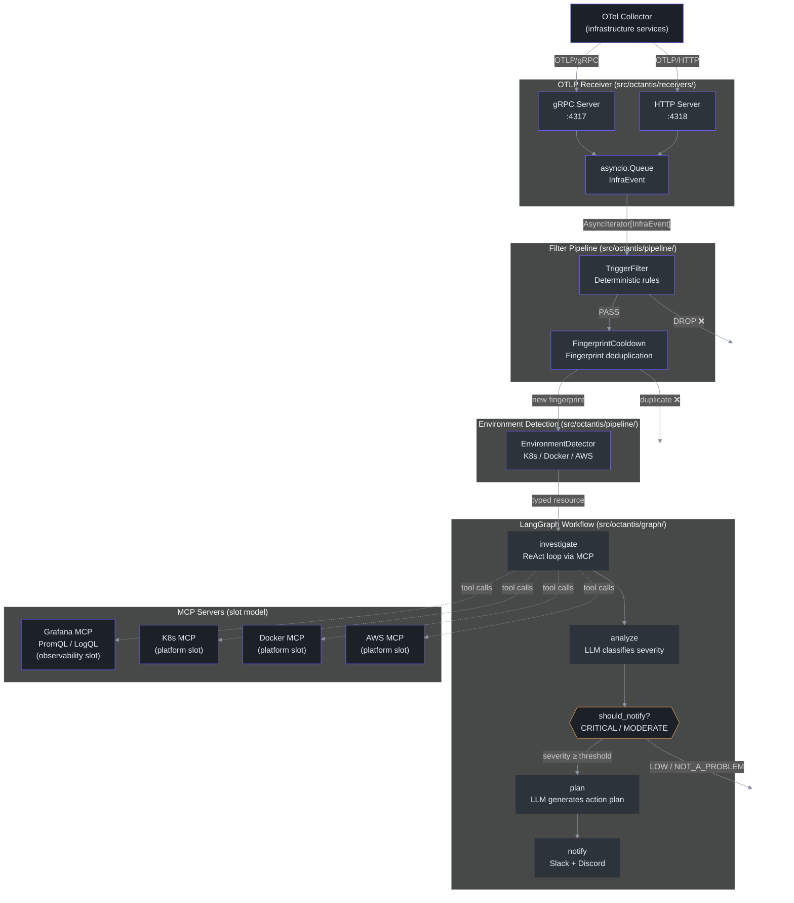
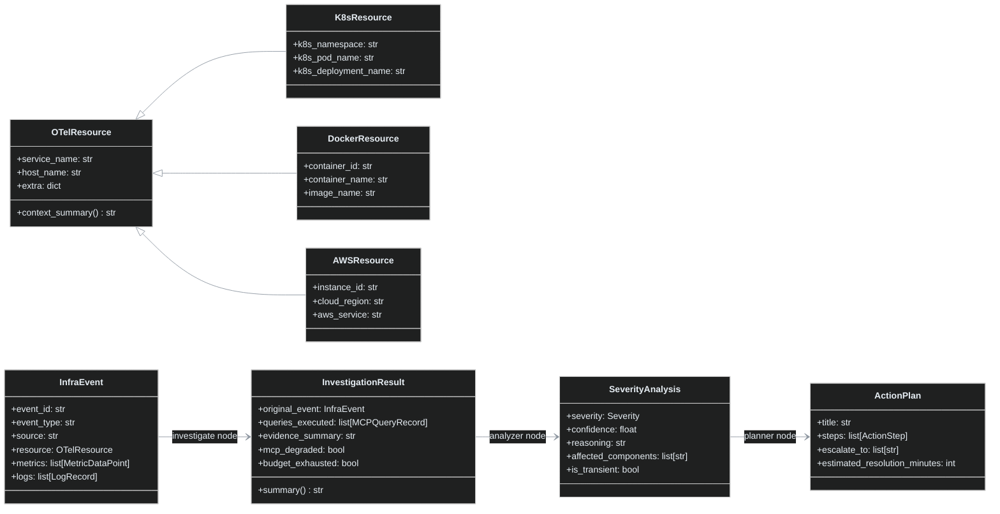

# Octantis — Architecture Overview

Octantis is an AI agent that intelligently monitors infrastructure. Instead of firing alerts for every breached threshold, it uses an LLM to evaluate the **real operational impact** — distinguishing a genuine crash from a false positive or a noisy metric.

## List of Contents

- [The Problem Octantis Solves](#the-problem-octantis-solves)
- [Complete Data Flow](#complete-data-flow)
- [Main Components](#main-components)
- [Directory Structure](#directory-structure)
- [Core Data Models](#core-data-models)
- [Quick Configuration](#quick-configuration)

## The Problem Octantis Solves

Traditional monitoring systems generate alerts based on simple thresholds:
- "CPU > 80% → alert"
- "Restarts > 2 → alert"

This results in **alert fatigue**: teams ignore alerts because 90% are noise. Octantis inverts the logic — instead of alerting on thresholds, it **autonomously investigates** via MCP (Model Context Protocol), querying Grafana (PromQL/LogQL) and optionally Kubernetes to build the full context before deciding whether the problem deserves human attention.

## Complete Data Flow



## Main Components

| Module | Responsibility | Key file |
|---|---|---|
| **Receiver** | Receives OTLP events via gRPC (:4317) and HTTP (:4318) | `receivers/` |
| **Pipeline** | Decides what is worth the LLM cost + environment detection | `pipeline/` |
| **MCP Client** | Registry-based SSE connections to MCP servers (slot model: observability + platform) | `mcp_client/manager.py` |
| **Graph** | Orchestrates the LangGraph workflow | `graph/workflow.py` |
| **Metrics** | 9 Prometheus metrics on `:9090/metrics` | `metrics.py` |
| **Notifiers** | Formats and sends Slack Block Kit / Discord Embeds | `notifiers/` |
| **Helm Chart** | Modular Kubernetes deployment with toggleable components | `charts/octantis/` |
| **kube-prometheus-stack** | Optional monitoring stack (Prometheus + Grafana + Alertmanager) via subchart | `charts/octantis/` |
| **Config** | All configuration via env vars | `config.py` |

## Directory Structure

```
src/octantis/
├── main.py                  # Entrypoint — assembles and runs the pipeline
├── config.py                # Pydantic BaseSettings (all config via .env)
├── metrics.py               # 9 Prometheus metrics + HTTP server
├── pipeline/
│   ├── trigger_filter.py    # ← Entry gate: deterministic rules
│   ├── cooldown.py          # ← Fingerprint deduplication + cooldown
│   └── environment_detector.py  # ← Promotes OTelResource to K8s/Docker/AWS subclass
├── receivers/
│   ├── receiver.py          # OTLPReceiver — orchestrates gRPC + HTTP + asyncio.Queue
│   ├── grpc_server.py       # gRPC servicer (MetricsService, LogsService, TraceService)
│   ├── http_server.py       # aiohttp server (/v1/metrics, /v1/logs, /v1/traces)
│   └── parser.py            # OTLP Protobuf/JSON → InfraEvent
├── mcp_client/
│   └── manager.py           # MCPClientManager — SSE connections + tool discovery
├── graph/
│   ├── workflow.py          # StateGraph LangGraph
│   ├── state.py             # AgentState (TypedDict)
│   └── nodes/
│       ├── investigator.py  # Node: ReAct loop with MCP tools
│       ├── analyzer.py      # Node: LLM classifies CRITICAL/MODERATE/LOW/NOT_A_PROBLEM
│       ├── planner.py       # Node: LLM generates remediation plan
│       └── notifier.py      # Node: Slack + Discord
├── notifiers/
│   ├── slack.py             # Block Kit with severity-based colors
│   └── discord.py           # Embeds with severity-based colors
└── models/
    ├── event.py             # InfraEvent, InvestigationResult, MCPQueryRecord
    ├── analysis.py          # SeverityAnalysis, Severity enum
    └── action_plan.py       # ActionPlan, ActionStep
```

## Core Data Models

Data flows through four shapes along the pipeline:



## Quick Configuration

```bash
cp .env.example .env
# Edit credentials and URLs

uv sync
uv run octantis
```

For Kubernetes deployment, use the Helm chart:

```bash
helm install octantis oci://ghcr.io/vinny1892/charts/octantis -n monitoring
```

See [`charts/octantis/README.md`](../charts/octantis/README.md) for the full configuration reference.

See [Filter Pipeline](./PIPELINE.md) to understand how events are triaged before reaching the LLM.
See [The LangGraph Agent](./AGENT.md) to understand the investigation, analysis, and notification workflow.
