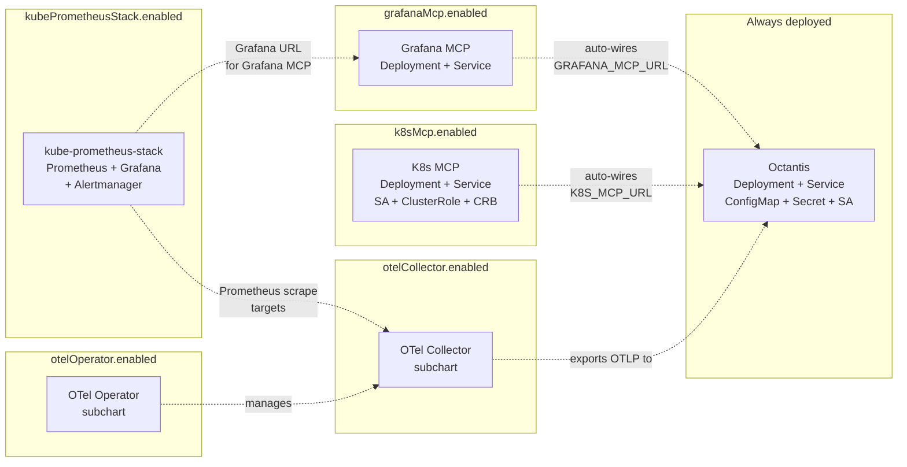

# Octantis Helm Chart

AI-powered infrastructure monitoring agent for EKS/Kubernetes.

## List of Contents

- [Quick Start](#quick-start)
- [Architecture](#architecture)
- [Configuration](#configuration)
- [Secrets Management](#secrets-management)
- [Examples](#examples)

## Quick Start

```bash
# Minimal install (Octantis only)
helm install octantis oci://ghcr.io/vinny1892/charts/octantis \
  -n monitoring --create-namespace \
  --set secrets.anthropicApiKey.create=true \
  --set secrets.anthropicApiKey.value="sk-ant-..."

# Full stack (Octantis + Grafana MCP + K8s MCP + OTel Collector)
helm install octantis oci://ghcr.io/vinny1892/charts/octantis \
  -n monitoring --create-namespace \
  -f values-full-stack.yaml
```

## Architecture



### Components

| Component | Type | Condition | Description |
|-----------|------|-----------|-------------|
| Octantis | In-chart | Always | Core agent: OTLP receiver, LLM analysis, notifications |
| Grafana MCP | In-chart | `grafanaMcp.enabled` | Prometheus + Loki queries via MCP |
| K8s MCP | In-chart | `k8sMcp.enabled` | Kubernetes API queries via MCP |
| OTel Collector | Subchart | `otelCollector.enabled` | Receives telemetry, exports to Octantis |
| OTel Operator | Subchart | `otelOperator.enabled` | Manages OpenTelemetryCollector CRs |
| kube-prometheus-stack | Subchart | `kubePrometheusStack.enabled` | Prometheus Operator + Grafana + Alertmanager |

## Configuration

### Octantis Core

| Parameter | Description | Default |
|-----------|-------------|---------|
| `octantis.image.repository` | Image repository | `ghcr.io/vinny1892/octantis` |
| `octantis.image.tag` | Image tag (defaults to Chart appVersion) | `""` |
| `octantis.image.pullPolicy` | Image pull policy | `IfNotPresent` |
| `octantis.replicaCount` | Number of replicas | `1` |
| `octantis.resources.requests.cpu` | CPU request | `200m` |
| `octantis.resources.requests.memory` | Memory request | `256Mi` |
| `octantis.resources.limits.cpu` | CPU limit | `1` |
| `octantis.resources.limits.memory` | Memory limit | `512Mi` |
| `octantis.serviceAccount.create` | Create ServiceAccount | `true` |
| `octantis.serviceAccount.name` | ServiceAccount name (auto-generated if empty) | `""` |
| `octantis.otlp.grpc.enabled` | Enable gRPC receiver | `true` |
| `octantis.otlp.grpc.port` | gRPC port | `4317` |
| `octantis.otlp.http.enabled` | Enable HTTP receiver | `true` |
| `octantis.otlp.http.port` | HTTP port | `4318` |
| `octantis.otlp.queueMaxSize` | Max queue size | `1000` |
| `octantis.llm.provider` | LLM provider (anthropic, openrouter, bedrock) | `anthropic` |
| `octantis.llm.model` | LLM model | `claude-sonnet-4-6` |
| `octantis.llm.investigationModel` | Investigation model (defaults to llm.model) | `""` |
| `octantis.llm.maxTokens` | Max tokens | `2048` |
| `octantis.llm.temperature` | Temperature | `0.1` |
| `octantis.pipeline.cpuThreshold` | CPU threshold (%) | `75.0` |
| `octantis.pipeline.memoryThreshold` | Memory threshold (%) | `80.0` |
| `octantis.pipeline.errorRateThreshold` | Error rate threshold | `0.01` |
| `octantis.pipeline.cooldownSeconds` | Cooldown window | `300` |
| `octantis.pipeline.cooldownMaxEntries` | Max cooldown entries | `1000` |
| `octantis.notifications.minSeverityToNotify` | Min severity | `MODERATE` |
| `octantis.notifications.slack.channel` | Slack channel | `#infra-alerts` |
| `octantis.metrics.enabled` | Enable metrics endpoint | `true` |
| `octantis.metrics.port` | Metrics port | `9090` |
| `octantis.logLevel` | Log level | `INFO` |
| `octantis.language` | Language (en, pt-br) | `en` |

### External MCP URLs

| Parameter | Description | Default |
|-----------|-------------|---------|
| `octantis.externalMcp.grafanaUrl` | External Grafana MCP URL | `""` |
| `octantis.externalMcp.k8sUrl` | External K8s MCP URL | `""` |
| `octantis.externalMcp.dockerUrl` | External Docker MCP URL | `""` |
| `octantis.externalMcp.awsUrl` | External AWS MCP URL | `""` |

### Grafana MCP

| Parameter | Description | Default |
|-----------|-------------|---------|
| `grafanaMcp.enabled` | Deploy Grafana MCP | `false` |
| `grafanaMcp.image.repository` | Image repository | `ghcr.io/vinny1892/mcp-grafana` |
| `grafanaMcp.image.tag` | Image tag | `latest` |
| `grafanaMcp.port` | Service port | `8080` |
| `grafanaMcp.containerPort` | Container port | `8000` |
| `grafanaMcp.grafanaUrl` | Grafana URL | `http://grafana.monitoring.svc.cluster.local:3000` |
| `grafanaMcp.enabledTools` | Enabled tools flag | `prometheus,loki` |
| `grafanaMcp.extraArgs` | Extra container args | `[--disable-oncall, ...]` |

### K8s MCP

| Parameter | Description | Default |
|-----------|-------------|---------|
| `k8sMcp.enabled` | Deploy K8s MCP | `false` |
| `k8sMcp.image.repository` | Image repository | `ghcr.io/containers/kubernetes-mcp-server` |
| `k8sMcp.image.tag` | Image tag | `latest` |
| `k8sMcp.port` | Service port | `8080` |
| `k8sMcp.args` | Container args | `[--port, 8080, --read-only, ...]` |
| `k8sMcp.serviceAccount.create` | Create ServiceAccount | `true` |
| `k8sMcp.rbac.create` | Create ClusterRole/Binding | `true` |
| `k8sMcp.rbac.additionalRules` | Additional RBAC rules | `[]` |

### OTel Collector

| Parameter | Description | Default |
|-----------|-------------|---------|
| `otelCollector.enabled` | Deploy OTel Collector (subchart) | `false` |
| `otelCollector.mode` | Deployment mode | `deployment` |

### OTel Operator

| Parameter | Description | Default |
|-----------|-------------|---------|
| `otelOperator.enabled` | Deploy OTel Operator (subchart) | `false` |

### OpenTelemetryCollector CR

| Parameter | Description | Default |
|-----------|-------------|---------|
| `otelCollectorCR.mode` | CR mode (when both Operator + Collector enabled) | `deployment` |

### kube-prometheus-stack

| Parameter | Description | Default |
|-----------|-------------|---------|
| `kubePrometheusStack.enabled` | Deploy kube-prometheus-stack (Prometheus Operator + Grafana + Alertmanager) | `false` |
| `kubePrometheusStack.grafana.enabled` | Deploy Grafana with the stack | `true` |
| `kubePrometheusStack.grafana.adminPassword` | Grafana admin password | `""` |
| `kubePrometheusStack.prometheus.enabled` | Deploy Prometheus with the stack | `true` |
| `kubePrometheusStack.alertmanager.enabled` | Deploy Alertmanager with the stack | `true` |

When `kubePrometheusStack.enabled: true` and `grafanaMcp.enabled: true`, the Grafana MCP automatically uses the in-chart Grafana instance. When combined with `otelCollector.enabled: true`, the OTel Collector is pre-configured with a Prometheus receiver for metrics scraping.

## Secrets Management

Each secret supports three modes with priority: `existingSecret` > `externalsecret` > `create`.

| Parameter | Description | Default |
|-----------|-------------|---------|
| `secrets.anthropicApiKey.create` | Create K8s Secret | `false` |
| `secrets.anthropicApiKey.value` | Secret value (create mode) | `""` |
| `secrets.anthropicApiKey.existingSecret` | Reference existing Secret | `""` |
| `secrets.anthropicApiKey.key` | Key name in Secret | `ANTHROPIC_API_KEY` |
| `secrets.anthropicApiKey.externalsecret.create` | Create ExternalSecret CR | `false` |
| `secrets.anthropicApiKey.externalsecret.spec.secretStoreRef.name` | ESO SecretStore name | `""` |
| `secrets.anthropicApiKey.externalsecret.spec.remoteRef.key` | Remote secret key | `""` |

The same structure applies to: `openrouterApiKey`, `grafanaMcpApiKey`, `slackWebhookUrl`, `discordWebhookUrl`.

### Examples

**Create mode (dev):**
```yaml
secrets:
  anthropicApiKey:
    create: true
    value: "sk-ant-..."
```

**Existing Secret (production with External Secrets Operator):**
```yaml
secrets:
  anthropicApiKey:
    existingSecret: "my-vault-secret"
```

**ExternalSecret CR (chart-managed ESO):**
```yaml
secrets:
  anthropicApiKey:
    externalsecret:
      create: true
      spec:
        secretStoreRef:
          name: vault-backend
          kind: ClusterSecretStore
        remoteRef:
          key: secret/octantis/anthropic-key
```

## Examples

See `charts/octantis/examples/` for complete values files:

- `values-minimal.yaml` — Octantis only
- `values-full-stack.yaml` — All components enabled
- `values-external-mcp.yaml` — Octantis with external MCP URLs
