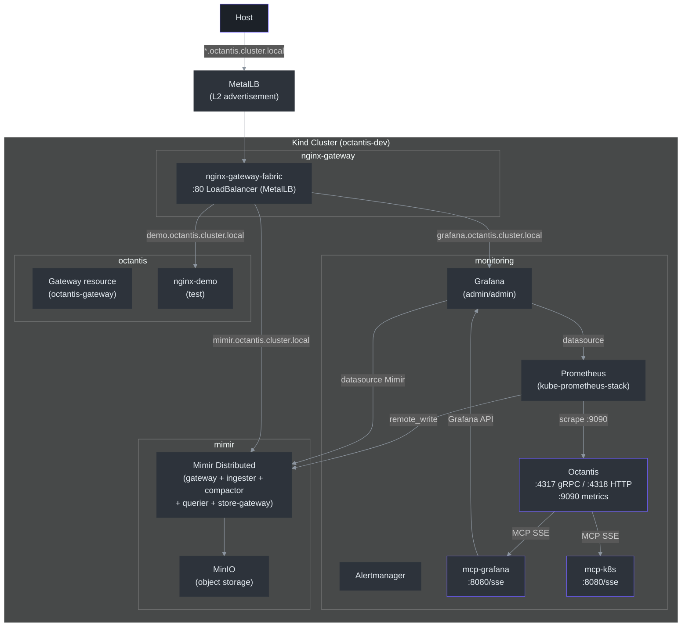

# Development Environment

Local Kind cluster with a full observability stack for Octantis development and testing.

## Prerequisites

- [Docker](https://docs.docker.com/get-docker/)
- [Kind](https://kind.sigs.k8s.io/docs/user/quick-start/#installation)
- [kubectl](https://kubernetes.io/docs/tasks/tools/)
- [Helm](https://helm.sh/docs/intro/install/)
- [1Password CLI](https://developer.1password.com/docs/cli/get-started/) (`op`) — *optional, alternative: environment variables*

## Quick Setup

```bash
# 1. Configure local DNS (requires sudo)
sudo bash dev/dns-setup.sh

# 2. Configure secrets (choose one option)

# Option A: environment variables (without 1Password)
export OPENROUTER_API_KEY="sk-or-..."
export SLACK_WEBHOOK_URL="https://hooks.slack.com/services/..."
export DISCORD_WEBHOOK_URL="https://discord.com/api/webhooks/..."

# Option B: 1Password (once per machine)
bash dev/op-setup.sh
# Edit values in 1Password with real keys

# 3. Create the cluster
bash dev/setup.sh

# To recreate from scratch (destroys and recreates)
bash dev/setup.sh --force
```

## Cluster Architecture



## Components

### Kind Cluster (`dev/kind/kind-config.yaml`)

Cluster with 1 control-plane + 2 workers. Workers mount `/tmp/octantis-dev/worker{1,2}` as `/data` for persistent volumes.

### MetalLB

LoadBalancer for Kind. Installed via Helm in the `metallb-system` namespace. The `setup.sh` script automatically detects the Docker Kind subnet and allocates a `/28` range (e.g., `172.18.255.200-172.18.255.250`) for LoadBalancer IPs.

This allows using `type: LoadBalancer` on Services instead of NodePort.

### nginx-gateway-fabric (`dev/helm/nginx-gateway-fabric/values.yaml`)

Gateway API implementation via NGINX. Replaces traditional ingress-nginx. The `ngf-nginx-gateway-fabric` service is of type LoadBalancer — MetalLB assigns an IP accessible from the host machine.

The Gateway resource (`dev/manifests/gateway.yaml`) accepts HTTPRoutes from all namespaces.

### kube-prometheus-stack (`dev/helm/kube-prometheus-stack/values.yaml`)

Full monitoring stack in the `monitoring` namespace:

| Component | Configuration |
|-----------|---------------|
| **Prometheus** | 30s scrape, 2h/2GB retention, remote_write to Mimir |
| **Grafana** | admin/admin, anonymous viewer, Prometheus + Mimir datasources |
| **Alertmanager** | Enabled, null receiver (no notifications) |
| **node-exporter** | Host metrics |
| **kube-state-metrics** | Cluster metrics |

Prometheus does remote_write to Mimir with the `X-Scope-OrgID: dev` header for long-term retention. Local retention is short (2h) because Mimir is the primary storage.

### Mimir (`dev/helm/mimir/values.yaml`)

Distributed TSDB for long-term metrics, in the `mimir` namespace. Multitenancy enabled with tenant `dev`.

| Component | Replicas |
|-----------|----------|
| distributor | 1 |
| ingester | 1 |
| querier | 1 |
| query-frontend | 1 |
| query-scheduler | 1 |
| store-gateway | 1 |
| compactor | 1 |
| nginx (gateway) | 1 |
| **MinIO** | 1 (local object storage) |

MinIO serves as S3-compatible storage for blocks, ruler, and alertmanager. Credentials: `mimir`/`supersecret`.

The Mimir datasource in Grafana points to `http://mimir-gateway.mimir.svc.cluster.local/prometheus` with the `X-Scope-OrgID: dev` header.

### OpenTelemetry Collector (`dev/helm/opentelemetry-collector/values.yaml`)

Collector in deployment mode (1 replica). Receives OTLP gRPC (:4317) and HTTP (:4318).

| Pipeline | Receivers | Exporters |
|----------|-----------|-----------|
| metrics | otlp | prometheusremotewrite (Mimir), debug |
| traces | otlp | debug |
| logs | otlp | debug |

OTLP metrics are converted and sent to Mimir via remote write. Traces and logs currently only go to debug (stdout).

### Grafana MCP Server (`dev/manifests/mcp-grafana.yaml`)

MCP server (Model Context Protocol) that exposes Grafana query tools via SSE. Runs in the `monitoring` namespace.

- **Image**: `ghcr.io/vinny1892/mcp-grafana:latest` (built from [grafana/mcp-grafana](https://github.com/grafana/mcp-grafana))
- **Endpoint**: `mcp-grafana.monitoring.svc.cluster.local:8080/sse` (Service :8080 → container :8000)
- **Authentication**: Grafana service account token (`GRAFANA_SERVICE_ACCOUNT_TOKEN`), automatically created by `setup.sh` and stored in the secret `mcp-grafana-token`

### Kubernetes MCP Server (`dev/manifests/mcp-k8s.yaml`)

MCP server that exposes Kubernetes resource queries via SSE. Runs in the `monitoring` namespace with read-only access to the cluster.

- **Image**: `ghcr.io/containers/kubernetes-mcp-server:latest`
- **Endpoint**: `mcp-k8s.monitoring.svc.cluster.local:8080/sse`
- **Authentication**: ServiceAccount `mcp-k8s` with read-only ClusterRole (pods, deployments, services, events, etc.)
- **Mode**: `--read-only` (does not allow cluster modifications)

### Octantis (`dev/manifests/octantis.yaml`)

The Octantis agent runs in the `monitoring` namespace.

- **Image**: `ghcr.io/vinny1892/octantis:latest`
- **LLM**: OpenRouter (`claude-sonnet-4-6`)
- **MCP**: Connects to `mcp-grafana` and `mcp-k8s` via SSE
- **OTLP**: Receives on `:4317` (gRPC) and `:4318` (HTTP)
- **Metrics**: Exports on `:9090/metrics` (scraped by Prometheus)
- **Language**: `LANGUAGE=pt-br` (analyses and notifications in Portuguese; default: `en`)
- **Secrets**: Via environment variables or 1Password (see [Secrets](#secrets))

### nginx-demo (`dev/manifests/nginx-demo.yaml`)

Simple NGINX deployment in the `octantis` namespace to test Gateway connectivity. Accessible at `http://demo.octantis.cluster.local`.

## Local DNS (`dev/dns-setup.sh`)

Adds entries to `/etc/hosts` to resolve cluster domains, pointing to the LoadBalancer IP (MetalLB):

| Domain | Service |
|--------|---------|
| `grafana.octantis.cluster.local` | Grafana UI |
| `mimir.octantis.cluster.local` | Mimir API |
| `demo.octantis.cluster.local` | nginx-demo |

The `setup.sh` script configures DNS automatically. To reconfigure manually:

```bash
sudo bash dev/dns-setup.sh
```

Traffic reaches the MetalLB IP → nginx-gateway-fabric (LoadBalancer) → HTTPRoute → target Service.

To remove: `sudo bash dev/dns-cleanup.sh`

## Secrets

Octantis needs 3 secrets to operate:

| Variable | Description |
|----------|-------------|
| `OPENROUTER_API_KEY` | OpenRouter API key for the LLM |
| `SLACK_WEBHOOK_URL` | Slack incoming webhook for notifications |
| `DISCORD_WEBHOOK_URL` | Discord webhook for notifications |

The `setup.sh` script accepts two ways to provide these secrets, with the following priority:

1. **Environment variables** — if already set in the shell, they are used directly
2. **1Password CLI** — if `op` is installed and authenticated, reads from the `Local` vault

### Option 1: Environment Variables

For those not using 1Password. Export the variables before running setup:

```bash
export OPENROUTER_API_KEY="sk-or-..."
export SLACK_WEBHOOK_URL="https://hooks.slack.com/services/..."
export DISCORD_WEBHOOK_URL="https://discord.com/api/webhooks/..."

bash dev/setup.sh
```

Or in a single line:

```bash
OPENROUTER_API_KEY="sk-or-..." \
SLACK_WEBHOOK_URL="https://hooks.slack.com/services/..." \
DISCORD_WEBHOOK_URL="https://discord.com/api/webhooks/..." \
bash dev/setup.sh
```

### Option 2: 1Password CLI

For those using 1Password. Configure once per machine:

```bash
# Create item with placeholder values
bash dev/op-setup.sh

# Edit with real values
op item edit octantis-dev --vault Local 'OPENROUTER_API_KEY=sk-or-...'
op item edit octantis-dev --vault Local 'SLACK_WEBHOOK_URL=https://hooks.slack.com/services/...'
op item edit octantis-dev --vault Local 'DISCORD_WEBHOOK_URL=https://discord.com/api/webhooks/...'
```

On subsequent runs, `setup.sh` reads automatically via `op read "op://Local/octantis-dev/..."`.

## ServiceMonitors

| Monitor | Namespace | Target |
|---------|-----------|--------|
| `nginx-gateway-fabric` | `nginx-gateway` | NGF metrics `:9113` |
| Octantis (via annotation) | `monitoring` | `:9090/metrics` |

## Scripts

| Script | Description |
|--------|-------------|
| `dev/setup.sh` | Creates the full cluster (Kind + Helm charts + manifests + secrets). Idempotent — if the cluster already exists, shows a warning and exits |
| `dev/setup.sh --force` | Destroys the existing cluster and recreates everything from scratch |
| `dev/teardown.sh` | Deletes the Kind cluster and cleans up local data |
| `dev/dns-setup.sh` | Configures `/etc/hosts` with the LoadBalancer IP (requires sudo) |
| `dev/dns-cleanup.sh` | Removes entries from `/etc/hosts` (requires sudo) |
| `dev/op-setup.sh` | Creates `octantis-dev` item in the 1Password `Local` vault |

## File Structure

```
dev/
├── setup.sh                              # Main setup script
├── teardown.sh                           # Destroy cluster
├── dns-setup.sh                          # Local DNS (*.octantis.cluster.local)
├── dns-cleanup.sh                        # Clean local DNS
├── op-setup.sh                           # Create 1Password item
├── kind/
│   └── kind-config.yaml                  # 1 control-plane + 2 workers
├── helm/
│   ├── kube-prometheus-stack/
│   │   └── values.yaml                   # Prometheus + Grafana + Alertmanager
│   ├── mimir/
│   │   └── values.yaml                   # Mimir distributed + MinIO
│   ├── nginx-gateway-fabric/
│   │   └── values.yaml                   # Gateway API controller
│   └── opentelemetry-collector/
│       └── values.yaml                   # OTel Collector → Mimir remote write
└── manifests/
    ├── gateway.yaml                      # Gateway resource (accepts HTTPRoutes from all ns)
    ├── grafana-route.yaml                # HTTPRoute + ReferenceGrant for Grafana
    ├── mimir-route.yaml                  # HTTPRoute for Mimir API
    ├── metallb-config.yaml               # IPAddressPool + L2Advertisement (MetalLB)
    ├── mcp-grafana.yaml                  # Deployment + Service for MCP Grafana
    ├── mcp-k8s.yaml                      # ServiceAccount + RBAC + Deployment + Service for MCP K8s
    ├── octantis.yaml                     # Deployment + Service for Octantis
    ├── nginx-demo.yaml                   # Deployment + Service + HTTPRoute (test)
    └── ngf-servicemonitor.yaml           # ServiceMonitor for nginx-gateway-fabric
```

## Troubleshooting

### Gateway returns 404

The HTTPRoute may not have been accepted. Check:

```bash
kubectl get httproute -A
kubectl describe httproute <name> -n <namespace>
```

If the status doesn't have `Accepted: True`, check if the ReferenceGrant exists (required for cross-namespace routes).

### Grafana MCP not connecting

```bash
kubectl logs -n monitoring deploy/mcp-grafana
kubectl get secret mcp-grafana-token -n monitoring -o jsonpath='{.data.token}' | base64 -d
```

If the token is empty, recreate via Grafana API or re-run the setup.

### Octantis in CrashLoopBackoff

```bash
kubectl logs -n monitoring deploy/octantis
kubectl get secret octantis-secrets -n monitoring -o yaml
```

Common causes: `OPENROUTER_API_KEY` with value `change-me` (edit in 1Password), MCP Grafana not running.

### DNS not resolving

```bash
grep octantis /etc/hosts
curl -H "Host: grafana.octantis.cluster.local" http://127.0.0.1
```

If curl works but the browser doesn't, `/etc/hosts` may not have been updated. Re-run `sudo bash dev/dns-setup.sh`.
