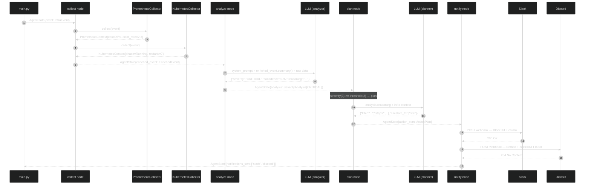

# O Agente LangGraph

> Quando o pipeline de filtragem decide que um evento merece análise, ele entrega um `InfraEvent` merged ao workflow LangGraph. A partir daqui, toda a lógica é orquestrada por um grafo de estados compilado em `graph/workflow.py`.

## O Grafo de Estados

```mermaid
%%{init: {"theme": "dark", "themeVariables": {"primaryColor": "#2d333b", "primaryBorderColor": "#6d5dfc", "primaryTextColor": "#e6edf3", "lineColor": "#8b949e", "secondaryColor": "#161b22"}}}%%
stateDiagram-v2
    direction LR
    [*] --> collect: InfraEvent\n(do pipeline)

    collect --> analyze: EnrichedEvent\n(+ Prometheus + K8s)

    analyze --> plan: severity ≥ threshold\n(CRITICAL / MODERATE)
    analyze --> [*]: severity < threshold\n(LOW / NOT_A_PROBLEM)\nlog only

    plan --> notify: ActionPlan gerado

    notify --> [*]: notifications_sent\n[slack, discord]

    state collect {
        PrometheusCollector
        KubernetesCollector
    }
    state analyze {
        LLM: SYSTEM_PROMPT\n+ enriched_event.summary()
    }
    state plan {
        LLM: analysis.reasoning\n+ infra context
    }
    state notify {
        SlackNotifier
        DiscordNotifier
    }
```

### AgentState — o envelope que circula pelo grafo

```python
# src/octantis/graph/state.py:8
class AgentState(TypedDict, total=False):
    event: InfraEvent           # input: vem do pipeline
    enriched_event: EnrichedEvent  # após collect
    analysis: SeverityAnalysis  # após analyze
    action_plan: ActionPlan | None  # após plan (None se LOW/NOT_A_PROBLEM)
    notifications_sent: list[str]   # após notify
    error: str | None
```

Cada nó recebe o state completo e retorna `{**state, chave_nova: valor}` — sem mutação, sem side effects no state anterior. O `total=False` significa que todos os campos são opcionais no TypedDict, o que evita erros de chave ao acessar campos ainda não populados por nós anteriores.

---

## Nó 1 — collect

**Arquivo:** `src/octantis/graph/nodes/collector.py`

O nó collector é a ponte entre o `InfraEvent` cru (que saiu do Redpanda) e o `EnrichedEvent` rico em contexto que o LLM vai receber. Ele dispara duas consultas em paralelo — Prometheus e Kubernetes API — e monta o objeto enriquecido.

```python
# src/octantis/graph/nodes/collector.py:22
prom_collector = PrometheusCollector(settings.prometheus.url)
k8s_collector = KubernetesCollector(
    in_cluster=settings.kubernetes.in_cluster,
    kubeconfig=settings.kubernetes.kubeconfig,
)

prom_ctx = await prom_collector.collect(event)
k8s_ctx = await k8s_collector.collect(event)

enriched = EnrichedEvent(
    original=event,
    prometheus=prom_ctx,
    kubernetes=k8s_ctx,
)
```

### PrometheusCollector

Constrói queries PromQL dinamicamente com base nos atributos do evento (`collectors/prometheus.py:36-57`). Para um evento com `k8s_namespace=production` e `k8s_pod_name=api-abc`:

| Campo | Query PromQL gerada |
|---|---|
| `cpu_usage_percent` | `sum(rate(container_cpu_usage_seconds_total{namespace="production",pod="api-abc"}[5m])) * 100` |
| `memory_usage_percent` | `(container_memory_working_set_bytes{...} / container_spec_memory_limit_bytes{...}) * 100` |
| `error_rate_5m` | `sum(rate(http_requests_total{...,status=~"5.."}[5m]))` |
| `request_latency_p99_ms` | `histogram_quantile(0.99, ...) * 1000` |

Se uma query falha (Prometheus indisponível, série inexistente), o campo fica `None` e o collector continua com as demais — sem exception propagada (`collectors/prometheus.py:63-68`).

### KubernetesCollector

Usa o client Python oficial da K8s API e preenche até quatro contextos dependendo dos atributos do evento (`collectors/kubernetes.py:36-55`):

| Método | API K8s | O que coleta |
|---|---|---|
| `_enrich_pod` | `CoreV1Api.read_namespaced_pod` | phase, conditions, restart count total |
| `_enrich_node` | `CoreV1Api.read_node` | conditions, pressões (MemoryPressure, DiskPressure, PIDPressure) |
| `_enrich_deployment` | `AppsV1Api.read_namespaced_deployment` | replicas available vs desired |
| `_enrich_events` | `CoreV1Api.list_namespaced_event` | últimos 10 eventos K8s do pod |

Cada método captura `ApiException` individualmente, então falhas de permissão em um recurso não bloqueiam os demais.

### EnrichedEvent.summary()

O método `summary()` (`models/event.py:88-118`) compila todos esses dados em texto estruturado que vai direto no prompt do LLM:

```
Event: metric from api-server
Service: api-server
Namespace: production
Pod: api-server-abc123
Metrics: cpu_usage=95.0%, memory_usage=78.2%
CPU: 95.0%
Memory: 78.2%
Error rate (5m): 0.45
Pod phase: Running
Replicas: 2/3
```

---

## Nó 2 — analyze

**Arquivo:** `src/octantis/graph/nodes/analyzer.py`

O nó mais importante do workflow. Recebe o `EnrichedEvent` e devolve um `SeverityAnalysis` — a decisão do LLM sobre o que está acontecendo.

### O System Prompt

```python
# src/octantis/graph/nodes/analyzer.py:14
SYSTEM_PROMPT = """\
You are Octantis, an expert SRE/infrastructure analyst.
...
Severity levels:
- CRITICAL: Requires immediate action. Service is down or severely degraded,
  data loss risk, or cascading failure likely.
- MODERATE: Requires attention soon. Degraded performance, elevated errors,
  or conditions trending toward critical.
- LOW: Worth knowing about but not urgent. Minor anomaly, self-resolving
  likely, or very limited blast radius.
- NOT_A_PROBLEM: False positive, expected behavior, or completely benign.
"""
```

O prompt instrui o LLM a ir **além do threshold** — um CPU de 95% pode ser NOT_A_PROBLEM se o serviço é um job de batch que termina em segundos. Um CPU de 60% pode ser CRITICAL se é acompanhado de latência P99 de 30s e pods sendo evicted.

### Contexto enviado ao LLM

```python
# src/octantis/graph/nodes/analyzer.py:43
def _build_user_message(enriched_event) -> str:
    return f"""Analyze this infrastructure event:

{enriched_event.summary}              # texto estruturado (veja acima)

Raw metrics:
{json.dumps([m.model_dump() for m in enriched_event.original.metrics], ...)}

Recent logs:
{json.dumps([l.model_dump() for l in enriched_event.original.logs[-5:]], ...)}

Kubernetes context:
{enriched_event.kubernetes.model_dump_json(indent=2)}

Prometheus context:
{enriched_event.prometheus.model_dump_json(indent=2)}
"""
```

O LLM recebe: summary textual + métricas brutas + últimos 5 logs + estado K8s completo + contexto Prometheus. `response_format={"type": "json_object"}` força resposta JSON puro sem markdown.

### Output e Fallback

```python
# src/octantis/graph/nodes/analyzer.py:96
try:
    data = json.loads(raw_content)
    analysis = SeverityAnalysis(**data)
except Exception as exc:
    # Fallback: treat as MODERATE so we don't silently drop issues
    analysis = SeverityAnalysis(
        severity=Severity.MODERATE,
        confidence=0.5,
        reasoning=f"Parse error, defaulting to MODERATE. Raw: {raw_content[:200]}",
    )
```

**Fail-safe deliberado:** parse error vira MODERATE, não LOW nem drop. A decisão é conservadora — é melhor disparar um alerta desnecessário do que perder um problema real por falha de parsing.

---

## Edge Condicional — _should_notify

```python
# src/octantis/graph/workflow.py:34
def _should_notify(state: AgentState) -> str:
    threshold = _NOTIFY_THRESHOLD.get(settings.min_severity_to_notify, Severity.MODERATE)
    severity_value = _SEVERITY_ORDER.get(analysis.severity, 0)
    threshold_value = _SEVERITY_ORDER.get(threshold, 2)

    if severity_value >= threshold_value:
        return "plan"
    else:
        return "end"
```

A severidade é mapeada para um inteiro para comparação ordinal (`workflow.py:19-24`):

```
NOT_A_PROBLEM=0  LOW=1  MODERATE=2  CRITICAL=3
```

`MIN_SEVERITY_TO_NOTIFY=MODERATE` (default) significa que MODERATE e CRITICAL vão para `plan`, e LOW/NOT_A_PROBLEM terminam aqui (logados, não notificados).

---

## Nó 3 — plan

**Arquivo:** `src/octantis/graph/nodes/planner.py`

O planner só é invocado quando a severidade justifica intervenção humana. Recebe a análise e o contexto de infraestrutura e gera um plano de remediação **concreto e ordenado por prioridade**.

### O System Prompt do Planner

```python
# src/octantis/graph/nodes/planner.py:14
SYSTEM_PROMPT = """\
You are Octantis, an expert SRE with deep Kubernetes/EKS knowledge.
...
Steps should be:
1. Immediately actionable (real kubectl/helm/shell commands where applicable)
2. Ordered by priority (most critical first)
3. Include expected outcomes and risks
"""
```

O planner tem acesso à análise completa do nó anterior — severidade, reasoning, `affected_components`, `is_transient` — além do contexto de infra. Isso permite gerar comandos específicos com namespace e pod name reais:

```python
# src/octantis/graph/nodes/planner.py:60
f"""
Kubernetes namespace: {enriched.original.resource.k8s_namespace or 'unknown'}
Pod: {enriched.original.resource.k8s_pod_name or 'unknown'}
Node: {enriched.original.resource.k8s_node_name or 'unknown'}
Deployment: {enriched.original.resource.k8s_deployment_name or 'unknown'}
"""
```

### ActionPlan e StepType

O output é validado pelo Pydantic como `ActionPlan` (`models/action_plan.py`). Cada step tem um `StepType` enum que comunica a intenção ao receptor:

| StepType | Significado |
|---|---|
| `investigate` | Coletar informação antes de agir |
| `execute` | Executar um comando com efeito colateral |
| `escalate` | Acionar outra pessoa ou time |
| `monitor` | Observar métricas por N minutos |
| `rollback` | Reverter uma mudança recente |

O planner faz coerção segura de tipos desconhecidos para `investigate` (`planner.py:101-103`), evitando falha de validação quando o LLM inventa um tipo novo.

---

## Nó 4 — notify

**Arquivo:** `src/octantis/graph/nodes/notifier.py`

O nó notifier é fault-isolated: falha no Slack não impede envio ao Discord e vice-versa. Cada notifier é instanciado e invocado dentro de um try/except independente (`notifier.py:23-51`).

### Slack — Block Kit

O Slack usa Block Kit com attachment colorido por severidade (`notifiers/slack.py:14-18`):

```python
_SEVERITY_COLORS = {
    Severity.CRITICAL: "#FF0000",   # vermelho
    Severity.MODERATE: "#FFA500",   # laranja
    Severity.LOW: "#FFFF00",        # amarelo
    Severity.NOT_A_PROBLEM: "#36a64f",  # verde
}
```

A mensagem tem estrutura fixa de blocos (`notifiers/slack.py:38-152`):
1. **Header** — emoji + severidade + serviço
2. **Fields** — Service, Namespace, Severity+confidence, Transient
3. **Analysis** — o `reasoning` do LLM em texto livre
4. **Affected components** — lista de serviços impactados
5. **Metrics** — CPU, mem, error rate, P99 latency (se disponíveis)
6. **Action Plan** — até 5 steps com comandos em code blocks
7. **Escalate to** — times a acionar
8. **Context** — event_id + source (rodapé)

Dois modos de envio: via **incoming webhook** (simples, sem bot token) ou via **Bot API** com `chat.postMessage` (permite escolher o channel dinamicamente via `SLACK_CHANNEL`).

### Discord — Embeds

Discord usa a API de embeds com cor inteira (`notifiers/discord.py`). A cor é derivada diretamente do enum `Severity.discord_color` que converte o hex para int (`models/analysis.py:26-28`). Os fields do embed espelham a estrutura do Slack, adaptada para o limite de 1024 chars por field.

---

## Sequência Completa — Evento CRITICAL



---

## Configuração do Agente

```env
# LLM
LLM_PROVIDER=anthropic          # ou openrouter
LLM_MODEL=claude-sonnet-4-6
ANTHROPIC_API_KEY=sk-ant-...

# Severidade mínima para notificar
MIN_SEVERITY_TO_NOTIFY=MODERATE  # CRITICAL | MODERATE | LOW | NOT_A_PROBLEM

# Slack
SLACK_WEBHOOK_URL=https://hooks.slack.com/services/...
# ou, para usar a API com channel dinâmico:
SLACK_BOT_TOKEN=xoxb-...
SLACK_CHANNEL=#infra-alerts

# Discord
DISCORD_WEBHOOK_URL=https://discord.com/api/webhooks/...
```

## Modos de Falha do Agente

| Situação | Comportamento |
|---|---|
| LLM retorna JSON inválido (analyzer) | Fallback para `MODERATE, confidence=0.5` — nunca dropa silenciosamente |
| LLM retorna JSON inválido (planner) | ActionPlan com step único "Manual investigation required" |
| Prometheus indisponível | `PrometheusContext` com todos os campos `None` — análise continua com menos contexto |
| K8s API sem permissão em um recurso | Apenas aquele `_enrich_*` falha — os outros continuam |
| Slack retorna erro HTTP | Logado como `ERROR`, Discord ainda tenta |
| Discord retorna erro HTTP | Logado como `ERROR`, não propaga |
