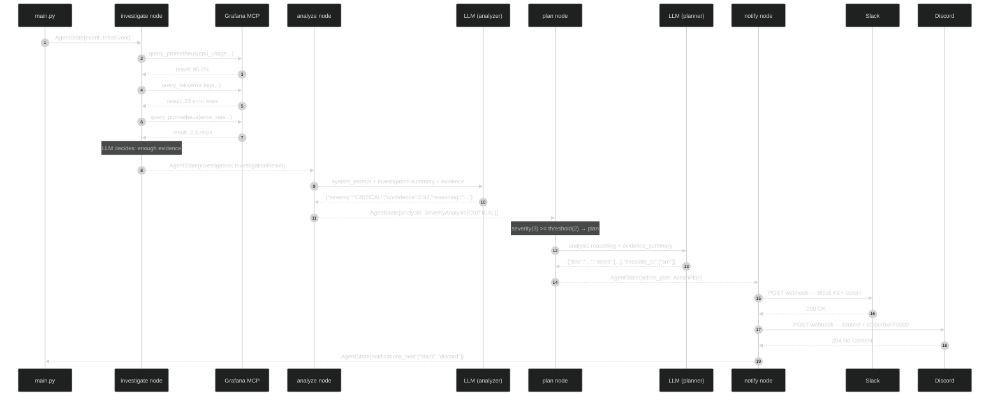

# The LangGraph Agent

> When the filter pipeline decides an event warrants investigation, it hands an `InfraEvent` to the LangGraph workflow. From here, all logic is orchestrated by a state graph compiled in `graph/workflow.py`.

## Table of Contents

- [The State Graph](#the-state-graph)
- [Node 1 — investigate](#node-1--investigate)
  - [MCP Connection](#mcp-connection)
  - [The System Prompt](#the-system-prompt)
  - [The ReAct Loop](#the-react-loop)
  - [Budget and Timeout](#budget-and-timeout)
  - [MCPQueryRecord](#mcpqueryrecord)
  - [Degraded Mode](#degraded-mode)
  - [Separate LLM Model](#separate-llm-model)
- [Node 2 — analyze](#node-2--analyze)
  - [The System Prompt](#the-system-prompt-1)
  - [Context Sent to the LLM](#context-sent-to-the-llm)
  - [Output and Fallback](#output-and-fallback)
- [Conditional Edge — \_should\_notify](#conditional-edge--_should_notify)
- [Node 3 — plan](#node-3--plan)
  - [The Planner System Prompt](#the-planner-system-prompt)
  - [ActionPlan and StepType](#actionplan-and-steptype)
- [Node 4 — notify](#node-4--notify)
  - [MCP Degradation Warning](#mcp-degradation-warning)
  - [Slack — Block Kit](#slack--block-kit)
  - [Discord — Embeds](#discord--embeds)
- [Complete Sequence — CRITICAL Event](#complete-sequence--critical-event)
- [Internal Metrics](#internal-metrics)
- [Agent Configuration](#agent-configuration)
- [Output Language (LANGUAGE)](#output-language-language)
- [Agent Failure Modes](#agent-failure-modes)

## The State Graph


### AgentState — the envelope that circulates through the graph

```python
# src/octantis/graph/state.py:8
class AgentState(TypedDict, total=False):
    event: InfraEvent              # input: from the pipeline
    investigation: InvestigationResult  # after investigate (MCP queries + evidence)
    analysis: SeverityAnalysis     # after analyze
    action_plan: ActionPlan | None # after plan (None if LOW/NOT_A_PROBLEM)
    notifications_sent: list[str]  # after notify
    error: str | None
```

Each node receives the full state and returns `{**state, new_key: value}` — no mutation, no side effects on previous state. The `total=False` means all fields are optional in the TypedDict, which avoids key errors when accessing fields not yet populated by earlier nodes.

---

## Node 1 — investigate

**File:** `src/octantis/graph/nodes/investigator.py`

The investigator node is the heart of Octantis. It implements a **ReAct loop** (Reason + Act) where the LLM receives MCP tools and autonomously decides which queries to execute to investigate the event.

### MCP Connection

The `MCPClientManager` (`src/octantis/mcp_client/manager.py:17`) manages SSE connections with two MCP servers:

| Server | Required | Image | Tools |
|---|---|---|---|
| **Grafana MCP** | Yes | `ghcr.io/vinny1892/mcp-grafana:latest` | PromQL queries, LogQL queries, dashboard search |
| **K8s MCP** | No (recommended) | `ghcr.io/containers/kubernetes-mcp-server:latest` | Pod status, events, deployments, node info |

The connection uses SSE (Server-Sent Events). Grafana MCP authenticates via Bearer token (Grafana service account). K8s MCP authenticates via Kubernetes ServiceAccount (in-cluster RBAC, no external credentials).

If K8s MCP is not configured, the system works normally with Grafana only. If Grafana MCP fails to connect, the server is marked as **degraded** and the system enters degraded mode (`manager.py:46-67`).

### The System Prompt

```python
# src/octantis/graph/nodes/investigator.py:28-63
INVESTIGATION_SYSTEM_PROMPT = """
You are an expert SRE/infrastructure analyst. You have access to observability
tools that can query metrics (PromQL) and logs (LogQL) from Grafana...

Common PromQL patterns:
- CPU: sum(rate(container_cpu_usage_seconds_total{namespace="X",pod=~"Y.*"}[5m])) * 100
- Memory: container_memory_working_set_bytes{namespace="X",pod=~"Y.*"}
- Error rate: sum(rate(http_requests_total{namespace="X",status=~"5.."}[5m]))
...
"""
```

The prompt instructs the LLM to act as an SRE, providing examples of common PromQL and LogQL queries to guide investigations.

### The ReAct Loop

```python
# src/octantis/graph/nodes/investigator.py:210-400
# Simplified pseudocode:
while query_count < max_queries:
    response = await acompletion(
        model=investigation_model,
        messages=messages,
        tools=tool_schemas,
    )

    if response has tool_calls:
        for tool_call in response.tool_calls:
            result = await execute_mcp_tool(tool_call)
            messages.append(tool_result)
            query_count += 1
    else:
        # LLM decided to stop — extract evidence_summary
        break
```

The LLM receives the trigger event context + available MCP tools and iteratively decides:
1. Which query to execute (PromQL, LogQL, or K8s resource)
2. Analyze the result
3. Decide whether it needs more data or has sufficient evidence

### Budget and Timeout

The investigator operates within configurable limits (`src/octantis/config.py:49-61`):

| Limit | Default | Config var |
|---|---|---|
| Max MCP queries | 10 | `INVESTIGATION_MAX_QUERIES` |
| Total timeout | 60s | `INVESTIGATION_TIMEOUT_SECONDS` |
| Per-query timeout | 10s | `INVESTIGATION_QUERY_TIMEOUT_SECONDS` |

When the budget is reached, the loop terminates and the `budget_exhausted=True` field is set on the `InvestigationResult` (`investigator.py:173`). The overall timeout uses `asyncio.timeout` wrapping the entire loop.

### MCPQueryRecord

Each query executed during investigation is recorded as an `MCPQueryRecord` (`models/event.py:54-62`):

```python
class MCPQueryRecord(BaseModel):
    tool_name: str          # e.g., "query_prometheus"
    query: str              # e.g., "sum(rate(...))"
    result_summary: str     # truncated result
    duration_ms: float      # query duration
    datasource: str         # "promql", "logql", or "k8s"
    error: str | None       # error if query failed
```

These records feed the `INVESTIGATION_QUERIES` and `MCP_QUERY_DURATION` metrics.

### Degraded Mode

When Grafana MCP is unavailable (`manager.is_degraded=True`), the investigator enters degraded mode (`investigator.py:143-162`):

1. The LLM analyzes **only the trigger event data** (raw metrics and logs)
2. The `mcp_degraded=True` field is set on the `InvestigationResult`
3. The notifier node includes a **degradation warning** in Slack/Discord messages
4. The `MCP_ERRORS` counter is incremented

The system **never stops** due to MCP unavailability — it degrades gracefully and warns operators.

### Separate LLM Model

The investigator can use a different model from the other nodes (`src/octantis/config.py:49-61`):

```env
LLM_MODEL=claude-sonnet-4-6                   # used by analyze and plan
LLM_INVESTIGATION_MODEL=claude-opus-4-6   # used by investigate (optional)
```

If `LLM_INVESTIGATION_MODEL` is not set, it falls back to `LLM_MODEL`. This allows using a more capable (and more expensive) model only for investigation, where reasoning quality directly impacts the queries executed.

---

## Node 2 — analyze

**File:** `src/octantis/graph/nodes/analyzer.py`

The most important node in the workflow in terms of decision-making. Receives the `InvestigationResult` and returns a `SeverityAnalysis` — the LLM's classification of what is happening.

### The System Prompt

```python
# src/octantis/graph/nodes/analyzer.py:14-40
SYSTEM_PROMPT = """\
You are Octantis, an expert SRE/infrastructure analyst.
...
Severity levels:
- CRITICAL: Requires immediate action. Service is down or severely degraded,
  data loss risk, or cascading failure likely.
- MODERATE: Requires attention soon. Degraded performance, elevated errors,
  or conditions trending toward critical.
- LOW: Worth knowing about but not urgent. Minor anomaly, self-resolving
  likely, or very limited blast radius.
- NOT_A_PROBLEM: False positive, expected behavior, or completely benign.
"""
```

The prompt instructs the LLM to go **beyond the threshold** — a 95% CPU can be NOT_A_PROBLEM if the service is a batch job that finishes in seconds. A 60% CPU can be CRITICAL if accompanied by P99 latency of 30s and pods being evicted.

### Context Sent to the LLM

The analyzer receives the full `InvestigationResult` (`analyzer.py:89-146`), including:

1. **`investigation.summary`** — structured text with event info, resource, metrics, logs
2. **`queries_executed`** — list of MCPQueryRecords with MCP query results
3. **`evidence_summary`** — text summary generated by the investigator

The LLM sees both the raw trigger data and all evidence collected by the MCP investigation, enabling a contextualized analysis.

### Output and Fallback

```python
# src/octantis/graph/nodes/analyzer.py:127-137
try:
    data = json.loads(raw_content)
    analysis = SeverityAnalysis(**data)
except Exception:
    # Fallback: treat as MODERATE so we don't silently drop issues
    analysis = SeverityAnalysis(
        severity=Severity.MODERATE,
        confidence=0.5,
        reasoning=f"Parse error, defaulting to MODERATE. Raw: {raw_content[:200]}",
    )
```

**Deliberate fail-safe:** parse errors become MODERATE, not LOW or drop. The decision is conservative — it is better to fire an unnecessary alert than to miss a real problem due to a parsing failure.

---

## Conditional Edge — _should_notify

```python
# src/octantis/graph/workflow.py:42-66
def _should_notify(state: AgentState) -> str:
    threshold = _NOTIFY_THRESHOLD.get(settings.min_severity_to_notify, Severity.MODERATE)
    severity_value = _SEVERITY_ORDER.get(analysis.severity, 0)
    threshold_value = _SEVERITY_ORDER.get(threshold, 2)

    if severity_value >= threshold_value:
        return "plan"
    else:
        return "end"
```

Severity is mapped to an integer for ordinal comparison (`workflow.py:27-32`):

```
NOT_A_PROBLEM=0  LOW=1  MODERATE=2  CRITICAL=3
```

`MIN_SEVERITY_TO_NOTIFY=MODERATE` (default) means MODERATE and CRITICAL go to `plan`, while LOW/NOT_A_PROBLEM end here (logged, not notified).

---

## Node 3 — plan

**File:** `src/octantis/graph/nodes/planner.py`

The planner is only invoked when the severity warrants human intervention. It receives the analysis and investigation evidence and generates a remediation plan that is **concrete and ordered by priority**.

### The Planner System Prompt

```python
# src/octantis/graph/nodes/planner.py:14-43
SYSTEM_PROMPT = """\
You are Octantis, an expert SRE with deep infrastructure knowledge.
...
Steps should be:
1. Immediately actionable (real kubectl/helm/shell commands where applicable)
2. Ordered by priority (most critical first)
3. Include expected outcomes and risks
"""
```

### ActionPlan and StepType

The output is validated by Pydantic as `ActionPlan` (`models/action_plan.py`). Each step has a `StepType` enum that communicates intent to the receiver:

| StepType | Meaning |
|---|---|
| `investigate` | Gather information before acting |
| `execute` | Run a command with side effects |
| `escalate` | Involve another person or team |
| `monitor` | Observe metrics for N minutes |
| `rollback` | Revert a recent change |

The planner safely coerces unknown types to `investigate` (`planner.py:112-114`), avoiding validation failures when the LLM invents a new type.

---

## Node 4 — notify

**File:** `src/octantis/graph/nodes/notifier.py`

The notifier node is fault-isolated: a Slack failure does not prevent sending to Discord and vice versa. Each notifier is instantiated and invoked within an independent try/except (`notifier.py:34-63`).

### MCP Degradation Warning

When `investigation.mcp_degraded=True`, the notifier adds a warning block to notifications (`notifier.py:25-31`):

> ⚠️ MCP servers were unavailable during this investigation. Analysis may be less accurate.

This ensures operators know the investigation was done only with trigger data, without MCP queries.

### Slack — Block Kit

Slack uses Block Kit with severity-colored attachments (`notifiers/slack.py:14-19`):

| Severity | Color | Emoji |
|---|---|---|
| CRITICAL | `#FF0000` (red) | 🔴 |
| MODERATE | `#FFA500` (orange) | 🟠 |
| LOW | `#FFFF00` (yellow) | 🟡 |
| NOT_A_PROBLEM | `#36a64f` (green) | 🟢 |

The message includes: header, service/namespace fields, analysis reasoning, affected components, **investigation queries count + duration**, action plan (up to 5 steps), escalation teams, and event_id footer.

Two sending modes: via **incoming webhook** (simple) or via **Bot API** with `chat.postMessage` (allows choosing the channel via `SLACK_CHANNEL`).

### Discord — Embeds

Discord uses the embeds API with integer color (`notifiers/discord.py`). The color is derived from the `Severity.discord_color` enum which converts hex to int (`models/analysis.py:28-30`). Includes a "Warning" field when MCP is degraded.

---

## Complete Sequence — CRITICAL Event



---

## Internal Metrics

The workflow instruments 9 Prometheus metrics exported on `:9090/metrics` (`src/octantis/metrics.py`):

| Metric | Type | Labels | Node |
|---|---|---|---|
| `octantis_investigation_duration_seconds` | Histogram | — | investigate |
| `octantis_investigation_queries_total` | Counter | `datasource` | investigate |
| `octantis_mcp_query_duration_seconds` | Histogram | `datasource` | investigate |
| `octantis_mcp_errors_total` | Counter | `error_type` | investigate |
| `octantis_trigger_total` | Counter | `outcome` | pipeline |
| `octantis_llm_tokens_input_total` | Counter | `node` | all |
| `octantis_llm_tokens_output_total` | Counter | `node` | all |
| `octantis_llm_tokens_total` | Counter | `node` | all |

Useful PromQL queries:

```promql
# Token cost per node in the last 5min
sum by (node) (rate(octantis_llm_tokens_total[5m]))

# MCP error rate
sum by (error_type) (rate(octantis_mcp_errors_total[5m]))

# Investigation P95 latency
histogram_quantile(0.95, rate(octantis_investigation_duration_seconds_bucket[5m]))
```

---

## Agent Configuration

```env
# LLM
LLM_PROVIDER=anthropic               # or openrouter, bedrock
LLM_MODEL=claude-sonnet-4-6
ANTHROPIC_API_KEY=sk-ant-...

# Investigation model (optional — default: LLM_MODEL)
# LLM_INVESTIGATION_MODEL=claude-opus-4-6

# For Bedrock (inference profiles):
# LLM_PROVIDER=bedrock
# LLM_MODEL=global.anthropic.claude-opus-4-6-v1
# AWS_REGION_NAME=us-east-1
# Credentials: env vars (AWS_ACCESS_KEY_ID/AWS_SECRET_ACCESS_KEY), IRSA, or instance profile

# Grafana MCP (required)
GRAFANA_MCP_URL=http://mcp-grafana:8080/sse
GRAFANA_MCP_API_KEY=glsa_...

# K8s MCP (optional, recommended)
# K8S_MCP_URL=http://mcp-k8s:8080/sse

# Investigation budget
INVESTIGATION_MAX_QUERIES=10
INVESTIGATION_TIMEOUT_SECONDS=60
INVESTIGATION_QUERY_TIMEOUT_SECONDS=10

# Minimum severity to notify
MIN_SEVERITY_TO_NOTIFY=MODERATE  # CRITICAL | MODERATE | LOW | NOT_A_PROBLEM

# Output language (analyses, plans, notifications)
LANGUAGE=en  # en | pt-br

# Slack
SLACK_WEBHOOK_URL=https://hooks.slack.com/services/...
# or, to use the API with dynamic channel:
SLACK_BOT_TOKEN=xoxb-...
SLACK_CHANNEL=#infra-alerts

# Discord
DISCORD_WEBHOOK_URL=https://discord.com/api/webhooks/...

# Metrics
METRICS_PORT=9090
METRICS_ENABLED=true
```

## Output Language (LANGUAGE)

Octantis supports generating text in English (`en`) or Brazilian Portuguese (`pt-br`) via the `LANGUAGE` environment variable. This affects all free-text fields generated by the LLM:

- **Investigator**: investigation summary (`evidence_summary`)
- **Analyzer**: `reasoning`, `similar_past_issues`
- **Planner**: `title`, `summary`, `description`, `expected_outcome`, `risk`
- **Notifications**: Slack and Discord receive text in the configured language

JSON keys (`severity`, `confidence`, `steps`, etc.) always remain in English to maintain compatibility with parsing and metrics.

```env
LANGUAGE=pt-br  # notifications and analyses in Portuguese
LANGUAGE=en     # default — everything in English
```

## Agent Failure Modes

| Situation | Behavior |
|---|---|
| Grafana MCP unavailable | Degraded mode: analyzes with trigger data only + warning in notifications |
| K8s MCP unavailable | Investigation continues with Grafana only — no warning (K8s is optional) |
| Query budget exhausted | Investigation ends with partial result, `budget_exhausted=True` |
| Investigation timeout | Partial result with queries executed up to that point |
| LLM returns invalid JSON (analyzer) | Fallback to `MODERATE, confidence=0.5` — never silently drops |
| LLM returns invalid JSON (planner) | ActionPlan with single step "Manual investigation required" |
| Slack returns HTTP error | Logged as `ERROR`, Discord still attempts |
| Discord returns HTTP error | Logged as `ERROR`, does not propagate |
