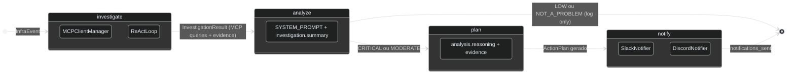
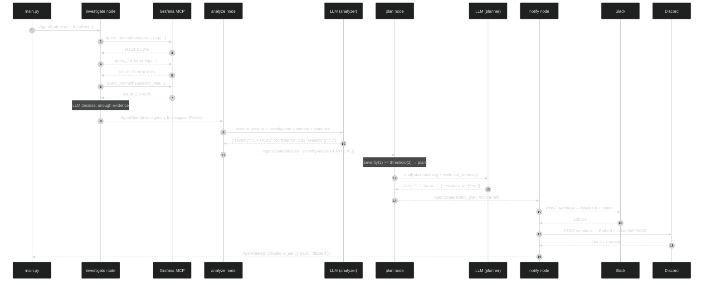

# O Agente LangGraph

> Quando o pipeline de filtragem decide que um evento merece investigação, ele entrega um `InfraEvent` ao workflow LangGraph. A partir daqui, toda a lógica é orquestrada por um grafo de estados compilado em `graph/workflow.py`.

## O Grafo de Estados



### AgentState — o envelope que circula pelo grafo

```python
# src/octantis/graph/state.py:8
class AgentState(TypedDict, total=False):
    event: InfraEvent              # input: vem do pipeline
    investigation: InvestigationResult  # após investigate (MCP queries + evidence)
    analysis: SeverityAnalysis     # após analyze
    action_plan: ActionPlan | None # após plan (None se LOW/NOT_A_PROBLEM)
    notifications_sent: list[str]  # após notify
    error: str | None
```

Cada nó recebe o state completo e retorna `{**state, chave_nova: valor}` — sem mutação, sem side effects no state anterior. O `total=False` significa que todos os campos são opcionais no TypedDict, o que evita erros de chave ao acessar campos ainda não populados por nós anteriores.

---

## Nó 1 — investigate

**Arquivo:** `src/octantis/graph/nodes/investigator.py`

O nó investigador é o coração do Octantis. Ele implementa um **ReAct loop** (Reason + Act) onde o LLM recebe ferramentas MCP e decide autonomamente quais queries executar para investigar o evento.

### Conexão MCP

O `MCPClientManager` (`src/octantis/mcp_client/manager.py:17`) gerencia conexões SSE com dois servidores MCP:

| Servidor | Obrigatório | Imagem | Ferramentas |
|---|---|---|---|
| **Grafana MCP** | Sim | `ghcr.io/vinny1892/mcp-grafana:latest` | PromQL queries, LogQL queries, dashboard search |
| **K8s MCP** | Não (recomendado) | `ghcr.io/containers/kubernetes-mcp-server:latest` | Pod status, events, deployments, node info |

A conexão usa SSE (Server-Sent Events). O Grafana MCP autentica via Bearer token (service account do Grafana). O K8s MCP autentica via ServiceAccount do Kubernetes (RBAC in-cluster, sem credenciais externas).

Se o K8s MCP não está configurado, o sistema funciona normalmente só com Grafana. Se o Grafana MCP falha na conexão, o servidor é marcado como **degraded** e o sistema entra em modo degradado (`manager.py:46-67`).

### O System Prompt

```python
# src/octantis/graph/nodes/investigator.py:28-63
INVESTIGATION_SYSTEM_PROMPT = """
You are an expert SRE/infrastructure analyst. You have access to observability
tools that can query metrics (PromQL) and logs (LogQL) from Grafana...

Common PromQL patterns:
- CPU: sum(rate(container_cpu_usage_seconds_total{namespace="X",pod=~"Y.*"}[5m])) * 100
- Memory: container_memory_working_set_bytes{namespace="X",pod=~"Y.*"}
- Error rate: sum(rate(http_requests_total{namespace="X",status=~"5.."}[5m]))
...
"""
```

O prompt instrui o LLM a agir como um SRE, fornecendo exemplos de queries PromQL e LogQL comuns para guiar as investigações.

### O ReAct Loop

```python
# src/octantis/graph/nodes/investigator.py:210-400
# Pseudocódigo simplificado:
while query_count < max_queries:
    response = await acompletion(
        model=investigation_model,
        messages=messages,
        tools=tool_schemas,
    )

    if response has tool_calls:
        for tool_call in response.tool_calls:
            result = await execute_mcp_tool(tool_call)
            messages.append(tool_result)
            query_count += 1
    else:
        # LLM decidiu parar — extrair evidence_summary
        break
```

O LLM recebe o contexto do trigger event + ferramentas MCP disponíveis e decide iterativamente:
1. Qual query executar (PromQL, LogQL, ou K8s resource)
2. Analisar o resultado
3. Decidir se precisa de mais dados ou se já tem evidência suficiente

### Budget e Timeout

O investigador opera dentro de limites configuráveis (`src/octantis/config.py:49-61`):

| Limite | Default | Config var |
|---|---|---|
| Máximo de queries MCP | 10 | `INVESTIGATION_MAX_QUERIES` |
| Timeout total | 60s | `INVESTIGATION_TIMEOUT_SECONDS` |
| Timeout por query | 10s | `INVESTIGATION_QUERY_TIMEOUT_SECONDS` |

Quando o budget é atingido, o loop termina e o campo `budget_exhausted=True` é setado no `InvestigationResult` (`investigator.py:173`). O timeout geral usa `asyncio.timeout` envolvendo todo o loop.

### MCPQueryRecord

Cada query executada durante a investigação é registrada como um `MCPQueryRecord` (`models/event.py:54-62`):

```python
class MCPQueryRecord(BaseModel):
    tool_name: str          # e.g., "query_prometheus"
    query: str              # e.g., "sum(rate(...))"
    result_summary: str     # truncated result
    duration_ms: float      # tempo da query
    datasource: str         # "promql", "logql", ou "k8s"
    error: str | None       # erro se a query falhou
```

Esses registros alimentam as métricas `INVESTIGATION_QUERIES` e `MCP_QUERY_DURATION`.

### Modo Degradado

Quando o Grafana MCP está indisponível (`manager.is_degraded=True`), o investigador entra em modo degradado (`investigator.py:143-162`):

1. O LLM analisa **apenas os dados do trigger event** (métricas e logs crus)
2. O campo `mcp_degraded=True` é setado no `InvestigationResult`
3. O nó notifier inclui um **warning de degradação** nas mensagens Slack/Discord
4. O counter `MCP_ERRORS` é incrementado

O sistema **nunca para** por falta de MCP — ele degrada graciosamente e avisa os operadores.

### Modelo LLM Separado

O investigador pode usar um modelo diferente dos outros nós (`src/octantis/config.py:49-61`):

```env
LLM_MODEL=claude-sonnet-4-6                   # usado por analyze e plan
LLM_INVESTIGATION_MODEL=claude-opus-4-6   # usado pelo investigate (opcional)
```

Se `LLM_INVESTIGATION_MODEL` não está configurado, usa `LLM_MODEL`. Isso permite usar um modelo mais capaz (e mais caro) apenas para a investigação, onde a qualidade do raciocínio impacta diretamente as queries executadas.

---

## Nó 2 — analyze

**Arquivo:** `src/octantis/graph/nodes/analyzer.py`

O nó mais importante do workflow em termos de decisão. Recebe o `InvestigationResult` e devolve um `SeverityAnalysis` — a classificação do LLM sobre o que está acontecendo.

### O System Prompt

```python
# src/octantis/graph/nodes/analyzer.py:14-40
SYSTEM_PROMPT = """\
You are Octantis, an expert SRE/infrastructure analyst.
...
Severity levels:
- CRITICAL: Requires immediate action. Service is down or severely degraded,
  data loss risk, or cascading failure likely.
- MODERATE: Requires attention soon. Degraded performance, elevated errors,
  or conditions trending toward critical.
- LOW: Worth knowing about but not urgent. Minor anomaly, self-resolving
  likely, or very limited blast radius.
- NOT_A_PROBLEM: False positive, expected behavior, or completely benign.
"""
```

O prompt instrui o LLM a ir **além do threshold** — um CPU de 95% pode ser NOT_A_PROBLEM se o serviço é um job de batch que termina em segundos. Um CPU de 60% pode ser CRITICAL se é acompanhado de latência P99 de 30s e pods sendo evicted.

### Contexto Enviado ao LLM

O analyzer recebe o `InvestigationResult` completo (`analyzer.py:89-146`), incluindo:

1. **`investigation.summary`** — texto estruturado com event info, resource, métricas, logs
2. **`queries_executed`** — lista de MCPQueryRecords com resultados das queries MCP
3. **`evidence_summary`** — resumo textual gerado pelo investigador

O LLM vê tanto os dados brutos do trigger quanto toda a evidência coletada pela investigação MCP, permitindo uma análise contextualizada.

### Output e Fallback

```python
# src/octantis/graph/nodes/analyzer.py:127-137
try:
    data = json.loads(raw_content)
    analysis = SeverityAnalysis(**data)
except Exception:
    # Fallback: treat as MODERATE so we don't silently drop issues
    analysis = SeverityAnalysis(
        severity=Severity.MODERATE,
        confidence=0.5,
        reasoning=f"Parse error, defaulting to MODERATE. Raw: {raw_content[:200]}",
    )
```

**Fail-safe deliberado:** parse error vira MODERATE, não LOW nem drop. A decisão é conservadora — é melhor disparar um alerta desnecessário do que perder um problema real por falha de parsing.

---

## Edge Condicional — _should_notify

```python
# src/octantis/graph/workflow.py:42-66
def _should_notify(state: AgentState) -> str:
    threshold = _NOTIFY_THRESHOLD.get(settings.min_severity_to_notify, Severity.MODERATE)
    severity_value = _SEVERITY_ORDER.get(analysis.severity, 0)
    threshold_value = _SEVERITY_ORDER.get(threshold, 2)

    if severity_value >= threshold_value:
        return "plan"
    else:
        return "end"
```

A severidade é mapeada para um inteiro para comparação ordinal (`workflow.py:27-32`):

```
NOT_A_PROBLEM=0  LOW=1  MODERATE=2  CRITICAL=3
```

`MIN_SEVERITY_TO_NOTIFY=MODERATE` (default) significa que MODERATE e CRITICAL vão para `plan`, e LOW/NOT_A_PROBLEM terminam aqui (logados, não notificados).

---

## Nó 3 — plan

**Arquivo:** `src/octantis/graph/nodes/planner.py`

O planner só é invocado quando a severidade justifica intervenção humana. Recebe a análise e a evidência da investigação e gera um plano de remediação **concreto e ordenado por prioridade**.

### O System Prompt do Planner

```python
# src/octantis/graph/nodes/planner.py:14-43
SYSTEM_PROMPT = """\
You are Octantis, an expert SRE with deep Kubernetes/EKS knowledge.
...
Steps should be:
1. Immediately actionable (real kubectl/helm/shell commands where applicable)
2. Ordered by priority (most critical first)
3. Include expected outcomes and risks
"""
```

### ActionPlan e StepType

O output é validado pelo Pydantic como `ActionPlan` (`models/action_plan.py`). Cada step tem um `StepType` enum que comunica a intenção ao receptor:

| StepType | Significado |
|---|---|
| `investigate` | Coletar informação antes de agir |
| `execute` | Executar um comando com efeito colateral |
| `escalate` | Acionar outra pessoa ou time |
| `monitor` | Observar métricas por N minutos |
| `rollback` | Reverter uma mudança recente |

O planner faz coerção segura de tipos desconhecidos para `investigate` (`planner.py:112-114`), evitando falha de validação quando o LLM inventa um tipo novo.

---

## Nó 4 — notify

**Arquivo:** `src/octantis/graph/nodes/notifier.py`

O nó notifier é fault-isolated: falha no Slack não impede envio ao Discord e vice-versa. Cada notifier é instanciado e invocado dentro de um try/except independente (`notifier.py:34-63`).

### Warning de Degradação MCP

Quando `investigation.mcp_degraded=True`, o notifier adiciona um bloco de warning nas notificações (`notifier.py:25-31`):

> ⚠️ MCP servers were unavailable during this investigation. Analysis may be less accurate.

Isso garante que os operadores saibam que a investigação foi feita apenas com dados do trigger, sem consultas MCP.

### Slack — Block Kit

O Slack usa Block Kit com attachment colorido por severidade (`notifiers/slack.py:14-19`):

| Severity | Cor | Emoji |
|---|---|---|
| CRITICAL | `#FF0000` (vermelho) | 🔴 |
| MODERATE | `#FFA500` (laranja) | 🟠 |
| LOW | `#FFFF00` (amarelo) | 🟡 |
| NOT_A_PROBLEM | `#36a64f` (verde) | 🟢 |

A mensagem inclui: header, service/namespace fields, analysis reasoning, affected components, **investigation queries count + duration**, action plan (até 5 steps), escalation teams, e event_id footer.

Dois modos de envio: via **incoming webhook** (simples) ou via **Bot API** com `chat.postMessage` (permite escolher o channel via `SLACK_CHANNEL`).

### Discord — Embeds

Discord usa a API de embeds com cor inteira (`notifiers/discord.py`). A cor é derivada do enum `Severity.discord_color` que converte hex para int (`models/analysis.py:28-30`). Inclui campo "Warning" quando MCP está degradado.

---

## Sequência Completa — Evento CRITICAL



---

## Métricas Internas

O workflow instrumenta 9 métricas Prometheus exportadas em `:9090/metrics` (`src/octantis/metrics.py`):

| Métrica | Tipo | Labels | Nó |
|---|---|---|---|
| `octantis_investigation_duration_seconds` | Histogram | — | investigate |
| `octantis_investigation_queries_total` | Counter | `datasource` | investigate |
| `octantis_mcp_query_duration_seconds` | Histogram | `datasource` | investigate |
| `octantis_mcp_errors_total` | Counter | `error_type` | investigate |
| `octantis_trigger_total` | Counter | `outcome` | pipeline |
| `octantis_llm_tokens_input_total` | Counter | `node` | all |
| `octantis_llm_tokens_output_total` | Counter | `node` | all |
| `octantis_llm_tokens_total` | Counter | `node` | all |

Queries PromQL úteis:

```promql
# Custo de tokens por nó nos últimos 5min
sum by (node) (rate(octantis_llm_tokens_total[5m]))

# Taxa de erros MCP
sum by (error_type) (rate(octantis_mcp_errors_total[5m]))

# Latência P95 de investigação
histogram_quantile(0.95, rate(octantis_investigation_duration_seconds_bucket[5m]))
```

---

## Configuração do Agente

```env
# LLM
LLM_PROVIDER=anthropic               # ou openrouter, bedrock
LLM_MODEL=claude-sonnet-4-6
ANTHROPIC_API_KEY=sk-ant-...

# Investigation model (opcional — default: LLM_MODEL)
# LLM_INVESTIGATION_MODEL=claude-opus-4-6

# Para Bedrock (inference profiles):
# LLM_PROVIDER=bedrock
# LLM_MODEL=global.anthropic.claude-opus-4-6-v1
# AWS_REGION_NAME=us-east-1
# Credenciais: env vars (AWS_ACCESS_KEY_ID/AWS_SECRET_ACCESS_KEY), IRSA, ou instance profile

# Grafana MCP (obrigatório)
GRAFANA_MCP_URL=http://mcp-grafana:8080/sse
GRAFANA_MCP_API_KEY=glsa_...

# K8s MCP (opcional, recomendado)
# K8S_MCP_URL=http://mcp-k8s:8080/sse

# Investigation budget
INVESTIGATION_MAX_QUERIES=10
INVESTIGATION_TIMEOUT_SECONDS=60
INVESTIGATION_QUERY_TIMEOUT_SECONDS=10

# Severidade mínima para notificar
MIN_SEVERITY_TO_NOTIFY=MODERATE  # CRITICAL | MODERATE | LOW | NOT_A_PROBLEM

# Idioma dos outputs (análises, planos, notificações)
LANGUAGE=en  # en | pt-br

# Slack
SLACK_WEBHOOK_URL=https://hooks.slack.com/services/...
# ou, para usar a API com channel dinâmico:
SLACK_BOT_TOKEN=xoxb-...
SLACK_CHANNEL=#infra-alerts

# Discord
DISCORD_WEBHOOK_URL=https://discord.com/api/webhooks/...

# Metrics
METRICS_PORT=9090
METRICS_ENABLED=true
```

## Idioma dos Outputs (LANGUAGE)

O Octantis suporta geração de textos em inglês (`en`) ou português brasileiro (`pt-br`) via variável de ambiente `LANGUAGE`. Isso afeta todos os campos de texto livre gerados pelo LLM:

- **Investigator**: resumo da investigação (`evidence_summary`)
- **Analyzer**: `reasoning`, `similar_past_issues`
- **Planner**: `title`, `summary`, `description`, `expected_outcome`, `risk`
- **Notificações**: Slack e Discord recebem os textos no idioma configurado

As chaves JSON (`severity`, `confidence`, `steps`, etc.) sempre permanecem em inglês para manter compatibilidade com parsing e métricas.

```env
LANGUAGE=pt-br  # notificações e análises em português
LANGUAGE=en     # default — tudo em inglês
```

## Modos de Falha do Agente

| Situação | Comportamento |
|---|---|
| Grafana MCP indisponível | Modo degradado: analisa com dados do trigger + warning nas notificações |
| K8s MCP indisponível | Investigação continua só com Grafana — sem warning (K8s é opcional) |
| Budget de queries esgotado | Investigação termina com resultado parcial, `budget_exhausted=True` |
| Timeout de investigação | Resultado parcial com queries executadas até o momento |
| LLM retorna JSON inválido (analyzer) | Fallback para `MODERATE, confidence=0.5` — nunca dropa silenciosamente |
| LLM retorna JSON inválido (planner) | ActionPlan com step único "Manual investigation required" |
| Slack retorna erro HTTP | Logado como `ERROR`, Discord ainda tenta |
| Discord retorna erro HTTP | Logado como `ERROR`, não propaga |
