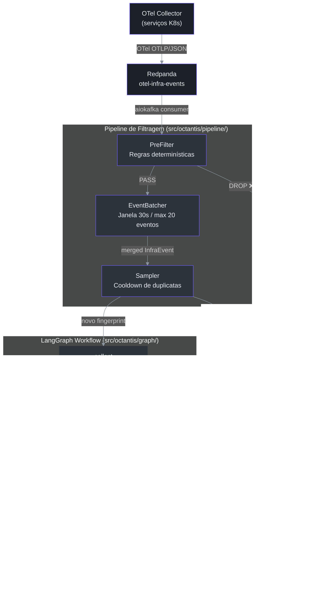
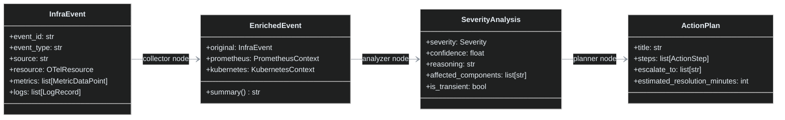

# Octantis — Visão Geral da Arquitetura

Octantis é um agente de IA que monitora infraestrutura EKS/Kubernetes de forma inteligente. Em vez de disparar alertas para todo threshold breachado, ele usa um LLM para avaliar o **impacto operacional real** — distinguindo um crash genuíno de um falso positivo de uma métrica ruidosa.

## O Problema que o Octantis Resolve

Sistemas de monitoramento tradicionais geram alertas baseados em thresholds simples:
- "CPU > 80% → alerta"
- "Restarts > 2 → alerta"

Isso resulta em **alert fatigue**: a equipe ignora os alertas porque 90% são ruído. O Octantis inverte a lógica — ao invés de alertar por threshold, ele analisa o **contexto completo** (métricas, logs, estado K8s, histórico Prometheus) e decide se o problema merece atenção humana.

## Fluxo de Dados Completo



## Componentes Principais

| Módulo | Responsabilidade | Arquivo chave |
|---|---|---|
| **Consumer** | Consome eventos do Redpanda e desserializa OTel JSON | `consumers/redpanda.py` |
| **Pipeline** | Decide o que vale o custo do LLM | `pipeline/` |
| **Collectors** | Enriquece o evento com contexto adicional | `collectors/` |
| **Graph** | Orquestra o workflow LangGraph | `graph/workflow.py` |
| **Notifiers** | Formata e envia Slack Block Kit / Discord Embeds | `notifiers/` |
| **Config** | Toda configuração via env vars | `config.py` |

## Estrutura de Diretórios

```
src/octantis/
├── main.py                  # Entrypoint — monta e executa o pipeline
├── config.py                # Pydantic BaseSettings (todas as configs via .env)
├── pipeline/
│   ├── prefilter.py         # ← Porta de entrada: regras determinísticas
│   ├── batcher.py           # ← Agrupamento temporal por workload
│   └── sampler.py           # ← Deduplicação por fingerprint + cooldown
├── consumers/
│   └── redpanda.py          # aiokafka consumer, parser OTel → InfraEvent
├── collectors/
│   ├── prometheus.py        # Queries PromQL para contexto
│   └── kubernetes.py        # Pod/Node/Deployment state via K8s API
├── graph/
│   ├── workflow.py          # StateGraph LangGraph
│   ├── state.py             # AgentState (TypedDict)
│   └── nodes/
│       ├── collector.py     # Nó: enriquecimento
│       ├── analyzer.py      # Nó: LLM classifica CRITICAL/MODERATE/LOW/NOT_A_PROBLEM
│       ├── planner.py       # Nó: LLM gera plano de remediação
│       └── notifier.py      # Nó: Slack + Discord
├── notifiers/
│   ├── slack.py             # Block Kit com cores por severidade
│   └── discord.py           # Embeds com cores por severidade
└── models/
    ├── event.py             # InfraEvent, EnrichedEvent, OTelResource
    ├── analysis.py          # SeverityAnalysis, Severity enum
    └── action_plan.py       # ActionPlan, ActionStep
```

## Modelos de Dados Centrais

O dado flui por três formas ao longo do pipeline:



## Configuração Rápida

```bash
cp .env.example .env
# Editar credenciais e URLs

uv sync
uv run octantis
```

Ver [Pipeline de Filtragem](./pipeline.md) para entender como os eventos são triados antes de chegar ao LLM.
