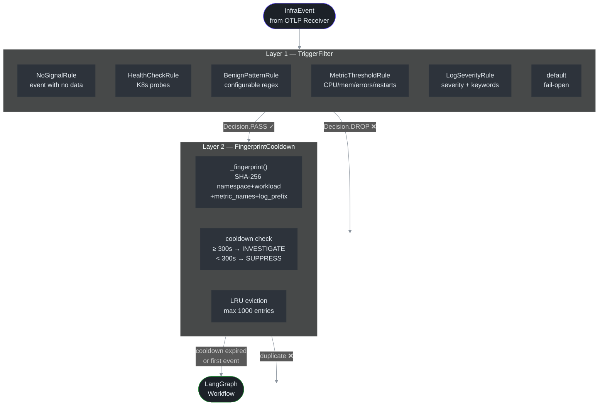

# Filter Pipeline

> **Why this doc exists:** Octantis's operational cost is proportional to the number of LLM calls. An active infrastructure environment emits hundreds of events per minute — the vast majority are health checks, normal-range metrics, and informational logs with no diagnostic value. The filter pipeline is the layer that absorbs this volume and delivers to the LLM **only the events that have a real chance of being a problem**.

## Table of Contents

- [The Two Layers](#the-two-layers)
- [Layer 1 — TriggerFilter](#layer-1--triggerfilter)
  - [Chain of Responsibility](#chain-of-responsibility)
  - [Rule 1 — NoSignalRule](#rule-1--nosignalrule)
  - [Rule 2 — HealthCheckRule](#rule-2--healthcheckrule)
  - [Rule 3 — BenignPatternRule](#rule-3--benignpatternrule)
  - [Rule 4 — MetricThresholdRule](#rule-4--metricthresholdrule)
  - [Rule 5 — LogSeverityRule](#rule-5--logseverityrule)
- [Layer 2 — FingerprintCooldown](#layer-2--fingerprintcooldown)
  - [Fingerprint Generation](#fingerprint-generation)
  - [Cooldown Logic](#cooldown-logic)
  - [LRU Eviction](#lru-eviction)
- [Configuration](#configuration)
  - [Configuration Trade-offs](#configuration-trade-offs)
- [How to Add a New Rule](#how-to-add-a-new-rule)
- [Pipeline Observability](#pipeline-observability)

## The Two Layers



The two layers are **composed sequentially** in `main.py:95-100` (`src/octantis/main.py:95`):

```python
# src/octantis/main.py:95
async for event in consumer.events():
    if not trigger_filter.should_investigate(event):   # Layer 1
        continue
    if not cooldown.should_investigate(event):          # Layer 2
        continue
    await workflow.ainvoke({"event": event})             # MCP Investigation
```

---

## Layer 1 — TriggerFilter

**File:** `src/octantis/pipeline/trigger_filter.py`

**Principle:** cheap, deterministic evaluation. No network calls, no I/O — just inspecting the `InfraEvent` in memory. The cost of an incorrect DROP is low (occasional false negative); the cost of an unnecessary PASS is an MCP investigation + LLM call.

### Chain of Responsibility

The `TriggerFilter` implements the *Chain of Responsibility* pattern (`trigger_filter.py:268-310`): rules are evaluated in order, and the **first match terminates the chain**. If no rule matches, the event passes by default (**fail-open** — `trigger_filter.py:302-307`).

The default order is built by `TriggerFilter.default()` (`trigger_filter.py:268-287`):

```
1. NoSignalRule
2. HealthCheckRule
3. BenignPatternRule
4. MetricThresholdRule
5. LogSeverityRule
```

Order matters: `NoSignalRule` first because it's the cheapest (checks if there are metrics or logs). `HealthCheckRule` next because it's the most frequent case. `LogSeverityRule` last because it needs to iterate over all logs.

### Rule 1 — NoSignalRule

**File:** `trigger_filter.py:238-250`

Drops events that arrive without metrics **and** without logs — signals without data have no diagnostic value. This can happen with traces-only or malformed events.

### Rule 2 — HealthCheckRule

```python
# src/octantis/pipeline/trigger_filter.py:52-59
_PROBE_PATTERNS = [
    re.compile(r"GET /health", re.IGNORECASE),
    re.compile(r"GET /healthz", re.IGNORECASE),
    re.compile(r"GET /readyz", re.IGNORECASE),
    re.compile(r"GET /livez", re.IGNORECASE),
    re.compile(r"GET /ping", re.IGNORECASE),
    re.compile(r"kube-probe/", re.IGNORECASE),
]
```

**Why it exists:** Health check probes (such as Kubernetes liveness/readiness probes) run every few seconds on each service. In an environment with 50 services probed every 10s, this generates ~300 events/min that are **100% noise** — the orchestrator already knows if the service is healthy. The rule checks the body of each `LogRecord` against these patterns and drops the event on the first match (`trigger_filter.py:60-68`).

**What the rule does NOT cover:** probes that return errors. A `GET /healthz` with status 500 in the log body would pass through `HealthCheckRule` without matching, reach `LogSeverityRule`, and be analyzed by the keyword `error`.

### Rule 3 — BenignPatternRule

**File:** `trigger_filter.py:207-234`

**Why it exists:** Each environment has its quirks — nightly backup jobs, Prometheus scrapers, specific exporters. Instead of hardcoding these cases, the rule accepts a configurable list of regexes via `PIPELINE_BENIGN_PATTERNS` in `.env`. The check runs against `source`, `event_type`, and log bodies (`trigger_filter.py:209-211`).

**Configuration:**
```env
PIPELINE_BENIGN_PATTERNS=nightly-batch,prometheus-scrape,fluent-bit-healthcheck
```

### Rule 4 — MetricThresholdRule

This is the most sophisticated rule in the filter. It operates in two modes:

#### Mode 1 — Metric name indicates a problem (ALWAYS_ANALYZE)

```python
# src/octantis/pipeline/trigger_filter.py:92-102
_ALWAYS_ANALYZE_NAMES: frozenset[str] = frozenset({
    "oomkill", "eviction", "failed", "error",
    "crash", "panic", "timeout",
})
```

If any metric in the event has one of these terms in its name, the event **always passes** regardless of value (`trigger_filter.py:104-113`). This catches cases like `container_oomkill_total=0` — zero OOM kills *now* but the counter was reset, which means something was restarted.

#### Mode 2 — Threshold by category

```python
# src/octantis/pipeline/trigger_filter.py:119
if "cpu" in name and m.value >= self.cpu_ok_below:      # ≥75%
    breached.append(...)
elif "memory" in name and m.value >= self.memory_ok_below:  # ≥80%
    breached.append(...)
elif "error" in name and m.value >= self.error_rate_ok_below:  # ≥0.01
    breached.append(...)
elif "restart" in name and m.value >= self.restart_count_ok_below:  # ≥3
    breached.append(...)
```

The DROP criterion requires that **all thresholds are within normal range simultaneously**. If a single metric breaches, the event passes (`trigger_filter.py:128-133`).

> **Example DROP:** event with `cpu_usage=50.0`, `memory_usage=60.0`, no errors, restarts=0 → all metrics healthy → `Decision.DROP`.
>
> **Example PASS:** same event but with `cpu_usage=50.0`, `memory_usage=82.0` → memory above threshold → `Decision.PASS`.

**If there are no metrics**, the rule returns `None` and defers to `LogSeverityRule` (`trigger_filter.py:101`).

### Rule 5 — LogSeverityRule

**File:** `trigger_filter.py:148-204`

The rule operates at two levels:

1. **Elevated severity** (`ERROR`, `FATAL`, `CRITICAL`, `WARN`, `WARNING`): passes immediately, without checking the content.
2. **Low severity** (`INFO`, `DEBUG`, `TRACE`, or absent): scans the body of all logs against four keyword groups (`trigger_filter.py:149-155`):

```
Group 1: error, exception, panic, fatal, critical, crash
Group 2: oom, killed, evicted, backoff, throttl
Group 3: timeout, connection refused, refused, unreachable
Group 4: failed, failure, cannot, unable to
```

If no log contains critical keywords and all are INFO/DEBUG, the event is dropped (`trigger_filter.py:186-190`). A log `"INFO: Server started on port 8080"` is silenced. A log `"INFO: connection refused to postgres"` passes.

---

## Layer 2 — FingerprintCooldown

**File:** `src/octantis/pipeline/cooldown.py`

**Problem it solves:** after filtering, a persistent problem (e.g., a pod in CrashLoopBackoff or a service repeatedly failing) would continue generating events indefinitely — and the LLM would investigate the same problem repeatedly. The cooldown suppresses fingerprints already investigated within a configurable window.

### Fingerprint Generation

```python
# src/octantis/pipeline/cooldown.py:21-40
def _fingerprint(event: InfraEvent) -> str:
    parts = [
        event.resource.k8s_namespace or "",
        event.resource.k8s_deployment_name
            or event.resource.k8s_pod_name
            or event.source,
        event.event_type,
        ",".join(sorted(m.name for m in event.metrics)),
    ]
    if event.logs:
        parts.append(event.logs[-1].body[:60])  # prefix of the most recent log

    raw = "|".join(parts)
    return hashlib.sha256(raw.encode()).hexdigest()[:16]
```

The fingerprint is **deliberately coarse** — it does not include metric *values*, only *names*. This ensures that `cpu_usage=82%` and `cpu_usage=95%` from the same workload generate the same fingerprint and are treated as the same ongoing problem.

The `[:60]` log prefix distinguishes different types of errors (`"OOMKilled: memory limit"` vs `"CrashLoopBackoff: back-off"`) without being sensitive to message variations that change per invocation.

**Intentional collision:** two different pods from the same Deployment in different namespaces have different fingerprints. Two different pods from the same Deployment in the same namespace have equal fingerprints — because they likely represent the same root cause.

### Cooldown Logic

```python
# src/octantis/pipeline/cooldown.py:69-106
def should_investigate(self, event: InfraEvent) -> bool:
    fp = _fingerprint(event)
    now = time.monotonic()
    entry = self._seen.get(fp)

    if entry is None:              # never seen → investigate
        self._record(fp, now)
        return True

    elapsed = now - entry.last_seen
    if elapsed >= self._cooldown:  # cooldown expired → reinvestigate
        self._record(fp, now)
        return True

    entry.count += 1               # within cooldown → suppress
    entry.last_seen = now          # update timestamp (sliding window)
    return False
```

The `last_seen` is updated even when the event is suppressed — this creates a **sliding window**: while the problem keeps arriving, the cooldown is renewed. When the problem stops, the cooldown expires naturally and the next occurrence triggers a new investigation.

### LRU Eviction

```python
# src/octantis/pipeline/cooldown.py:109-117
def _record(self, fp: str, now: float) -> None:
    if len(self._seen) >= self._max:
        oldest = min(self._seen, key=lambda k: self._seen[k].last_seen)
        del self._seen[oldest]
    self._seen[fp] = _Entry(last_seen=now)
```

When the fingerprint dict reaches `max_entries` (default: 1000), the entry with the oldest `last_seen` is removed. This means problems that stopped occurring are naturally forgotten and reintegrated into the investigation cycle when they return.

---

## Configuration

All pipeline settings are controlled via environment variables with the `PIPELINE_` prefix, mapped to `PipelineSettings` in `config.py:93-111` (`src/octantis/config.py:93`).

```env
# TriggerFilter thresholds
PIPELINE_CPU_THRESHOLD=75.0          # % — events with CPU ≥ this pass
PIPELINE_MEMORY_THRESHOLD=80.0       # % — events with memory ≥ this pass
PIPELINE_ERROR_RATE_THRESHOLD=0.01   # req/s

# Regexes for known benign sources/logs (always dropped)
PIPELINE_BENIGN_PATTERNS=nightly-batch,prometheus-scrape

# Cooldown
PIPELINE_COOLDOWN_SECONDS=300        # 5 minutes of suppression per fingerprint
PIPELINE_COOLDOWN_MAX_ENTRIES=1000   # max fingerprints in memory
```

### Configuration Trade-offs

| Parameter | Low value | High value |
|---|---|---|
| `CPU_THRESHOLD` | More MCP investigations, fewer false negatives | Fewer calls, risk of missing short spikes |
| `COOLDOWN_SECONDS` | Frequent reinvestigation, higher cost | Lower cost, risk of not detecting worsening |
| `COOLDOWN_MAX_ENTRIES` | Fingerprints expire faster (LRU), more reinvestigations | More memory, fingerprints retained longer |

---

## How to Add a New Rule

The system is extensible via the `Rule` protocol (`trigger_filter.py:33-38`):

```python
# src/octantis/pipeline/trigger_filter.py:33
class Rule(Protocol):
    name: str
    def evaluate(self, event: InfraEvent) -> FilterResult | None: ...
```

To add a custom rule:

**1. Implement the rule:**

```python
@dataclass
class NamespaceBlocklistRule:
    """Drop events from known-noisy namespaces."""
    name: str = "namespace_blocklist"
    blocked: frozenset[str] = frozenset({"ci", "cd", "staging-ephemeral"})

    def evaluate(self, event: InfraEvent) -> FilterResult | None:
        ns = event.resource.k8s_namespace or ""
        if ns in self.blocked:
            return FilterResult(
                decision=Decision.DROP,
                rule=self.name,
                reason=f"namespace '{ns}' is in blocklist",
            )
        return None
```

**2. Inject it into the chain:**

```python
# In main.py, when building the TriggerFilter:
trigger_filter = TriggerFilter(rules=[
    NoSignalRule(),
    HealthCheckRule(),
    NamespaceBlocklistRule(),  # new rule
    BenignPatternRule(patterns=cfg.benign_patterns_list),
    MetricThresholdRule(...),
    LogSeverityRule(),
])
```

The rule only needs to implement `evaluate()` returning `FilterResult | None`. Returning `None` means "I have no opinion, let the next one decide".

---

## Pipeline Observability

The pipeline instruments the `TRIGGER_TOTAL` counter with an `outcome` label (`src/octantis/metrics.py:31-35`):

| Label `outcome` | Meaning |
|---|---|
| `passed` | Event passed through TriggerFilter + Cooldown and was investigated |
| `dropped` | Event dropped by TriggerFilter |
| `cooldown` | Event suppressed by FingerprintCooldown |

Each layer also emits structured logs:

| Log event | Layer | What it indicates |
|---|---|---|
| `trigger.rule_matched` (level=DEBUG) | TriggerFilter | Each decision with rule + reason |
| `cooldown.first_seen` (level=DEBUG) | Cooldown | First event for a fingerprint |
| `cooldown.suppressed` (level=INFO) | Cooldown | Event suppressed with `suppressed_count` |
| `cooldown.expired` (level=DEBUG) | Cooldown | Reanalysis after cooldown expired |

A useful PromQL query to monitor pipeline efficiency:

```promql
# Drop vs pass rate in the last 5 minutes
sum by (outcome) (rate(octantis_trigger_total[5m]))
```
