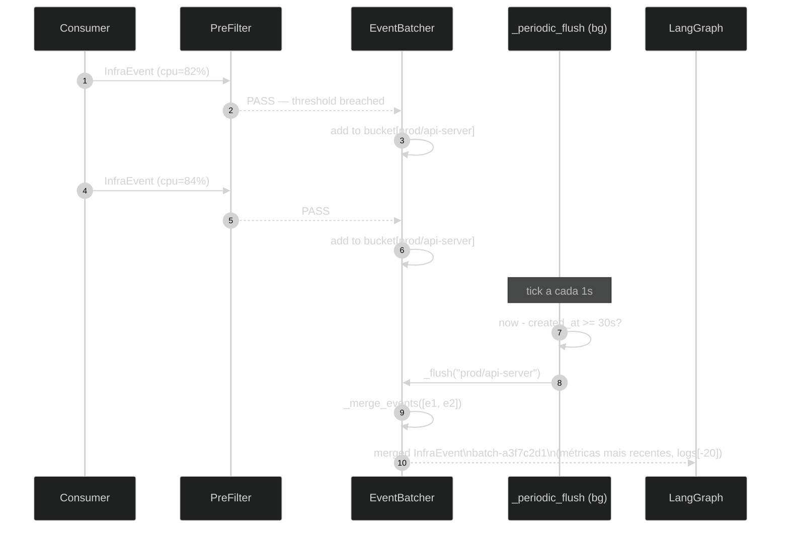

# Pipeline de Filtragem

> **Por que esse doc existe:** O custo operacional do Octantis é proporcional ao número de chamadas ao LLM. Um cluster EKS ativo emite centenas de eventos por minuto — a esmagadora maioria são health checks, métricas dentro do normal, e logs informativos sem valor diagnóstico. O pipeline de filtragem é a camada que absorve esse volume e entrega ao LLM **apenas os eventos que têm chance real de ser um problema**.

## As Três Camadas

```mermaid
%%{init: {"theme": "dark", "themeVariables": {"primaryColor": "#2d333b", "primaryBorderColor": "#6d5dfc", "primaryTextColor": "#e6edf3", "lineColor": "#8b949e", "secondaryColor": "#161b22"}}}%%
flowchart LR
    IN(["InfraEvent\ndo Redpanda"]):::input

    subgraph L1["Camada 1 — PreFilter"]
        direction TB
        HC["HealthCheckRule\nprobes K8s"]:::rule
        BP["BenignPatternRule\nregex configurável"]:::rule
        ETA["EventTypeAllowlistRule\nwhitelist de tipos"]:::rule
        MT["MetricThresholdRule\nCPU/mem/errors/restarts"]:::rule
        LS["LogSeverityRule\nseveridade + keywords"]:::rule
        DF["default\nfail-open"]:::rule
    end

    subgraph L2["Camada 2 — EventBatcher"]
        BK["_batch_key()\nnamespace/workload"]:::fn
        BU["_Bucket\nevents + created_at"]:::fn
        MG["_merge_events()\nmétricas mais recentes\nlogs[-20:]"]:::fn
    end

    subgraph L3["Camada 3 — Sampler"]
        FP["_fingerprint()\nSHA-256 namespace+workload\n+metric_names+log_prefix"]:::fn
        CD["cooldown check\n≥ 300s → ANALYZE\n< 300s → SUPPRESS"]:::fn
        LRU["LRU eviction\nmax 1000 entradas"]:::fn
    end

    LLM(["LangGraph\nWorkflow"]):::output

    IN --> L1
    L1 -->|"Decision.DROP ❌"| SINK1[" "]:::void
    L1 -->|"Decision.PASS ✓"| L2
    L2 -->|"window 30s\nou max 20 eventos"| L3
    L3 -->|"cooldown expirado\nou primeiro evento"| LLM
    L3 -->|"duplicata ❌"| SINK2[" "]:::void

    classDef input fill:#1c2128,stroke:#6d5dfc,color:#e6edf3
    classDef rule fill:#2d333b,stroke:#30363d,color:#e6edf3
    classDef fn fill:#2d333b,stroke:#30363d,color:#e6edf3
    classDef output fill:#1c2128,stroke:#238636,color:#e6edf3
    classDef void fill:none,stroke:none
```



As três camadas são **compostas sequencialmente** em `main.py:94-108`:

```python
# src/octantis/main.py:94
async def _filtered_stream():
    async for event in consumer.events():
        if pre_filter.should_analyze(event):   # Camada 1
            yield event

async for batch in batcher.run(_filtered_stream()):  # Camada 2
    if not sampler.should_analyze(batch):             # Camada 3
        continue
    await workflow.ainvoke({"event": batch})          # LLM
```

---

## Camada 1 — PreFilter

**Arquivo:** `src/octantis/pipeline/prefilter.py`

**Princípio:** avaliação barata e determinística. Nenhuma chamada de rede, nenhuma I/O — só inspeção do `InfraEvent` em memória. O custo de uma decisão errada de DROP é baixo (falso negativo ocasional); o custo de um PASS desnecessário é uma chamada ao LLM.

### Chain of Responsibility

O `PreFilter` implementa o padrão *Chain of Responsibility* (`prefilter.py:252-311`): regras são avaliadas em ordem, e o **primeiro match encerra a cadeia**. Se nenhuma regra bater, o evento passa por default (**fail-open** — `prefilter.py:303-307`).

A ordem padrão é construída por `PreFilter.default()` (`prefilter.py:263-288`):

```
1. HealthCheckRule
2. BenignPatternRule
3. EventTypeAllowlistRule
4. MetricThresholdRule
5. LogSeverityRule
```

A ordem importa: `HealthCheckRule` primeiro porque é o caso mais frequente e mais barato de checar. `LogSeverityRule` por último porque precisa iterar sobre todos os logs.

### Regra 1 — HealthCheckRule

```python
# src/octantis/pipeline/prefilter.py:44
_PROBE_PATTERNS = [
    re.compile(r"GET /health", re.IGNORECASE),
    re.compile(r"GET /healthz", re.IGNORECASE),
    re.compile(r"GET /readyz", re.IGNORECASE),
    re.compile(r"GET /livez", re.IGNORECASE),
    re.compile(r"GET /ping", re.IGNORECASE),
    re.compile(r"kube-probe/", re.IGNORECASE),
]
```

**Por que existe:** O kubelet executa liveness e readiness probes a cada poucos segundos em cada pod. Em um cluster de 50 pods com probe a cada 10s, isso gera ~300 eventos/min que são **100% ruído** — o Kubernetes já sabe se o pod está saudável. A regra verifica o corpo de cada `LogRecord` contra esses padrões e dropa o evento na primeira correspondência (`prefilter.py:60-68`).

**O que a regra NÃO cobre:** probes que retornam erro. Um `GET /healthz` com status 500 no corpo do log passaria pela `HealthCheckRule` sem match, chegaria na `LogSeverityRule`, e seria analisado pelo keyword `error`.

### Regra 2 — BenignPatternRule

```python
# src/octantis/pipeline/prefilter.py:195
@dataclass
class BenignPatternRule:
    patterns: list[str] = field(default_factory=list)

    def evaluate(self, event: InfraEvent) -> FilterResult | None:
        candidates = [event.source, event.event_type]
        for record in event.logs:
            candidates.append(record.body)
```

**Por que existe:** Cada ambiente tem suas peculiaridades — jobs noturnos de backup, scrapers de Prometheus, exporters específicos. Ao invés de hardcodar esses casos, a regra aceita uma lista de regexes configurável via `PIPELINE_BENIGN_PATTERNS` no `.env`. A checagem ocorre no `source`, `event_type`, e corpo dos logs (`prefilter.py:209-211`).

**Configuração:**
```env
PIPELINE_BENIGN_PATTERNS=nightly-batch,prometheus-scrape,fluent-bit-healthcheck
```

### Regra 3 — EventTypeAllowlistRule

Opera como whitelist de `event.event_type` (e.g. `"metric"`, `"log"`, `"alert"`). Se a lista estiver vazia, a regra retorna `None` e defere para a próxima — ou seja, **noop por padrão** (`prefilter.py:235`). Útil para ambientes onde apenas alertas do Alertmanager devem ser analisados, ignorando métricas brutas.

### Regra 4 — MetricThresholdRule

Esta é a regra mais sofisticada do pré-filtro. Ela opera em dois modos:

#### Modo 1 — Nome da métrica indica problema (ALWAYS_ANALYZE)

```python
# src/octantis/pipeline/prefilter.py:90
_ALWAYS_ANALYZE_NAMES: frozenset[str] = frozenset({
    "oomkill", "eviction", "failed", "error",
    "crash", "panic", "timeout",
})
```

Se qualquer métrica no evento tem um desses termos no nome, o evento **sempre passa** independente do valor (`prefilter.py:104-113`). Isso captura casos como `container_oomkill_total=0` — zero OOM kills *agora* mas o contador zerou, o que significa que algo foi reiniciado.

#### Modo 2 — Threshold por categoria

```python
# src/octantis/pipeline/prefilter.py:119
if "cpu" in name and m.value >= self.cpu_ok_below:      # ≥75%
    breached.append(...)
elif "memory" in name and m.value >= self.memory_ok_below:  # ≥80%
    breached.append(...)
elif "error" in name and m.value >= self.error_rate_ok_below:  # ≥0.01
    breached.append(...)
elif "restart" in name and m.value >= self.restart_count_ok_below:  # ≥3
    breached.append(...)
```

O critério de DROP exige que **todos os thresholds estejam dentro do normal ao mesmo tempo**. Se uma única métrica bater, o evento passa (`prefilter.py:128-133`).

> **Exemplo de DROP:** evento com `cpu_usage=50.0`, `memory_usage=60.0`, sem erros, restarts=0 → todas as métricas saudáveis → `Decision.DROP`.
>
> **Exemplo de PASS:** mesmo evento mas com `cpu_usage=50.0`, `memory_usage=82.0` → memória acima do threshold → `Decision.PASS`.

**Se não há métricas**, a regra retorna `None` e defere para a `LogSeverityRule` (`prefilter.py:101`).

### Regra 5 — LogSeverityRule

```python
# src/octantis/pipeline/prefilter.py:169
sev = (record.severity_text or "").upper()
if sev in {"ERROR", "FATAL", "CRITICAL", "WARN", "WARNING"}:
    return FilterResult(decision=Decision.PASS, ...)
```

A regra opera em dois níveis:

1. **Severidade elevada** (`ERROR`, `FATAL`, `CRITICAL`, `WARN`): passa imediatamente, sem verificar o conteúdo.
2. **Severidade baixa** (`INFO`, `DEBUG`, `TRACE`, ou ausente): varre o corpo de todos os logs contra quatro grupos de keywords (`prefilter.py:149-155`):

```
Grupo 1: error, exception, panic, fatal, critical, crash
Grupo 2: oom, killed, evicted, backoff, throttl
Grupo 3: timeout, connection refused, refused, unreachable
Grupo 4: failed, failure, cannot, unable to
```

Se nenhum log contém keywords críticas e todos são INFO/DEBUG, o evento é dropado (`prefilter.py:186-190`). Um log `"INFO: Server started on port 8080"` é silenciado. Um log `"INFO: connection refused to postgres"` passa.

---

## Camada 2 — EventBatcher

**Arquivo:** `src/octantis/pipeline/batcher.py`

**Problema que resolve:** depois do pré-filtro, um pod com CPU alta pode emitir um evento a cada 15 segundos. Mandar cada evento individualmente ao LLM é redundante — a análise seria idêntica. O batcher agrupa eventos do mesmo workload em uma janela temporal e envia **um único evento enriquecido** com a visão consolidada.

### Chave de Agrupamento

```python
# src/octantis/pipeline/batcher.py:24
def _batch_key(event: InfraEvent) -> str:
    ns = event.resource.k8s_namespace or "global"
    workload = (
        event.resource.k8s_deployment_name   # preferência 1
        or event.resource.k8s_pod_name        # preferência 2
        or event.resource.service_name        # preferência 3
        or event.source                       # fallback
    )
    return f"{ns}/{workload}"
```

A chave é `namespace/workload` — dois eventos do mesmo Deployment em namespaces diferentes geram buckets separados. A prioridade do workload identifier é intencional: Deployment agrupa pods do mesmo ReplicaSet, evitando que pods individuais gerem análises separadas para a mesma causa raiz.

### Merge de Eventos

```python
# src/octantis/pipeline/batcher.py:51
for m in e.metrics:
    if m.name not in seen_metrics:
        merged_metrics.append(m)
        seen_metrics.add(m.name)
    else:
        # Replace with newer value (events are appended chronologically)
        for i, existing in enumerate(merged_metrics):
            if existing.name == m.name:
                merged_metrics[i] = m
                break

# src/octantis/pipeline/batcher.py:65
merged_logs = merged_logs[-20:]
```

**Métricas:** para cada nome de métrica, mantém apenas o valor mais recente (os eventos são processados cronologicamente, então a última ocorrência é a mais atual).

**Logs:** concatena todos os logs do batch e mantém os **últimos 20** (`merged_logs[-20:]`). O LLM recebe os eventos mais recentes, que geralmente têm mais relevância diagnóstica, sem o risco de prompts gigantes.

### Triggers de Flush

O batcher mantém um background task (`_periodic_flush`) que verifica buckets stale a cada segundo (`batcher.py:101-112`). Um bucket é flushed quando:

| Trigger | Código | Quando |
|---|---|---|
| **Janela temporal** | `batcher.py:106-112` | `now - bucket.created_at >= window_seconds` (default: 30s) |
| **Tamanho máximo** | `batcher.py:134-136` | `len(bucket.events) >= max_batch_size` (default: 20) |
| **Shutdown** | `batcher.py:152-155` | SIGTERM/SIGINT — flush de tudo que está pendente |



---

## Camada 3 — Sampler

**Arquivo:** `src/octantis/pipeline/sampler.py`

**Problema que resolve:** após o batcher, um problema persistente (ex: pod em CrashLoopBackoff) continuaria gerando batches a cada 30s indefinidamente — e o LLM analisaria o mesmo problema repetidamente. O sampler suprime fingerprints já analisados dentro de um janela de cooldown.

### Geração de Fingerprint

```python
# src/octantis/pipeline/sampler.py:22
def _fingerprint(event: InfraEvent) -> str:
    parts = [
        event.resource.k8s_namespace or "",
        event.resource.k8s_deployment_name
            or event.resource.k8s_pod_name
            or event.source,
        event.event_type,
        ",".join(sorted(m.name for m in event.metrics)),
    ]
    if event.logs:
        parts.append(event.logs[-1].body[:60])  # prefixo do log mais recente

    raw = "|".join(parts)
    return hashlib.sha256(raw.encode()).hexdigest()[:16]
```

O fingerprint é **deliberadamente grosseiro** — não inclui os *valores* das métricas, apenas os *nomes*. Isso garante que `cpu_usage=82%` e `cpu_usage=95%` do mesmo pod gerem o mesmo fingerprint e sejam tratados como o mesmo problema em andamento.

O prefixo `[:60]` do log serve para distinguir tipos diferentes de erro (`"OOMKilled: memory limit"` vs `"CrashLoopBackoff: back-off"`) sem ser sensível a variações de mensagem que mudam por invocação.

**Colisão proposital:** dois pods diferentes do mesmo Deployment em namespaces diferentes têm fingerprints diferentes. Dois pods diferentes do mesmo Deployment no mesmo namespace têm fingerprints iguais — porque provavelmente representam a mesma causa raiz.

### Lógica de Cooldown

```python
# src/octantis/pipeline/sampler.py:68
def should_analyze(self, event: InfraEvent) -> bool:
    fp = _fingerprint(event)
    now = time.monotonic()
    entry = self._seen.get(fp)

    if entry is None:              # nunca visto → analisa
        self._record(fp, now)
        return True

    elapsed = now - entry.last_seen
    if elapsed >= self._cooldown:  # cooldown expirou → reanálise
        self._record(fp, now)
        return True

    entry.count += 1               # dentro do cooldown → suprime
    entry.last_seen = now          # atualiza timestamp (sliding window)
    return False
```

O `last_seen` é atualizado mesmo quando o evento é suprimido — isso cria uma **sliding window**: enquanto o problema continua chegando, o cooldown é renovado. Quando o problema para, o cooldown expira naturalmente e a próxima ocorrência dispara uma nova análise.

O log de supressão inclui `suppressed_count` (`sampler.py:98`), que mostra quantas ocorrências foram silenciadas — útil para estimar a frequência do problema durante o cooldown.

### Evição LRU

```python
# src/octantis/pipeline/sampler.py:102
def _record(self, fp: str, now: float) -> None:
    if len(self._seen) >= self._max:
        oldest = min(self._seen, key=lambda k: self._seen[k].last_seen)
        del self._seen[oldest]
    self._seen[fp] = _Entry(last_seen=now)
```

Quando o dict de fingerprints atinge `max_entries` (default: 1000), o entry com o `last_seen` mais antigo é removido. Isso significa que problemas que pararam de ocorrer são naturalmente esquecidos e reintegrados ao ciclo de análise quando voltam.

---

## Configuração

Todas as configurações do pipeline são controladas via variáveis de ambiente com prefixo `PIPELINE_`, mapeadas para `PipelineSettings` em `config.py:78-106`.

```env
# Thresholds do PreFilter
PIPELINE_CPU_THRESHOLD=75.0          # % — eventos com CPU ≥ isso passam
PIPELINE_MEMORY_THRESHOLD=80.0       # % — eventos com memória ≥ isso passam
PIPELINE_ERROR_RATE_THRESHOLD=0.01   # req/s

# Regexes de fontes/logs conhecidos como benignos (sempre dropados)
PIPELINE_BENIGN_PATTERNS=nightly-batch,prometheus-scrape

# Whitelist de event_type (vazio = todos passam)
PIPELINE_ALLOWED_EVENT_TYPES=

# Batcher
PIPELINE_BATCH_WINDOW_SECONDS=30.0   # segundos até flush automático
PIPELINE_BATCH_MAX_SIZE=20           # flush imediato se atingir esse limite

# Sampler
PIPELINE_SAMPLER_COOLDOWN_SECONDS=300  # 5 minutos de supressão por fingerprint
PIPELINE_SAMPLER_MAX_ENTRIES=1000      # máximo de fingerprints em memória
```

### Trade-offs de Configuração

| Parâmetro | Valor baixo | Valor alto |
|---|---|---|
| `CPU_THRESHOLD` | Mais chamadas ao LLM, menos falsos negativos | Menos chamadas, risk de perder picos curtos |
| `BATCH_WINDOW_SECONDS` | Análise mais rápida, mais chamadas | Mais contexto por análise, latência maior |
| `SAMPLER_COOLDOWN_SECONDS` | Reanálise frequente, mais custo | Menos custo, risk de não detectar agravamento |

---

## Como Adicionar uma Nova Regra

O sistema é extensível via o protocolo `Rule` (`prefilter.py:33-38`):

```python
# src/octantis/pipeline/prefilter.py:33
class Rule(Protocol):
    name: str
    def evaluate(self, event: InfraEvent) -> FilterResult | None: ...
```

Para adicionar uma regra customizada:

**1. Implemente a regra:**

```python
@dataclass
class HighRestartRatioRule:
    """Drop events where restart count hasn't changed since last seen."""
    name: str = "high_restart_ratio"
    threshold: int = 10

    def evaluate(self, event: InfraEvent) -> FilterResult | None:
        for m in event.metrics:
            if "restart" in m.name.lower() and m.value >= self.threshold:
                return FilterResult(
                    decision=Decision.PASS,
                    rule=self.name,
                    reason=f"restart count critical: {m.value}",
                )
        return None
```

**2. Injete-a na chain:**

```python
# Em main.py, ao construir o PreFilter:
pre_filter = PreFilter(rules=[
    HealthCheckRule(),
    HighRestartRatioRule(threshold=10),  # nova regra
    BenignPatternRule(patterns=cfg.benign_patterns_list),
    MetricThresholdRule(...),
    LogSeverityRule(),
])
```

A regra só precisa implementar `evaluate()` retornando `FilterResult | None`. Retornar `None` significa "não tenho opinião, deixa a próxima decidir".

---

## Observabilidade do Pipeline

Cada camada emite logs estruturados que permitem monitorar a taxa de filtragem:

| Evento de log | Camada | O que indica |
|---|---|---|
| `prefilter.rule_matched` (level=DEBUG) | PreFilter | Cada decisão com regra + motivo |
| `batcher.flush` (level=INFO) | Batcher | Flush de bucket com `batch_size` e `key` |
| `batcher.max_size_reached` (level=DEBUG) | Batcher | Flush antecipado por volume |
| `sampler.suppressed` (level=INFO) | Sampler | Evento suprimido com `cooldown_remaining_s` e `suppressed_count` |
| `sampler.cooldown_expired` (level=DEBUG) | Sampler | Reanálise de problema em andamento |
| `octantis.batch.invoking_llm` (level=INFO) | main | Evento que chegou ao LLM com contagem de métricas/logs |

Uma query Loki útil para monitorar a eficiência do pipeline:

```logql
{app="octantis"}
| json
| line_format "{{.event}} rule={{.rule}} decision={{.decision}}"
| __error__=""
```
