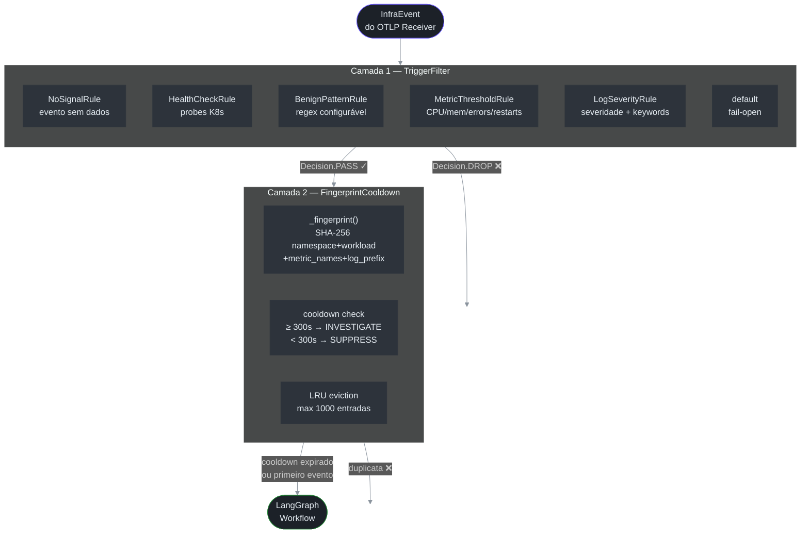

# Pipeline de Filtragem

> **Por que esse doc existe:** O custo operacional do Octantis é proporcional ao número de chamadas ao LLM. Um cluster EKS ativo emite centenas de eventos por minuto — a esmagadora maioria são health checks, métricas dentro do normal, e logs informativos sem valor diagnóstico. O pipeline de filtragem é a camada que absorve esse volume e entrega ao LLM **apenas os eventos que têm chance real de ser um problema**.

## As Duas Camadas



As duas camadas são **compostas sequencialmente** em `main.py:95-100` (`src/octantis/main.py:95`):

```python
# src/octantis/main.py:95
async for event in consumer.events():
    if not trigger_filter.should_investigate(event):   # Camada 1
        continue
    if not cooldown.should_investigate(event):          # Camada 2
        continue
    await workflow.ainvoke({"event": event})             # MCP Investigation
```

---

## Camada 1 — TriggerFilter

**Arquivo:** `src/octantis/pipeline/trigger_filter.py`

**Princípio:** avaliação barata e determinística. Nenhuma chamada de rede, nenhuma I/O — só inspeção do `InfraEvent` em memória. O custo de uma decisão errada de DROP é baixo (falso negativo ocasional); o custo de um PASS desnecessário é uma investigação MCP + chamada ao LLM.

### Chain of Responsibility

O `TriggerFilter` implementa o padrão *Chain of Responsibility* (`trigger_filter.py:268-310`): regras são avaliadas em ordem, e o **primeiro match encerra a cadeia**. Se nenhuma regra bater, o evento passa por default (**fail-open** — `trigger_filter.py:302-307`).

A ordem padrão é construída por `TriggerFilter.default()` (`trigger_filter.py:268-287`):

```
1. NoSignalRule
2. HealthCheckRule
3. BenignPatternRule
4. MetricThresholdRule
5. LogSeverityRule
```

A ordem importa: `NoSignalRule` primeiro porque é o mais barato (checa se há métricas ou logs). `HealthCheckRule` em seguida porque é o caso mais frequente. `LogSeverityRule` por último porque precisa iterar sobre todos os logs.

### Regra 1 — NoSignalRule

**Arquivo:** `trigger_filter.py:238-250`

Dropa eventos que chegam sem métricas **e** sem logs — sinais sem dados não têm valor diagnóstico. Isso pode acontecer com traces-only ou eventos malformados.

### Regra 2 — HealthCheckRule

```python
# src/octantis/pipeline/trigger_filter.py:52-59
_PROBE_PATTERNS = [
    re.compile(r"GET /health", re.IGNORECASE),
    re.compile(r"GET /healthz", re.IGNORECASE),
    re.compile(r"GET /readyz", re.IGNORECASE),
    re.compile(r"GET /livez", re.IGNORECASE),
    re.compile(r"GET /ping", re.IGNORECASE),
    re.compile(r"kube-probe/", re.IGNORECASE),
]
```

**Por que existe:** O kubelet executa liveness e readiness probes a cada poucos segundos em cada pod. Em um cluster de 50 pods com probe a cada 10s, isso gera ~300 eventos/min que são **100% ruído** — o Kubernetes já sabe se o pod está saudável. A regra verifica o corpo de cada `LogRecord` contra esses padrões e dropa o evento na primeira correspondência (`trigger_filter.py:60-68`).

**O que a regra NÃO cobre:** probes que retornam erro. Um `GET /healthz` com status 500 no corpo do log passaria pela `HealthCheckRule` sem match, chegaria na `LogSeverityRule`, e seria analisado pelo keyword `error`.

### Regra 3 — BenignPatternRule

**Arquivo:** `trigger_filter.py:207-234`

**Por que existe:** Cada ambiente tem suas peculiaridades — jobs noturnos de backup, scrapers de Prometheus, exporters específicos. Ao invés de hardcodar esses casos, a regra aceita uma lista de regexes configurável via `PIPELINE_BENIGN_PATTERNS` no `.env`. A checagem ocorre no `source`, `event_type`, e corpo dos logs (`trigger_filter.py:209-211`).

**Configuração:**
```env
PIPELINE_BENIGN_PATTERNS=nightly-batch,prometheus-scrape,fluent-bit-healthcheck
```

### Regra 4 — MetricThresholdRule

Esta é a regra mais sofisticada do filtro. Ela opera em dois modos:

#### Modo 1 — Nome da métrica indica problema (ALWAYS_ANALYZE)

```python
# src/octantis/pipeline/trigger_filter.py:92-102
_ALWAYS_ANALYZE_NAMES: frozenset[str] = frozenset({
    "oomkill", "eviction", "failed", "error",
    "crash", "panic", "timeout",
})
```

Se qualquer métrica no evento tem um desses termos no nome, o evento **sempre passa** independente do valor (`trigger_filter.py:104-113`). Isso captura casos como `container_oomkill_total=0` — zero OOM kills *agora* mas o contador zerou, o que significa que algo foi reiniciado.

#### Modo 2 — Threshold por categoria

```python
# src/octantis/pipeline/trigger_filter.py:119
if "cpu" in name and m.value >= self.cpu_ok_below:      # ≥75%
    breached.append(...)
elif "memory" in name and m.value >= self.memory_ok_below:  # ≥80%
    breached.append(...)
elif "error" in name and m.value >= self.error_rate_ok_below:  # ≥0.01
    breached.append(...)
elif "restart" in name and m.value >= self.restart_count_ok_below:  # ≥3
    breached.append(...)
```

O critério de DROP exige que **todos os thresholds estejam dentro do normal ao mesmo tempo**. Se uma única métrica bater, o evento passa (`trigger_filter.py:128-133`).

> **Exemplo de DROP:** evento com `cpu_usage=50.0`, `memory_usage=60.0`, sem erros, restarts=0 → todas as métricas saudáveis → `Decision.DROP`.
>
> **Exemplo de PASS:** mesmo evento mas com `cpu_usage=50.0`, `memory_usage=82.0` → memória acima do threshold → `Decision.PASS`.

**Se não há métricas**, a regra retorna `None` e defere para a `LogSeverityRule` (`trigger_filter.py:101`).

### Regra 5 — LogSeverityRule

**Arquivo:** `trigger_filter.py:148-204`

A regra opera em dois níveis:

1. **Severidade elevada** (`ERROR`, `FATAL`, `CRITICAL`, `WARN`, `WARNING`): passa imediatamente, sem verificar o conteúdo.
2. **Severidade baixa** (`INFO`, `DEBUG`, `TRACE`, ou ausente): varre o corpo de todos os logs contra quatro grupos de keywords (`trigger_filter.py:149-155`):

```
Grupo 1: error, exception, panic, fatal, critical, crash
Grupo 2: oom, killed, evicted, backoff, throttl
Grupo 3: timeout, connection refused, refused, unreachable
Grupo 4: failed, failure, cannot, unable to
```

Se nenhum log contém keywords críticas e todos são INFO/DEBUG, o evento é dropado (`trigger_filter.py:186-190`). Um log `"INFO: Server started on port 8080"` é silenciado. Um log `"INFO: connection refused to postgres"` passa.

---

## Camada 2 — FingerprintCooldown

**Arquivo:** `src/octantis/pipeline/cooldown.py`

**Problema que resolve:** após o filtro, um problema persistente (ex: pod em CrashLoopBackoff) continuaria gerando eventos indefinidamente — e o LLM investigaria o mesmo problema repetidamente. O cooldown suprime fingerprints já investigados dentro de uma janela configurable.

### Geração de Fingerprint

```python
# src/octantis/pipeline/cooldown.py:21-40
def _fingerprint(event: InfraEvent) -> str:
    parts = [
        event.resource.k8s_namespace or "",
        event.resource.k8s_deployment_name
            or event.resource.k8s_pod_name
            or event.source,
        event.event_type,
        ",".join(sorted(m.name for m in event.metrics)),
    ]
    if event.logs:
        parts.append(event.logs[-1].body[:60])  # prefixo do log mais recente

    raw = "|".join(parts)
    return hashlib.sha256(raw.encode()).hexdigest()[:16]
```

O fingerprint é **deliberadamente grosseiro** — não inclui os *valores* das métricas, apenas os *nomes*. Isso garante que `cpu_usage=82%` e `cpu_usage=95%` do mesmo pod gerem o mesmo fingerprint e sejam tratados como o mesmo problema em andamento.

O prefixo `[:60]` do log serve para distinguir tipos diferentes de erro (`"OOMKilled: memory limit"` vs `"CrashLoopBackoff: back-off"`) sem ser sensível a variações de mensagem que mudam por invocação.

**Colisão proposital:** dois pods diferentes do mesmo Deployment em namespaces diferentes têm fingerprints diferentes. Dois pods diferentes do mesmo Deployment no mesmo namespace têm fingerprints iguais — porque provavelmente representam a mesma causa raiz.

### Lógica de Cooldown

```python
# src/octantis/pipeline/cooldown.py:69-106
def should_investigate(self, event: InfraEvent) -> bool:
    fp = _fingerprint(event)
    now = time.monotonic()
    entry = self._seen.get(fp)

    if entry is None:              # nunca visto → investiga
        self._record(fp, now)
        return True

    elapsed = now - entry.last_seen
    if elapsed >= self._cooldown:  # cooldown expirou → reinvestiga
        self._record(fp, now)
        return True

    entry.count += 1               # dentro do cooldown → suprime
    entry.last_seen = now          # atualiza timestamp (sliding window)
    return False
```

O `last_seen` é atualizado mesmo quando o evento é suprimido — isso cria uma **sliding window**: enquanto o problema continua chegando, o cooldown é renovado. Quando o problema para, o cooldown expira naturalmente e a próxima ocorrência dispara uma nova investigação.

### Evição LRU

```python
# src/octantis/pipeline/cooldown.py:109-117
def _record(self, fp: str, now: float) -> None:
    if len(self._seen) >= self._max:
        oldest = min(self._seen, key=lambda k: self._seen[k].last_seen)
        del self._seen[oldest]
    self._seen[fp] = _Entry(last_seen=now)
```

Quando o dict de fingerprints atinge `max_entries` (default: 1000), o entry com o `last_seen` mais antigo é removido. Isso significa que problemas que pararam de ocorrer são naturalmente esquecidos e reintegrados ao ciclo de investigação quando voltam.

---

## Configuração

Todas as configurações do pipeline são controladas via variáveis de ambiente com prefixo `PIPELINE_`, mapeadas para `PipelineSettings` em `config.py:93-111` (`src/octantis/config.py:93`).

```env
# Thresholds do TriggerFilter
PIPELINE_CPU_THRESHOLD=75.0          # % — eventos com CPU ≥ isso passam
PIPELINE_MEMORY_THRESHOLD=80.0       # % — eventos com memória ≥ isso passam
PIPELINE_ERROR_RATE_THRESHOLD=0.01   # req/s

# Regexes de fontes/logs conhecidos como benignos (sempre dropados)
PIPELINE_BENIGN_PATTERNS=nightly-batch,prometheus-scrape

# Cooldown
PIPELINE_COOLDOWN_SECONDS=300        # 5 minutos de supressão por fingerprint
PIPELINE_COOLDOWN_MAX_ENTRIES=1000   # máximo de fingerprints em memória
```

### Trade-offs de Configuração

| Parâmetro | Valor baixo | Valor alto |
|---|---|---|
| `CPU_THRESHOLD` | Mais investigações MCP, menos falsos negativos | Menos chamadas, risk de perder picos curtos |
| `COOLDOWN_SECONDS` | Reinvestigação frequente, mais custo | Menos custo, risk de não detectar agravamento |
| `COOLDOWN_MAX_ENTRIES` | Fingerprints expiram mais rápido (LRU), mais reinvestigações | Mais memória, fingerprints retidos por mais tempo |

---

## Como Adicionar uma Nova Regra

O sistema é extensível via o protocolo `Rule` (`trigger_filter.py:33-38`):

```python
# src/octantis/pipeline/trigger_filter.py:33
class Rule(Protocol):
    name: str
    def evaluate(self, event: InfraEvent) -> FilterResult | None: ...
```

Para adicionar uma regra customizada:

**1. Implemente a regra:**

```python
@dataclass
class NamespaceBlocklistRule:
    """Drop events from known-noisy namespaces."""
    name: str = "namespace_blocklist"
    blocked: frozenset[str] = frozenset({"ci", "cd", "staging-ephemeral"})

    def evaluate(self, event: InfraEvent) -> FilterResult | None:
        ns = event.resource.k8s_namespace or ""
        if ns in self.blocked:
            return FilterResult(
                decision=Decision.DROP,
                rule=self.name,
                reason=f"namespace '{ns}' is in blocklist",
            )
        return None
```

**2. Injete-a na chain:**

```python
# Em main.py, ao construir o TriggerFilter:
trigger_filter = TriggerFilter(rules=[
    NoSignalRule(),
    HealthCheckRule(),
    NamespaceBlocklistRule(),  # nova regra
    BenignPatternRule(patterns=cfg.benign_patterns_list),
    MetricThresholdRule(...),
    LogSeverityRule(),
])
```

A regra só precisa implementar `evaluate()` retornando `FilterResult | None`. Retornar `None` significa "não tenho opinião, deixa a próxima decidir".

---

## Observabilidade do Pipeline

O pipeline instrumenta o counter `TRIGGER_TOTAL` com label `outcome` (`src/octantis/metrics.py:31-35`):

| Label `outcome` | Significado |
|---|---|
| `passed` | Evento passou pelo TriggerFilter + Cooldown e foi investigado |
| `dropped` | Evento dropado pelo TriggerFilter |
| `cooldown` | Evento suprimido pelo FingerprintCooldown |

Cada camada também emite logs estruturados:

| Evento de log | Camada | O que indica |
|---|---|---|
| `trigger.rule_matched` (level=DEBUG) | TriggerFilter | Cada decisão com regra + motivo |
| `cooldown.first_seen` (level=DEBUG) | Cooldown | Primeiro evento de um fingerprint |
| `cooldown.suppressed` (level=INFO) | Cooldown | Evento suprimido com `suppressed_count` |
| `cooldown.expired` (level=DEBUG) | Cooldown | Reanálise após cooldown expirado |

Uma query PromQL útil para monitorar a eficiência do pipeline:

```promql
# Taxa de drop vs pass nos últimos 5 minutos
sum by (outcome) (rate(octantis_trigger_total[5m]))
```
