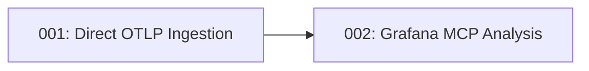

# PRD Index

> Auto-generated — do not edit manually

| # | Title | Summary | Priority | Effort | Owner | Tags | Created |
|---|-------|---------|----------|--------|-------|------|---------|
| 001 | [Direct OTLP Ingestion — Redpanda Removal](prd-001-otlp-direct-ingestion.md) | Remove Redpanda/Kafka from the ingestion stack and receive OTLP events directly via gRPC and HTTP in Octantis | media | medium | Vinicius Espindola | architecture, otlp, ingestion | 2026-04-05 |
| 002 | [Grafana MCP Analysis — Trigger-Based Investigation](prd-002-grafana-mcp-analysis.md) | Replace static enrichment with LLM-driven analysis via Grafana MCP, using OTLP events as triggers and querying Prometheus/Loki directly for investigation | alta | medium | Vinicius Espindola | architecture, grafana, mcp, llm, prometheus, loki, pipeline | 2026-04-06 |

## Dependency Graph

