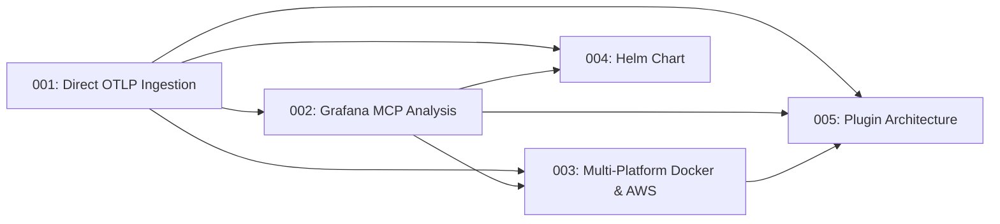

# Tech Spec Index

> Auto-generated — do not edit manually

| # | Title | Summary | Priority | PRD | Owner | Tags | Created |
|---|-------|---------|----------|-----|-------|------|---------|
| 001 | [Direct OTLP Ingestion — Redpanda Removal](tech-spec-001-otlp-direct-ingestion.md) | Replace Redpanda/Kafka with a native OTLP receiver (gRPC + HTTP) backed by an asyncio.Queue | media | [PRD 001](../prds/prd-001-otlp-direct-ingestion.md) | Vinicius Espindola | architecture, otlp, ingestion, grpc, http, asyncio | 2026-04-06 |
| 002 | [Grafana MCP Analysis — Trigger-Based Investigation](tech-spec-002-grafana-mcp-analysis.md) | Replace static Prometheus collector with LLM-driven investigation via Grafana MCP (SSE), using LangGraph ToolNode for autonomous PromQL/LogQL/K8s queries with budget and timeout controls | alta | [PRD 002](../prds/prd-002-grafana-mcp-analysis.md) | Vinicius Espindola | architecture, grafana, mcp, llm, prometheus, loki, langgraph, pipeline | 2026-04-06 |
| 003 | [Multi-Platform Support — Docker & AWS](tech-spec-003-multi-platform-docker-aws.md) | Add multi-platform support via polymorphic OTelResource hierarchy, registry-based MCPClientManager with slot validation, Environment Detector, Node Exporter metric normalization, and Docker/AWS MCP integrations | media | [PRD 003](../prds/prd-003-multi-platform-docker-aws.md) | Vinicius Espindola | architecture, docker, aws, mcp, node-exporter, multi-platform, otel | 2026-04-10 |
| 004 | [Octantis Helm Chart — Modular Deployment](tech-spec-004-helm-chart.md) | Modular Helm chart with grouped values API, conditional OTel subcharts, in-chart MCP templates, dual secrets support, and tag-based OCI publishing via git-cliff | media | [PRD 004](../prds/prd-004-helm-chart.md) | Vinicius Espindola | helm, kubernetes, deployment, distribution, otel, mcp, ci-cd | 2026-04-10 |
| 005 | [Plugin Architecture & Open-Core Foundation](tech-spec-005-plugin-architecture.md) | Plugin architecture with 5 Protocol interfaces, registry-based lifecycle, JWT Ed25519 plan gating, separate Apache-2.0 SDK, dual deploy modes (standalone + distributed via Redpanda), and AGPL-3.0 license migration | alta | [PRD 005](../prds/prd-005-plugin-architecture.md) | Vinicius Espindola | architecture, plugins, monetization, open-core, licensing, agpl, redpanda, distributed | 2026-04-11 |

## Dependency Graph

