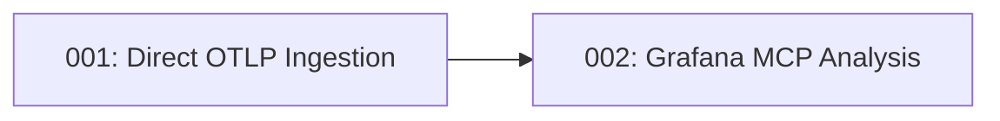

# Tech Spec Index

> Auto-generated — do not edit manually

| # | Title | Summary | Priority | PRD | Owner | Tags | Created |
|---|-------|---------|----------|-----|-------|------|---------|
| 001 | [Direct OTLP Ingestion — Redpanda Removal](tech-spec-001-otlp-direct-ingestion.md) | Replace Redpanda/Kafka with a native OTLP receiver (gRPC + HTTP) backed by an asyncio.Queue | media | [PRD 001](../prds/prd-001-otlp-direct-ingestion.md) | Vinicius Espindola | architecture, otlp, ingestion, grpc, http, asyncio | 2026-04-06 |
| 002 | [Grafana MCP Analysis — Trigger-Based Investigation](tech-spec-002-grafana-mcp-analysis.md) | Replace static Prometheus collector with LLM-driven investigation via Grafana MCP (SSE), using LangGraph ToolNode for autonomous PromQL/LogQL/K8s queries with budget and timeout controls | alta | [PRD 002](../prds/prd-002-grafana-mcp-analysis.md) | Vinicius Espindola | architecture, grafana, mcp, llm, prometheus, loki, langgraph, pipeline | 2026-04-06 |

## Dependency Graph

