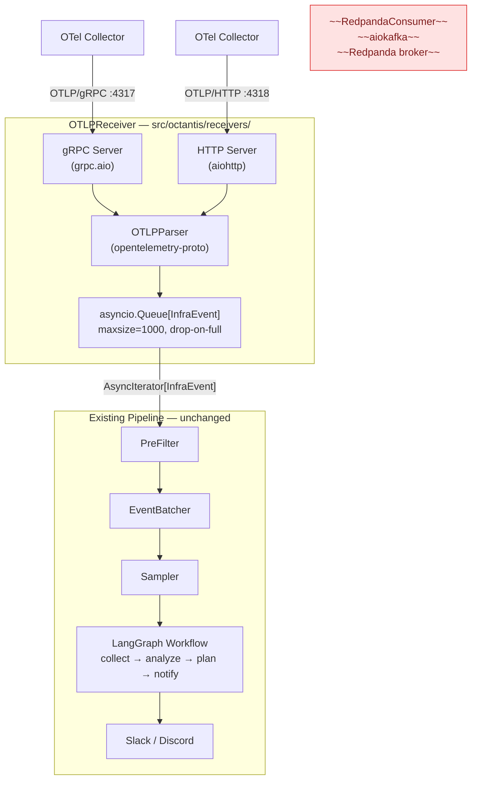
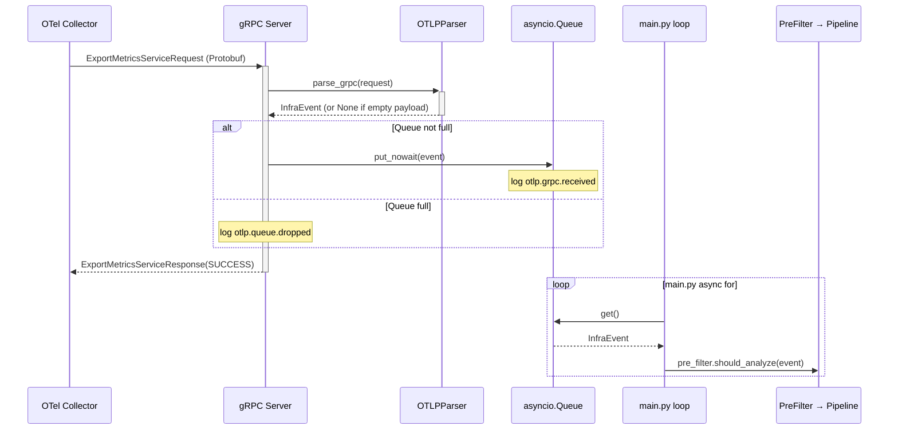
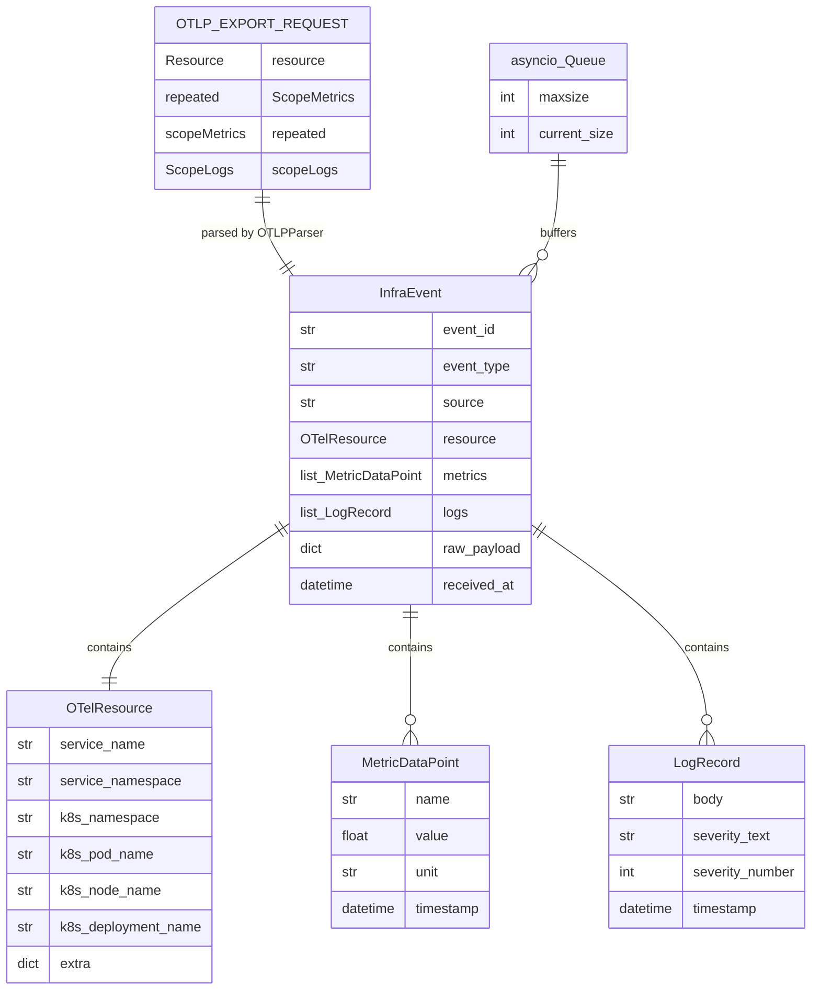
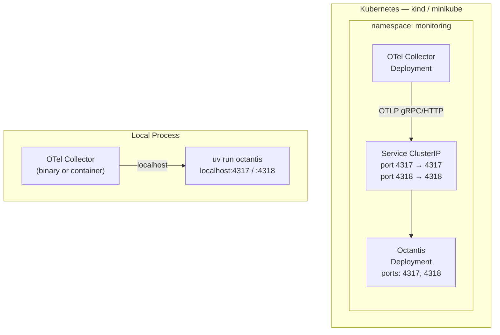

# Tech Spec 001: Direct OTLP Ingestion — Redpanda Removal

> Tech Spec — Generated by Design Docs Expert | 2026-04-06
>
> Based on: [PRD 001 — Direct OTLP Ingestion — Redpanda Removal](../prds/prd-001-otlp-direct-ingestion.md)

## List of Contents

- [1. Context](#1-context)
- [2. Objective](#2-objective)
- [3. Architecture](#3-architecture)
- [4. Technical Decisions](#4-technical-decisions)
- [5. Requirements](#5-requirements)
- [6. Data Model](#6-data-model)
- [7. Security](#7-security)
- [8. Infrastructure](#8-infrastructure)
- [9. Observability](#9-observability)
- [10. Cost Estimate](#10-cost-estimate)
- [11. Rollout Plan](#11-rollout-plan)
- [12. Test Plan](#12-test-plan)
- [13. Future Considerations](#13-future-considerations)
- [14. Decision Log](#14-decision-log)

## 1. Context

### Problem Statement

Octantis currently requires a running Redpanda (Kafka-compatible) broker to receive telemetry events. Kafka and its derivatives are designed for high-throughput, multi-producer, multi-consumer pipelines — they are the right tool when you need fan-out, replay, or independent consumer groups at scale. None of those properties apply here: Octantis is the sole consumer, there is no replay requirement, and the event volume of a small Kubernetes cluster does not justify a distributed log.

Running Redpanda adds provisioning overhead (broker process, JVM-equivalent resources, SASL configuration, topic and consumer group management) with zero architectural benefit. The OTel Collector already buffers and retries exports natively — adding a broker between the Collector and Octantis is redundant. Removing it reduces the operational surface and makes the setup proportional to the problem.

### Current State

Data flow today:

```
OTel Collector → Redpanda (Kafka) → aiokafka consumer → _parse_otel_message() → InfraEvent → Pipeline
```

`consumers/redpanda.py` holds an `AIOKafkaConsumer` and a `_parse_otel_message()` function that converts informal OTel JSON (not standard Protobuf) to `InfraEvent`. `main.py` calls `consumer.start()` then iterates over `consumer.events()` (an `AsyncIterator[InfraEvent]`). The entire downstream pipeline (`PreFilter → EventBatcher → Sampler → LangGraph Workflow`) is untouched by this change.

### System Type

**Event-driven receiver** — a long-running async process that accepts push-based telemetry over two transports (gRPC and HTTP) and feeds a bounded in-memory queue consumed by the processing pipeline.

---

## 2. Objective

### Goals

- Expose native OTLP endpoints (gRPC :4317, HTTP :4318) so any OTel Collector can export directly to Octantis without a broker intermediary.
- Remove Redpanda, `aiokafka`, and `RedpandaSettings` from the stack entirely.
- Parse standard OTLP Protobuf payloads (replacing the current ad-hoc JSON parser) using the official `opentelemetry-proto` Python package.
- Preserve the `consumer.events() → AsyncIterator[InfraEvent]` interface so `main.py` requires minimal changes.

### Non-Goals

- Persistent event buffer or retry queue — event loss when Octantis is down is accepted by design.
- Authentication or TLS on the OTLP endpoints in v1 — internal cluster network is the trust boundary.
- Changes to the filtering pipeline (PreFilter, Batcher, Sampler) or the LangGraph Workflow.
- Forwarding events to multiple consumers — Octantis is the final destination.

### Success Criteria

| Criterion | Baseline | Target | Verification |
|-----------|----------|--------|-------------|
| No broker dependency | Redpanda required to start | `docker compose up octantis` (or `uv run octantis`) works without Redpanda | Start Octantis with no Redpanda running; confirm no error |
| gRPC ingestion | Not supported | OTel Collector exports via gRPC to port 4317 | Configure OTel Collector exporter endpoint `localhost:4317`; verify `InfraEvent` reaches pipeline |
| HTTP ingestion | Not supported | POST to `/v1/metrics` returns HTTP 200 | `curl -X POST http://localhost:4318/v1/metrics` with valid OTLP JSON payload |
| Pipeline unaffected | N/A | Full pipeline (PreFilter → Batcher → Sampler → Workflow) processes events normally | Send test event via OTLP; verify LangGraph workflow executes |
| `aiokafka` removed | Present in `pyproject.toml` | Not present | `grep aiokafka pyproject.toml` → empty |
| Existing tests pass | N/A | All pass | `uv run pytest` → green |

---

## 3. Architecture

### System Diagram



### Components

| Component | Responsibility | Technology | Delta |
|-----------|---------------|------------|-------|
| `receivers/grpc_server.py` | Async gRPC servicer for TraceService, MetricsService, LogsService | `grpcio` (`grpc.aio`) + `opentelemetry-proto` | **Added** |
| `receivers/http_server.py` | aiohttp server for `/v1/traces`, `/v1/metrics`, `/v1/logs` | `aiohttp` + `opentelemetry-proto` | **Added** |
| `receivers/parser.py` | Converts OTLP Protobuf/JSON payloads → `InfraEvent` | `opentelemetry-proto` Pydantic models | **Added** (replaces `_parse_otel_message`) |
| `receivers/__init__.py` | `OTLPReceiver` — orchestrates both servers + queue, exposes `events()` | Python `asyncio` | **Added** |
| `config.py` — `OTLPSettings` | `OTLP_GRPC_PORT`, `OTLP_HTTP_PORT`, `OTLP_GRPC_ENABLED`, `OTLP_HTTP_ENABLED`, `OTLP_QUEUE_MAX_SIZE` | `pydantic-settings` | **Added** |
| `main.py` | Swap `RedpandaConsumer` → `OTLPReceiver` | — | **Modified** (3 lines) |
| `consumers/redpanda.py` | Kafka consumer + ad-hoc JSON parser | `aiokafka` | **Removed** |
| `config.py` — `RedpandaSettings` | Redpanda broker configuration | — | **Removed** |

### Data Flow



### API Contracts

#### gRPC — OTLP Collector Services

The server implements the `*Servicer` interfaces from `opentelemetry-proto`. MetricsService and LogsService parse and enqueue events. TraceService is implemented for transport compatibility only — it accepts requests and returns `SUCCESS` but does not parse or enqueue trace data (Octantis only processes metrics and logs).

| Service | Proto package | Method | Request | Response | Enqueues? |
|---------|--------------|--------|---------|----------|-----------|
| MetricsService | `opentelemetry.proto.collector.metrics.v1` | `Export` | `ExportMetricsServiceRequest` | `ExportMetricsServiceResponse` | Yes |
| LogsService | `opentelemetry.proto.collector.logs.v1` | `Export` | `ExportLogsServiceRequest` | `ExportLogsServiceResponse` | Yes |
| TraceService | `opentelemetry.proto.collector.trace.v1` | `Export` | `ExportTraceServiceRequest` | `ExportTraceServiceResponse` | **No** — acknowledged and discarded |

The response always returns `SUCCESS` status. If parsing fails, the event is dropped and `SUCCESS` is still returned (to avoid OTel Collector retry storms). Trace exports always return `SUCCESS` and log `otlp.trace.ignored` at DEBUG level.

#### HTTP — OTLP/HTTP endpoints

| Method | Path | Content-Types accepted | Success | Error | Enqueues? |
|--------|------|----------------------|---------|-------|-----------|
| POST | `/v1/metrics` | `application/json`, `application/x-protobuf` | 200 empty body | 415 unsupported media type | Yes |
| POST | `/v1/logs` | `application/json`, `application/x-protobuf` | 200 empty body | 415 unsupported media type | Yes |
| POST | `/v1/traces` | `application/json`, `application/x-protobuf` | 200 empty body | 415 unsupported media type | **No** — acknowledged and discarded |
| * | any other path | — | — | 404 | — |

#### OTLP → InfraEvent field mapping

| OTLP field | `InfraEvent` / `OTelResource` field | Notes |
|-----------|-------------------------------------|-------|
| `resource.attributes["service.name"]` | `resource.service_name` | |
| `resource.attributes["service.namespace"]` | `resource.service_namespace` | |
| `resource.attributes["k8s.namespace.name"]` | `resource.k8s_namespace` | |
| `resource.attributes["k8s.pod.name"]` | `resource.k8s_pod_name` | |
| `resource.attributes["k8s.node.name"]` | `resource.k8s_node_name` | |
| `resource.attributes["k8s.deployment.name"]` | `resource.k8s_deployment_name` | |
| All other resource attributes | `resource.extra` dict | |
| `scopeMetrics[].metrics[].gauge/sum.dataPoints[]` | `metrics: list[MetricDataPoint]` | `asDouble` preferred over `asInt` |
| `scopeLogs[].logRecords[]` | `logs: list[LogRecord]` | `body.stringValue`, `severityText`, `severityNumber` |
| — | `event_id` | `uuid.uuid4()` always (OTLP has no concept of event ID) |
| inferred | `event_type` | `"metric"` if metrics present, `"log"` if logs present, `"unknown"` otherwise |
| `resource.service_name` or `"unknown"` | `source` | |

---

## 4. Technical Decisions

### Decision 1: asyncio.Queue as receiver–pipeline bridge

**Context:** The gRPC and HTTP servers receive events via push callbacks (request handlers), while the pipeline expects an `AsyncIterator[InfraEvent]`. These two models must be bridged.

**Decision:** Use an `asyncio.Queue[InfraEvent]` owned by `OTLPReceiver`. Server handlers call `queue.put_nowait(event)`; `OTLPReceiver.events()` yields from the queue.

**Alternatives:**

| Option | Pros | Cons | Verdict |
|--------|------|------|---------|
| `asyncio.Queue` (chosen) | Natural backpressure boundary; decouples servers from pipeline; easy to test | Events lost in memory if process crashes | **Chosen** |
| Direct callback to pipeline | Zero latency overhead | Couples receiver to pipeline internals; no backpressure | Rejected — violates separation of concerns |
| `AsyncIterator` protocol on receiver | Drop-in replacement without queue | Hard to implement cleanly with push-based gRPC/HTTP handlers | Rejected — queue achieves the same interface with less complexity |

**Trade-offs accepted:** Events in queue are lost if Octantis crashes. Acceptable per PRD decision: "event loss is acceptable."

---

### Decision 2: Queue drop-on-full (maxsize=1000)

**Context:** If the pipeline slows down (LLM latency spike, K8s API timeout), the gRPC/HTTP handlers will block or back-pressure the OTel Collector.

**Decision:** `queue.put_nowait()` with `asyncio.QueueFull` caught and logged. The handler always returns `SUCCESS` to the caller. Queue `maxsize` defaults to 1000, configurable via `OTLP_QUEUE_MAX_SIZE`.

**Alternatives:**

| Option | Pros | Cons | Verdict |
|--------|------|------|---------|
| Drop-on-full (chosen) | Consistent with PRD; predictable memory usage; never blocks callers | Events silently lost during congestion | **Chosen** |
| Block on full | No event loss during slow pipeline | Handler blocks gRPC/HTTP worker; could stall OTel Collector | Rejected — unacceptable latency impact on Collector |
| Unbounded queue | No drops ever | Unbounded memory growth; OOM risk on sustained slow pipeline | Rejected — unpredictable resource consumption |

**Trade-offs accepted:** Events dropped when pipeline is slow. The PRD explicitly accepts event loss.

---

### Decision 3: grpcio (grpc.aio) + opentelemetry-proto

**Context:** Two viable gRPC async options exist for Python: `grpcio` with `grpc.aio` and `grpclib`. The HTTP receiver needs an async server framework.

**Decision:** Use `grpcio` with `grpc.aio` async servicers for gRPC. Use `aiohttp` for the HTTP receiver. Use `opentelemetry-proto` (official OTel Python package) for all Protobuf message types — avoids generating or maintaining custom `.proto` stubs.

**Alternatives:**

| Option | Pros | Cons | Verdict |
|--------|------|------|---------|
| `grpcio` + `grpc.aio` (chosen) | Same library the OTel Python exporters use; mature; official async support | Verbose servicer boilerplate | **Chosen** |
| `grpclib` | Cleaner asyncio integration | Less adoption; not used by OTel Python ecosystem | Rejected — consistency with OTel toolchain preferred |
| FastAPI + uvicorn (HTTP) | Auto-docs, ergonomic routing | Heavy dependency for a simple receiver | Rejected — aiohttp is sufficient and lighter |

**Trade-offs accepted:** `grpcio` boilerplate is higher than `grpclib`, but ecosystem alignment with `opentelemetry-proto` justifies the choice.

---

### Decision 4: OTLPReceiver as drop-in for RedpandaConsumer

**Context:** `main.py` depends on a `consumer` object with `start()`, `stop()`, and `events() → AsyncIterator[InfraEvent]`. Preserving this interface minimizes changes to `main.py`.

**Decision:** `OTLPReceiver` exposes the same three methods. `main.py` changes are limited to: import path, instantiation (`OTLPReceiver(settings.otlp)`), and removing the Redpanda log line. The `_filtered_stream()` loop in `main.py` is untouched.

**Trade-offs accepted:** The `AsyncIterator` abstraction hides the queue internals. This is intentional — the pipeline should not know how events arrive.

---

## 5. Requirements

### Functional Requirements

#### Scenario: gRPC export — metrics

WHEN an OTel Collector sends an `ExportMetricsServiceRequest` to gRPC port 4317  
THEN the system MUST parse the Protobuf payload into an `InfraEvent`  
AND MUST place the event on the queue if space is available  
AND MUST return `ExportMetricsServiceResponse` with `SUCCESS` status  
AND MAY drop the event (logging `otlp.queue.dropped`) if the queue is full  
AND MUST NOT return an error status to the Collector regardless of queue state

#### Scenario: HTTP export — metrics

WHEN an OTel Collector sends a POST to `/v1/metrics` with `Content-Type: application/json`  
THEN the system MUST parse the OTLP JSON payload into an `InfraEvent`  
AND MUST return HTTP 200 with an empty body on success  
AND MUST return HTTP 415 if the `Content-Type` is not `application/json` or `application/x-protobuf`  
AND MUST return HTTP 404 for requests to any path other than `/v1/traces`, `/v1/metrics`, `/v1/logs`

#### Scenario: Trace export (gRPC or HTTP)

WHEN an OTel Collector sends a trace export request (gRPC `ExportTraceServiceRequest` or HTTP POST to `/v1/traces`)  
THEN the system MUST return SUCCESS/200 to the caller  
AND MUST log `otlp.trace.ignored` at DEBUG level with `transport` field  
AND MUST NOT parse the trace payload  
AND MUST NOT enqueue any event

#### Scenario: Empty payload

WHEN an export request contains a resource but no metrics and no logs  
THEN the system MUST create an `InfraEvent` with `event_type="unknown"`, `metrics=[]`, `logs=[]`  
AND MUST NOT raise an exception or return an error to the caller

#### Scenario: Parse error

WHEN a payload cannot be parsed (malformed Protobuf, invalid JSON, missing required fields)  
THEN the system MUST log `otlp.parse.error` with a truncated raw payload (max 200 chars)  
AND MUST return SUCCESS/200 to the caller (avoid Collector retry storms)  
AND MUST NOT propagate the exception to the event loop

#### Scenario: Queue full

WHEN the `asyncio.Queue` has reached `maxsize` and a new event arrives  
THEN the system MUST drop the new event  
AND MUST log `otlp.queue.dropped` with `reason="queue_full"`  
AND MUST NOT block the gRPC/HTTP handler

#### Scenario: Graceful shutdown

WHEN a `SIGINT` or `SIGTERM` signal is received  
THEN the system MUST stop accepting new gRPC connections  
AND MUST stop the HTTP server  
AND MUST drain the queue of events already accepted before stopping  
AND MUST log `otlp.server.stopped`

#### Scenario: Configuration via environment variables

WHEN `OTLP_GRPC_PORT` is set  
THEN the gRPC server MUST bind to that port instead of the default 4317  
AND MUST log a clear error and exit if the port is already in use

#### Scenario: Transport disabled via environment variable

WHEN `OTLP_GRPC_ENABLED` is set to `false`  
THEN the gRPC server MUST NOT be started  
AND MUST log `otlp.grpc.disabled` at INFO level  
AND the HTTP server (if enabled) MUST continue operating normally

WHEN `OTLP_HTTP_ENABLED` is set to `false`  
THEN the HTTP server MUST NOT be started  
AND MUST log `otlp.http.disabled` at INFO level  
AND the gRPC server (if enabled) MUST continue operating normally

WHEN both `OTLP_GRPC_ENABLED` and `OTLP_HTTP_ENABLED` are `false`  
THEN the system MUST log `otlp.server.no_transports` at WARNING level  
AND MUST start normally (no crash) — the pipeline will simply receive no events

### Non-Functional Requirements

| Category | Requirement | Target | Measurement |
|----------|-------------|--------|-------------|
| **Handler latency** | gRPC/HTTP handler response time (parse + queue put) | p99 < 50ms | `time.perf_counter()` in handler; log `duration_ms` |
| **Throughput** | Sustained events/sec (single OTel Collector, dev env) | ≥ 100 events/sec before queue fills | Load test with `otelgen` or equivalent |
| **Queue memory** | Memory consumed by full queue | ≤ 50MB at maxsize=1000 | `sys.getsizeof` on queue; ~50KB per `InfraEvent` worst case |
| **Startup time** | Time from process start to both servers accepting connections | < 3s | Log timestamps for `otlp.server.started` |
| **Availability** | Event loss on Octantis downtime | Accepted — no SLO | By design (PRD decision) |
| **Concurrency** | Simultaneous gRPC connections | ≥ 10 (single Collector scenario) | `grpc.aio` default thread pool is sufficient |

### Error Handling

#### Scenario: Port already in use on startup

WHEN `OTLP_GRPC_PORT` or `OTLP_HTTP_PORT` is already bound by another process  
THEN the system MUST log `otlp.server.port_conflict` with the port number  
AND MUST exit with a non-zero code  
AND MUST NOT silently fall back to a random port

#### Scenario: gRPC servicer exception

WHEN an unhandled exception occurs inside a gRPC servicer method  
THEN the system MUST catch it at the servicer boundary  
AND MUST log `otlp.parse.error` with the exception details  
AND MUST return `SUCCESS` to avoid triggering Collector retry loops  
AND MUST NOT crash the gRPC server

---

## 6. Data Model

### Entities

The `OTLPReceiver` introduces no new persistent entities. It transforms OTLP proto messages (transient, in-flight) into the existing `InfraEvent` Pydantic model.



### Consistency Model

**None required.** The receiver is stateless — it parses and enqueues. There is no shared state between the gRPC and HTTP servers beyond the `asyncio.Queue`, which is thread-safe by design in Python's asyncio model (single-threaded event loop).

### Data Retention

| Tier | Retention | Storage | Access Pattern |
|------|-----------|---------|----------------|
| In-flight (Queue) | Until consumed or dropped | `asyncio.Queue` in process memory | Write-once, read-once |
| Raw payload in `InfraEvent` | Until GC'd after pipeline processing | Process heap | Passed through pipeline; not persisted |

No persistent storage is introduced by this spec.

---

## 7. Security

### Authentication

None in v1. Explicitly out of scope per PRD. The trust boundary is the cluster network (Kubernetes `ClusterIP` service or `localhost` for local dev). mTLS or token auth can be added in a future iteration if the endpoint becomes externally reachable.

### Authorization

Not applicable — no multi-tenant model. Single Octantis instance, single OTel Collector.

### Data Protection

- **In transit**: Plain TCP. No TLS in v1. Acceptable because both endpoints (K8s ClusterIP, localhost) are network-isolated.
- **At rest**: No persistence — no encryption needed.
- **PII handling**: The receiver does not inspect or filter payload content. If OTel Collector emits PII in metric labels or log bodies, it flows through unchanged. Mitigation is the responsibility of the OTel Collector pipeline (attribute processors).

### Compliance

Not applicable — internal dev tool, single developer, no user data.

### Audit

Structured logs via `structlog` provide an event trail:
- `otlp.grpc.received` / `otlp.http.received` — every accepted event
- `otlp.queue.dropped` — every dropped event
- `otlp.parse.error` — every parse failure

---

## 8. Infrastructure

### Deployment Architecture



Both modes (K8s and local) expose the same ports. No environment-specific code changes — the ports are configurable via `OTLP_GRPC_PORT` and `OTLP_HTTP_PORT`.

### Resource Sizing

| Component | CPU request | Memory request | Replicas | Notes |
|-----------|-------------|----------------|----------|-------|
| Octantis (with receiver) | 0.1 core | 256Mi | 1 | Queue adds ~50MB worst case at maxsize=1000 |
| ~~Redpanda~~ | ~~0.25 core~~ | ~~512Mi~~ | ~~1~~ | **Removed** — net savings |

### Environments

| Environment | Purpose | Differences from prod |
|-------------|---------|----------------------|
| local | Development — `uv run octantis` | No K8s; OTel Collector connects to `localhost` |
| k8s-local | Integration testing — kind/minikube | Full K8s; Collector connects via ClusterIP Service |

---

## 9. Observability

### SLIs & SLOs

This is a dev-only project. Formal SLOs are not enforced. The following are operational targets:

| SLI | Target | Alert Threshold |
|-----|--------|-----------------|
| Handler latency p99 | < 50ms | Log warning if `duration_ms > 100` |
| Queue fill rate | < 50% sustained | Log warning at `otlp.queue.high_watermark` if size > 500 |
| Parse error rate | < 1% of events | Investigate if `otlp.parse.error` appears in logs |

### Metrics

No Prometheus exporter in v1. Observability is via structured logs only. Key counters to track in logs:

- Events received per transport (gRPC / HTTP)
- Events dropped (queue full)
- Parse errors
- Queue depth at each consumer cycle (optional debug log)

### Logging

All logs use `structlog` with dot-notation namespacing, consistent with the rest of Octantis:

| Event | Level | Fields |
|-------|-------|--------|
| `otlp.server.started` | INFO | `grpc_port`, `http_port`, `queue_max_size` |
| `otlp.server.stopped` | INFO | — |
| `otlp.grpc.received` | DEBUG | `event_type`, `service_name`, `metrics_count`, `logs_count` |
| `otlp.http.received` | DEBUG | `path`, `content_type`, `event_type`, `service_name` |
| `otlp.queue.dropped` | WARNING | `reason="queue_full"`, `queue_size` |
| `otlp.parse.error` | ERROR | `transport`, `error`, `raw_payload` (truncated to 200 chars) |
| `otlp.trace.ignored` | DEBUG | `transport` (gRPC or HTTP) |
| `otlp.grpc.disabled` | INFO | — |
| `otlp.http.disabled` | INFO | — |
| `otlp.server.no_transports` | WARNING | — |
| `otlp.queue.high_watermark` | WARNING | `queue_size` (logged when size > 50% of maxsize) |

### Tracing

Not applicable — Octantis is an observability consumer, not a traced service. Ironic, but intentional.

### Dashboards

No dashboards in v1. `uv run octantis` in a TTY uses `structlog`'s `ConsoleRenderer` for human-readable output.

---

## 10. Cost Estimate

| Resource | Before | After | Delta |
|----------|--------|-------|-------|
| Redpanda process | ~0.25 CPU, ~512Mi RAM | Removed | **-0.25 CPU, -512Mi RAM** |
| Octantis process (receiver overhead) | ~0.1 CPU, ~200Mi RAM | ~0.1 CPU, ~250Mi RAM | +50Mi RAM (queue) |
| `aiokafka` dependency | Present | Removed | Build artifact reduction |
| `opentelemetry-proto` dependency | Absent | Added | Small (~2MB) |
| `aiohttp` dependency | Absent | Added | ~3MB |
| **Net infrastructure cost** | | | **$0** — resources freed exceed resources added |

### Cost Optimization Opportunities

- The removal of Redpanda frees ~512Mi RAM and ~0.25 CPU on any environment running both services. In a shared K8s node, this directly reduces node utilization.
- No additional cloud spend is introduced.

---

## 11. Rollout Plan

### Phases

| Phase | What | Validation | Rollback |
|-------|------|-----------|----------|
| 1 — Implement receiver | Add `src/octantis/receivers/` module (`grpc_server.py`, `http_server.py`, `parser.py`, `__init__.py`) | Unit tests for parser; `curl` to HTTP receiver; `grpcurl` to gRPC receiver | Delete `receivers/` directory |
| 2 — Integrate & remove Redpanda | Update `main.py`, `config.py`; remove `consumers/redpanda.py`; remove `aiokafka` from `pyproject.toml` | `uv run octantis` starts cleanly; full pipeline test with OTel Collector | `git revert` the integration commit |
| 3 — Documentation | Update `AGENTS.md`, `docs/overview.md`, `docs/pipeline.md`, `README.md`, `.env.example` | Docs reflect new architecture; quickstart works without Redpanda | N/A |

### Migration Plan

No migration required. The project is not in production and there are no events to migrate. This is a clean cut.

### Feature Flags

None. Single developer, no gradual rollout needed.

### Rollback Plan

```bash
# If Phase 1 needs rollback — delete receivers module
rm -rf src/octantis/receivers/

# If Phase 2 needs rollback — revert to last working commit
git log --oneline -5          # find the commit before integration
git revert HEAD               # or revert specific commit

# Redpanda can be re-started if needed
docker compose up redpanda -d
```

### Launch Checklist

- [ ] `uv run pytest` — all existing tests pass
- [ ] `curl -X POST http://localhost:4318/v1/metrics -H "Content-Type: application/json" -d @test_payload.json` → HTTP 200
- [ ] `grpcurl -plaintext -d @ localhost:4317 opentelemetry.proto.collector.metrics.v1.MetricsService/Export` → SUCCESS
- [ ] OTel Collector configured with `otlp` exporter pointing to `localhost:4317` — events visible in Octantis logs
- [ ] `grep aiokafka pyproject.toml` → empty
- [ ] `grep RedpandaSettings src/octantis/config.py` → empty
- [ ] `grep -r "from octantis.consumers.redpanda" src/` → empty
- [ ] `docker compose up octantis` starts without Redpanda container running

---

## 12. Test Plan

### Unit Tests — `tests/test_parser.py`

| Test | Input | Expected |
|------|-------|----------|
| Parse valid metrics (Protobuf) | `ExportMetricsServiceRequest` with 2 gauge datapoints | `InfraEvent` with `event_type="metric"`, 2 `MetricDataPoint` entries |
| Parse valid logs (Protobuf) | `ExportLogsServiceRequest` with 1 log record | `InfraEvent` with `event_type="log"`, 1 `LogRecord` entry |
| Parse valid metrics (JSON) | OTLP JSON payload with `resourceMetrics` | Same as Protobuf — identical `InfraEvent` output |
| Parse valid logs (JSON) | OTLP JSON payload with `resourceLogs` | Same as Protobuf — identical `InfraEvent` output |
| Resource attribute mapping | Payload with `service.name`, `k8s.namespace.name`, `k8s.pod.name`, unknown attr | `OTelResource` fields populated; unknown attr in `extra` dict |
| Empty payload (no metrics or logs) | `ExportMetricsServiceRequest` with resource only | `InfraEvent` with `event_type="unknown"`, `metrics=[]`, `logs=[]` |
| Malformed Protobuf | Garbage bytes | Returns `None`, no exception raised |
| Malformed JSON | Invalid JSON string | Returns `None`, no exception raised |
| event_id generation | Any valid payload | `event_id` is a valid UUID4 string |
| source fallback | Payload without `service.name` | `source="unknown"` |

### Unit Tests — `tests/test_otlp_receiver.py`

| Test | Setup | Expected |
|------|-------|----------|
| Queue put on valid event | Mock parser returning `InfraEvent`; call handler | Event appears in queue |
| Queue drop on full | Fill queue to `maxsize`; call handler | Event not in queue; `otlp.queue.dropped` logged |
| Trace export ignored (gRPC) | Call `TraceService.Export` | Returns SUCCESS; queue empty; `otlp.trace.ignored` logged |
| Trace export ignored (HTTP) | POST to `/v1/traces` | Returns 200; queue empty; `otlp.trace.ignored` logged |
| `events()` yields from queue | Put 3 events in queue; iterate `events()` | Yields 3 `InfraEvent` in order |
| Graceful stop drains queue | Put events, call `stop()` | Pending events yielded before iterator ends |

### Integration Tests — `tests/test_otlp_integration.py`

| Test | Setup | Expected |
|------|-------|----------|
| gRPC round-trip | Start `OTLPReceiver`; send `ExportMetricsServiceRequest` via `grpc.aio.insecure_channel` | `InfraEvent` yielded from `events()` with correct fields |
| HTTP round-trip | Start `OTLPReceiver`; POST OTLP JSON to `/v1/metrics` via `aiohttp.ClientSession` | `InfraEvent` yielded from `events()` with correct fields |
| HTTP 404 on unknown path | POST to `/v1/unknown` | HTTP 404 |
| HTTP 415 on bad content-type | POST to `/v1/metrics` with `Content-Type: text/plain` | HTTP 415 |
| gRPC + HTTP concurrent | Send one event via gRPC, one via HTTP simultaneously | Both events appear in queue |
| Transport disabled | Set `grpc_enabled=False`; start receiver | Only HTTP server running; gRPC connection refused |

### Test Fixtures

- `fixtures/otlp_metrics.pb` — serialized `ExportMetricsServiceRequest` with representative K8s metrics (CPU, memory, restarts)
- `fixtures/otlp_logs.pb` — serialized `ExportLogsServiceRequest` with ERROR and INFO logs
- `fixtures/otlp_metrics.json` — equivalent JSON payload for HTTP tests
- `fixtures/otlp_logs.json` — equivalent JSON payload for HTTP tests
- Fixtures generated from real OTel Collector output to ensure compatibility with production payloads

### Comparative Tests

To ensure the new parser produces the same output as the old one for equivalent inputs:

| Test | Input | Expected |
|------|-------|----------|
| Metrics parity | Same logical payload through old `_parse_otel_message()` and new `OTLPParser` | Identical `InfraEvent` (same `OTelResource` fields, same `MetricDataPoint` values) |
| Logs parity | Same logical payload through both parsers | Identical `InfraEvent` (same `LogRecord` fields) |

These tests run against the old parser before it is removed (Phase 1) to validate equivalence.

---

## 13. Future Considerations

- **Revisit if**: Octantis becomes externally reachable (outside the cluster) — add mTLS or token authentication at that point.
- **Revisit if**: Queue drop rate is consistently > 5% — consider adding a configurable back-pressure mode (block-on-full) as an alternative policy.
- **Revisit if**: Multiple OTel Collectors need to export simultaneously at high rate — benchmark `grpc.aio` thread pool sizing.
- **Planned evolution**: If Octantis ever needs HA (multiple replicas) or fan-out to independent consumers, the single `asyncio.Queue` model would need to be replaced with a proper message bus (NATS JetStream, Redis Streams, or a managed queue). The `OTLPReceiver` interface (`start()`, `stop()`, `events()`) makes that swap straightforward without touching the rest of the pipeline. A message broker would be justified at that point — not before.
- **Technical debt accepted**: `aiohttp` is a synchronous-in-practice choice for the HTTP receiver. If performance becomes a concern, migrating to `grpc.aio` for both transports (gRPC-first, HTTP/2 via gRPC-gateway pattern) could simplify the stack.

---

## 14. Decision Log

| Date | Decision | Rationale |
|------|----------|-----------|
| 2026-04-05 | Remove Redpanda/Kafka completely | Kafka is designed for multi-consumer fan-out and replay at scale — none of which apply here. Octantis is the sole consumer on a small cluster. The OTel Collector already handles buffering and retries. Running a broker in this context is disproportionate to the problem. |
| 2026-04-05 | Support both gRPC and HTTP transports | Maximizes compatibility — some OTel Collectors are configured for gRPC, others for HTTP. |
| 2026-04-05 | Accept event loss if Octantis is down | New events will arrive when the agent recovers. Buffering adds complexity not justified for dev-stage tooling. |
| 2026-04-05 | Clean cut — no transition period | Project is not in production, no users to migrate. |
| 2026-04-06 | asyncio.Queue as receiver–pipeline bridge | Decouples push-based server handlers from the pull-based pipeline without changing `main.py`'s `async for` loop. |
| 2026-04-06 | Queue drop-on-full (maxsize=1000) | Consistent with event loss policy; prevents unbounded memory growth; never blocks OTel Collector handlers. |
| 2026-04-06 | grpcio (grpc.aio) + opentelemetry-proto | Uses the same libraries as the OTel Python ecosystem; avoids custom `.proto` stub generation. |
| 2026-04-06 | OTLPReceiver as drop-in for RedpandaConsumer | Preserves `main.py` interface (`start()`, `stop()`, `events()`); minimizes integration diff to ~3 lines. |
| 2026-04-06 | Traces accepted but not processed | Octantis only analyzes metrics and logs. Accepting traces at transport level avoids breaking OTel Collector pipelines that export all signal types. Trace data is acknowledged (SUCCESS/200) and discarded. |
| 2026-04-06 | Per-transport enable flags (`OTLP_GRPC_ENABLED`, `OTLP_HTTP_ENABLED`) | Replaces ambiguous `OTLP_ENABLED`. Gives operators fine-grained control — e.g., disable HTTP if only gRPC is used. |
