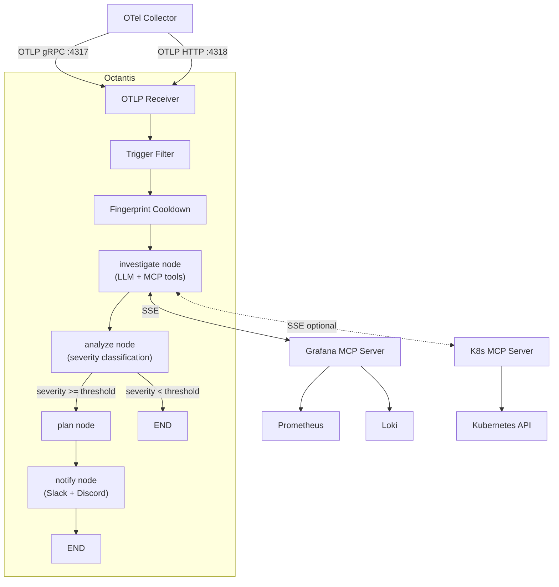
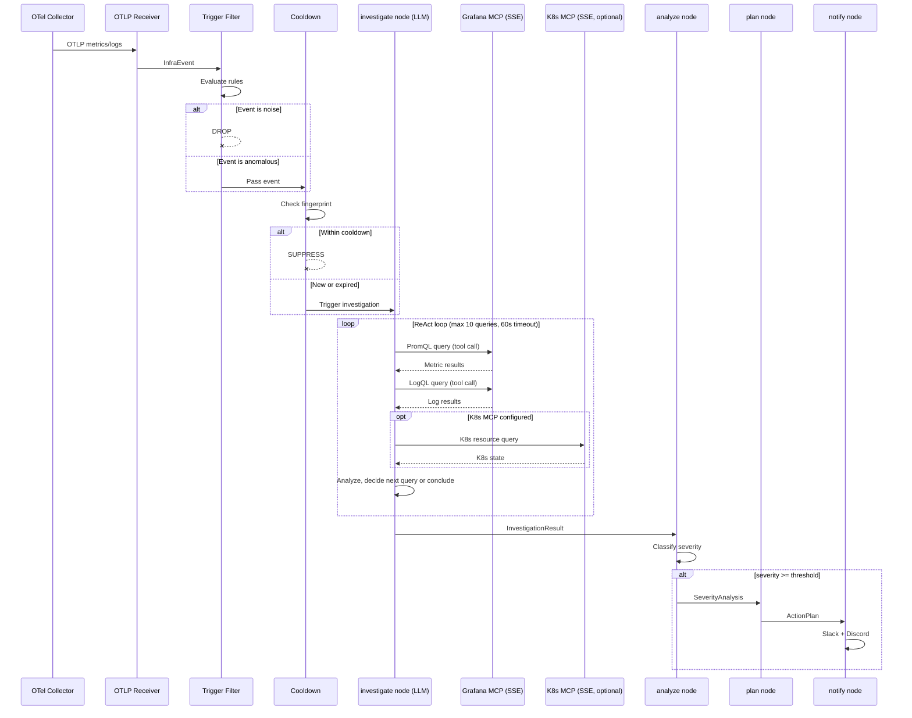
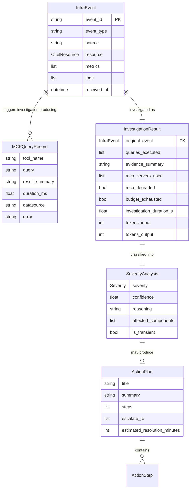
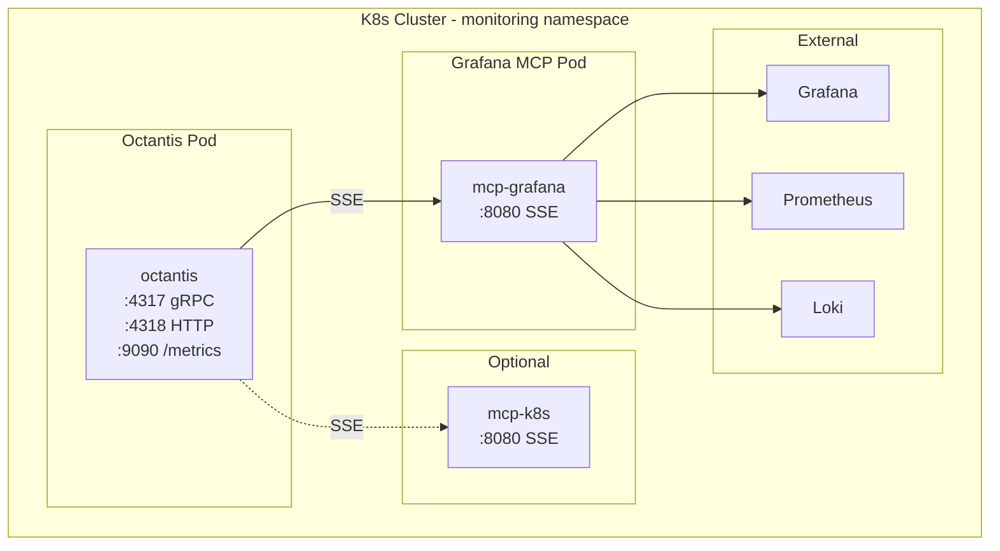

# Tech Spec 002: Grafana MCP Analysis — Trigger-Based Investigation

> Tech Spec — Generated by Design Docs Expert | 2026-04-06
>
> Based on: [PRD 002 — Grafana MCP Analysis](../prds/prd-002-grafana-mcp-analysis.md)

## Table of Contents

- [1. Context](#1-context)
- [2. Objective](#2-objective)
- [3. Architecture](#3-architecture)
- [4. Technical Decisions](#4-technical-decisions)
- [5. Requirements](#5-requirements)
- [6. Data Model](#6-data-model)
- [7. Security](#7-security)
- [8. Infrastructure](#8-infrastructure)
- [9. Observability](#9-observability)
- [10. Cost Estimate](#10-cost-estimate)
- [11. Rollout Plan](#11-rollout-plan)
- [12. Future Considerations](#12-future-considerations)
- [13. Decision Log](#13-decision-log)

## 1. Context

### Problem Statement

Octantis currently pre-fetches a fixed set of 5 PromQL queries (CPU, memory, error rate, restarts, latency p99) via `prometheus-api-client` in `collectors/prometheus.py` before the LLM sees any data. The LLM cannot request additional data — if the root cause involves disk pressure, network errors, or application-specific metrics, it has no way to investigate. This creates blind spots where the LLM identifies "something is wrong" but lacks evidence for root cause analysis.

Additionally, the 3-layer pipeline (PreFilter → EventBatcher → Sampler) was designed for per-event LLM analysis. With the new trigger-based model, batching and merging events is unnecessary overhead.

### Current State

- **Collector node** (`graph/nodes/collector.py`): Instantiates `PrometheusCollector` and `KubernetesCollector`, fetches static data, produces `EnrichedEvent`
- **Analyzer node** (`graph/nodes/analyzer.py`): Receives `EnrichedEvent`, calls LLM via `litellm.acompletion` (no tool calling), outputs `SeverityAnalysis`
- **Pipeline** (`main.py`): Consumer → PreFilter → EventBatcher → Sampler → LangGraph workflow (collect → analyze → plan → notify)
- **Dependencies**: `prometheus-api-client` for PromQL, `kubernetes` client for K8s API
- **LLM integration**: `litellm` with JSON response format, no function/tool calling

### System Type

Event-driven (async) — OTLP events trigger LLM-driven investigations via MCP tool calling. The system reacts to incoming telemetry by autonomously querying observability data sources.

## 2. Objective

### Goals

- LLM autonomously chooses which PromQL and LogQL queries to execute during investigation
- Investigation quality improves by eliminating blind spots from fixed query sets
- Pipeline complexity reduces from 5 components to 3 (receiver → trigger filter + cooldown → workflow)
- MCP server is a shared service reusable by other consumers (e.g., ELK integration)

### Non-Goals

- Tempo / trace analysis — deferred until MCP integration is proven
- Alertmanager integration — Octantis has its own trigger logic
- Multi-tenant / multi-cluster support
- Dashboard auto-generation in Grafana
- Provisioning or managing the Grafana instance

### Success Criteria

| Criterion | Baseline | Target | Verification |
|-----------|----------|--------|-------------|
| LLM query autonomy | 5 hardcoded PromQL queries | LLM chooses arbitrary PromQL + LogQL via MCP | Test: trigger event → verify LLM makes queries not in original hardcoded set |
| Pipeline components | 5 (PreFilter + Batcher + Sampler + Collector + Analyzer) | 3 (TriggerFilter + Cooldown + Investigator) | `EventBatcher` and `Sampler` classes not imported in main.py |
| MCP connection | No MCP | Octantis connects to Grafana MCP via SSE at startup | Health check log on startup |
| Investigation budget | Unbounded (fixed 5 queries) | Max 10 queries, 60s timeout | Test: budget exhaustion produces partial analysis |
| Prometheus client removed | `prometheus-api-client` in deps | Not in pyproject.toml | `grep prometheus-api-client pyproject.toml` returns empty |

## 3. Architecture

### System Diagram



### Components

| Component | Responsibility | Technology | Delta |
|-----------|---------------|------------|-------|
| OTLP Receiver | Receive telemetry via gRPC/HTTP | grpcio, aiohttp | Reused |
| Trigger Filter | Detect anomalous events worth investigating | Python dataclasses, regex | Modified (simplified from PreFilter) |
| Fingerprint Cooldown | Suppress repeated triggers within time window | hashlib, dict with TTL | Modified (extracted from Sampler) |
| MCP Client Manager | Manage SSE connections to MCP servers, expose tools | mcp[sse], langchain-mcp-adapters | Added |
| investigate node | LLM-driven investigation via MCP tool calling | LangGraph ToolNode, ReAct loop | Added (replaces collector node) |
| analyze node | Severity classification from investigation data | litellm, structured output | Modified (input changes from EnrichedEvent to InvestigationResult) |
| plan node | Remediation planning | litellm | Modified (input adapts to new data model) |
| notify node | Slack + Discord notifications | httpx | Modified (adds MCP degradation warning) |
| Metrics exporter | Expose internal Prometheus metrics | prometheus-client | Added |
| EventBatcher | Batch events by workload | asyncio | Removed |
| Sampler | Cooldown-based deduplication | hashlib | Removed (logic absorbed into Fingerprint Cooldown) |
| PrometheusCollector | Static PromQL queries | prometheus-api-client | Removed |
| KubernetesCollector | Direct K8s API calls | kubernetes client | Removed |
| collector node | Orchestrate static data fetching | — | Removed (replaced by investigate node) |

### Data Flow



### API Contracts

#### MCP Server Connection Config

```python
# Environment variables
GRAFANA_MCP_URL=http://mcp-grafana.monitoring.svc:8080/sse     # Required
GRAFANA_MCP_API_KEY=glsa_...                                     # Required
K8S_MCP_URL=http://mcp-k8s.monitoring.svc:8080/sse              # Optional (recommended)
```

#### InvestigationResult Model (new)

```python
class MCPQueryRecord(BaseModel):
    """Record of a single MCP query executed during investigation."""
    tool_name: str          # e.g., "query_prometheus", "query_loki"
    query: str              # The actual PromQL/LogQL/K8s query
    result_summary: str     # Condensed result for audit
    duration_ms: float
    datasource: str         # "prometheus", "loki", "kubernetes"
    error: str | None = None

class InvestigationResult(BaseModel):
    """Output of the investigate node — replaces EnrichedEvent."""
    original_event: InfraEvent
    queries_executed: list[MCPQueryRecord] = Field(default_factory=list)
    evidence_summary: str       # LLM-generated summary of findings
    mcp_servers_used: list[str] # Which MCP servers were available
    mcp_degraded: bool = False  # True if any MCP server was unavailable
    budget_exhausted: bool = False
    investigation_duration_s: float
    tokens_input: int = 0
    tokens_output: int = 0
```

#### Updated AgentState

```python
class AgentState(TypedDict, total=False):
    event: InfraEvent
    investigation: InvestigationResult   # Replaces enriched_event
    analysis: SeverityAnalysis
    action_plan: ActionPlan | None
    notifications_sent: list[str]
    error: str | None
```

## 4. Technical Decisions

### Decision 1: MCP via SSE with Shared Service

**Context:** Octantis needs to query Prometheus and Loki dynamically. The MCP protocol supports stdio (subprocess) and SSE (remote) transports.

**Decision:** Use SSE transport connecting to a shared `mcp-grafana` service running as a separate Deployment in the cluster.

**Alternatives:**

| Option | Pros | Cons | Verdict |
|--------|------|------|---------|
| SSE to shared service | Reusable by ELK and other consumers, independent scaling, standard deployment | Network hop, requires service discovery | **Chosen** |
| stdio subprocess | Zero network latency, simple lifecycle | One process per Octantis replica, not reusable, resource waste | Rejected — not shareable |
| Direct Grafana HTTP API | No MCP dependency, simple HTTP calls | No tool abstraction, manual query wrappers, LLM can't use as tools | Rejected — defeats MCP purpose |

**Trade-offs accepted:** Added network latency (~1-5ms within cluster) is negligible compared to Prometheus/Loki query time. Requires `mcp-grafana` to be deployed separately.

### Decision 2: LangGraph ToolNode with ReAct Loop

**Context:** The LLM needs to call MCP tools iteratively — query data, analyze, decide to query more or conclude.

**Decision:** Use `langchain-mcp-adapters` to convert MCP tools to LangChain tools, then use LangGraph's `ToolNode` with a ReAct-style loop in a subgraph. Query budget is a counter in the graph state.

**Alternatives:**

| Option | Pros | Cons | Verdict |
|--------|------|------|---------|
| LangGraph ToolNode + ReAct | Idiomatic LangGraph, automatic tool routing, budget as state | Depends on langchain-mcp-adapters | **Chosen** |
| litellm tool_use manual loop | Full control, no LangChain dependency | Duplicates LangGraph's loop logic, manual message history management | Rejected — unnecessary complexity |
| Single-shot with prefixed queries | Simplest, no loop | LLM can't adapt based on results, same blind spot problem | Rejected — defeats the purpose |

**Trade-offs accepted:** Adding `langchain-mcp-adapters` as a dependency. Acceptable because the project already uses LangGraph.

### Decision 3: K8s MCP as Optional Recommended Datasource

**Context:** The current `KubernetesCollector` makes direct API calls. PRD deferred this decision.

**Decision:** Remove the direct `kubernetes` client. K8s context is available via a separate K8s MCP server, configured as optional but recommended. When configured, its tools are exposed to the LLM alongside Grafana MCP tools.

**Alternatives:**

| Option | Pros | Cons | Verdict |
|--------|------|------|---------|
| K8s MCP optional | Uniform tool interface, LLM decides what K8s data to fetch, no direct API coupling | Requires separate MCP server deployment | **Chosen** |
| Keep kubernetes client as tools | Works without extra deployment | Two different tool patterns (MCP + direct), code to maintain | Rejected — inconsistent |
| Remove K8s entirely | Simplest | Loses valuable context for diagnosis | Rejected — too much lost |

**Trade-offs accepted:** Users who don't deploy K8s MCP lose K8s context in investigations. Mitigated by documentation marking it as recommended.

### Decision 4: Separate Investigation Model

**Context:** Investigation via tool calling is more complex than severity classification or plan generation.

**Decision:** Add `LLM_INVESTIGATION_MODEL` env var (default: same as `LLM_MODEL`, which defaults to `claude-sonnet-4-6`). Operators can configure a more capable model for investigation without affecting other nodes.

**Alternatives:**

| Option | Pros | Cons | Verdict |
|--------|------|------|---------|
| Separate configurable model | Operators tune cost/quality per node, well-documented | One more env var | **Chosen** |
| Single model for everything | Simpler config | Can't optimize investigation quality independently | Rejected — investigation is the critical path |
| Hardcode Opus for investigation | Best quality | Expensive, not everyone has Opus access | Rejected — not our decision |

**Trade-offs accepted:** Default is Sonnet for all nodes. Documentation clearly explains when and why to use a more capable model for investigation.

### Decision 5: Degraded Mode with Notification

**Context:** Grafana MCP may be unavailable. The system needs a fallback strategy.

**Decision:** When MCP is unreachable, the LLM analyzes using only the trigger event payload (degraded mode). The system logs a warning, adds `mcp_degraded: true` to `InvestigationResult`, and the notify node includes a degradation warning in Slack/Discord messages so operators know analyses may be imprecise.

**Alternatives:**

| Option | Pros | Cons | Verdict |
|--------|------|------|---------|
| Analyze degraded + notify operators | Maintains visibility, operators are informed | May produce lower quality analyses | **Chosen** |
| Silent fallback | Resilient, no operator noise | Operators don't know quality is degraded | Rejected — dangerous in prod |
| Drop events when MCP is down | Honest about capability | Loses all visibility during outage | Rejected — worst time to be blind |

**Trade-offs accepted:** Degraded analyses may have false negatives. Acceptable because the notification makes this transparent.

## 5. Requirements

### Functional Requirements

#### Scenario: MCP connection at startup
WHEN Octantis starts
THEN the system MUST attempt SSE connection to the Grafana MCP server at `GRAFANA_MCP_URL`
AND MUST log available MCP tools on successful connection
AND MUST log a warning and continue in degraded mode if connection fails
AND SHOULD attempt SSE connection to K8s MCP at `K8S_MCP_URL` if configured

#### Scenario: Trigger filter evaluates event
WHEN an OTLP event is received
THEN the trigger filter MUST evaluate the event against anomaly rules (metric thresholds, log severity, critical patterns)
AND MUST drop health check probes and benign patterns
AND MUST pass anomalous events to the cooldown check
AND SHOULD log the filter decision at DEBUG level

#### Scenario: Fingerprint cooldown suppresses duplicates
WHEN a trigger event passes the filter
THEN the cooldown MUST compute a fingerprint from namespace + workload + event type + metric names
AND MUST suppress events matching a fingerprint seen within the cooldown window (default 300s)
AND MUST use a sliding window that resets on each occurrence
AND MUST evict the oldest fingerprint when the table exceeds max size (default 1000)

#### Scenario: LLM investigation via MCP
WHEN a trigger event passes filter and cooldown
THEN the investigate node MUST provide the LLM with trigger event context and all available MCP tools
AND the LLM MUST be able to call PromQL queries via Grafana MCP
AND the LLM MUST be able to call LogQL queries via Grafana MCP
AND the LLM SHOULD be able to call K8s queries via K8s MCP if configured
AND the LLM MUST produce an InvestigationResult with evidence summary and query records

#### Scenario: Query budget enforcement
WHEN the LLM has executed 10 queries (configurable via `INVESTIGATION_MAX_QUERIES`)
THEN the system MUST stop the ReAct loop
AND MUST signal the LLM to produce a final analysis with data collected so far
AND MUST set `budget_exhausted: true` on the InvestigationResult

#### Scenario: Investigation timeout
WHEN 60 seconds have elapsed since investigation started (configurable via `INVESTIGATION_TIMEOUT_SECONDS`)
THEN the system MUST terminate the ReAct loop
AND MUST produce an InvestigationResult with partial data
AND MUST log a warning with the number of queries completed

#### Scenario: MCP server unavailable
WHEN the Grafana MCP SSE connection fails or times out during investigation
THEN the system MUST log a warning with the MCP server URL
AND MUST proceed with LLM analysis using only trigger event data
AND MUST set `mcp_degraded: true` on the InvestigationResult
AND the notify node MUST include a degradation warning in Slack/Discord messages

#### Scenario: LLM makes no queries
WHEN the LLM receives a trigger event and decides it is benign without querying MCP
THEN the system MUST accept this as a valid investigation
AND MUST produce an InvestigationResult with zero queries and the LLM's reasoning

#### Scenario: All queries return empty
WHEN the LLM queries MCP and all results are empty or no data
THEN the LLM SHOULD report "insufficient data" with LOW severity
AND MUST include the attempted queries in the InvestigationResult for debugging

### Non-Functional Requirements

| Category | Requirement | Target | Measurement |
|----------|-------------|--------|-------------|
| **Investigation latency** | p50 investigation duration | < 15s | `octantis_investigation_duration_seconds` histogram |
| **Investigation latency** | p99 investigation duration | < 45s | Same histogram, p99 quantile |
| **Investigation timeout** | Hard timeout per investigation | 60s | Timer in ReAct loop |
| **Query latency** | p99 per MCP query | < 10s | `octantis_mcp_query_duration_seconds` histogram |
| **Query budget** | Max queries per investigation | 10 | Counter in graph state |
| **Throughput** | Concurrent investigations | 5 (limited by LLM API concurrency) | Semaphore in main loop |
| **Cooldown table** | Max fingerprints tracked | 1000 | LRU eviction in Cooldown |
| **Availability** | System continues when MCP is down | Degraded mode, no crash | Integration test |
| **Token tracking** | Token usage per investigation | Tracked per request | `octantis_llm_tokens_input_total`, `octantis_llm_tokens_output_total`, `octantis_llm_tokens_total` |

### Error Handling

#### Scenario: MCP SSE connection drops mid-investigation
WHEN the SSE connection to Grafana MCP drops during an active investigation
THEN the system MUST catch the connection error
AND MUST complete the investigation with data gathered so far
AND MUST set `mcp_degraded: true`
AND SHOULD retry the SSE connection for subsequent investigations

#### Scenario: LLM API error during investigation
WHEN the LLM API returns an error during the ReAct loop
THEN the system MUST retry once with exponential backoff
AND MUST produce a fallback InvestigationResult with error details if retry fails
AND MUST log the error with event_id for correlation

#### Scenario: MCP query timeout
WHEN a single MCP query exceeds 10 seconds
THEN the system MUST cancel the query
AND MUST provide the timeout error to the LLM as a tool result
AND the LLM MAY retry with a simpler query or proceed with available data

## 6. Data Model

### Entities



### Consistency Model

Not applicable — Octantis is stateless. All data is ephemeral and flows through the pipeline. The fingerprint cooldown table is in-memory and rebuilt on restart (acceptable: a few duplicate investigations on restart are harmless).

### Data Retention

| Tier | Retention | Storage | Access Pattern |
|------|-----------|---------|----------------|
| Trigger events | Transient (in-flight only) | asyncio.Queue (memory) | Write-once, read-once |
| Cooldown fingerprints | 5 minutes (sliding window) | In-memory dict | Write-heavy, read-heavy |
| Investigation results | Transient (passed to next node) | LangGraph state (memory) | Write-once, read-once |
| Metrics | As long as Prometheus retains | Prometheus (external) | Write via /metrics endpoint |

## 7. Security

### Authentication

- **Grafana MCP**: Service account token (`GRAFANA_MCP_API_KEY`) with read-only access to Prometheus and Loki datasources. Token stored as Kubernetes Secret, injected as env var.
- **K8s MCP** (optional): MCP server runs with its own ServiceAccount RBAC (read-only pods, nodes, deployments, events). No token needed from Octantis side — the MCP server handles K8s auth internally.
- **LLM API**: API key via `ANTHROPIC_API_KEY` or `OPENROUTER_API_KEY` (unchanged from current).

### Authorization

- Grafana service account MUST have read-only permissions (Viewer role or datasource-specific read)
- Octantis MUST NOT have write access to Grafana, Prometheus, or Loki
- K8s MCP ServiceAccount MUST be limited to read-only verbs: `get`, `list`, `watch`

### Data Protection

- **In transit**: All MCP SSE connections within the cluster use HTTP (internal network). TLS optional via env var for cross-cluster setups.
- **At rest**: No persistent storage in Octantis. Prometheus/Loki handle their own encryption.
- **PII handling**: OTLP payloads may contain application log data. Log bodies are passed to the LLM but not persisted by Octantis. Token data and query strings are logged at DEBUG level only.

### Compliance

No specific compliance requirements. Octantis is an internal monitoring tool.

### Audit

- All MCP queries are recorded in `InvestigationResult.queries_executed` (tool name, query, duration, errors)
- Token usage tracked per investigation (`tokens_input`, `tokens_output`)
- Investigation outcomes logged via structlog (event_id, severity, queries_count, duration)

## 8. Infrastructure

### Deployment Architecture



### Resource Sizing

| Component | CPU | Memory | Storage | Replicas | Scaling |
|-----------|-----|--------|---------|----------|---------|
| Octantis | 200m req / 1 core limit | 256Mi req / 512Mi limit | None | 1 | Manual (single instance, stateful cooldown) |
| mcp-grafana | 100m req / 500m limit | 128Mi req / 256Mi limit | None | 1-2 | Manual |
| mcp-k8s (optional) | 100m req / 500m limit | 128Mi req / 256Mi limit | None | 1 | Manual |

### Environments

| Environment | Purpose | Scale Factor | Differences |
|-------------|---------|-------------|-------------|
| dev | Local development | 1x (minimal) | MCP servers run locally or mocked, LLM uses cheaper model |
| prod | Production | 1x | Full MCP connectivity, real Grafana/Prometheus/Loki |

## 9. Observability

### SLIs & SLOs

| SLI | SLO | Window | Alert Threshold |
|-----|-----|--------|-----------------|
| Investigation success rate | > 95% | 1 hour | < 90% for 5 min |
| Investigation p99 latency | < 45s | 1 hour | > 50s for 5 min |
| MCP query error rate | < 5% | 1 hour | > 10% for 5 min |
| MCP degraded mode rate | < 1% | 1 hour | > 5% for 5 min |

### Metrics

All metrics exposed via Prometheus client on `:9090/metrics`.

| Metric | Type | Labels | Description |
|--------|------|--------|-------------|
| `octantis_investigation_duration_seconds` | Histogram | — | Total investigation time (ReAct loop) |
| `octantis_investigation_queries_total` | Counter | `datasource` (promql, logql, k8s) | Number of MCP queries per investigation |
| `octantis_mcp_query_duration_seconds` | Histogram | `datasource` | Latency per individual MCP query |
| `octantis_mcp_errors_total` | Counter | `error_type` (timeout, connection, query) | MCP query failures |
| `octantis_trigger_total` | Counter | `outcome` (passed, dropped, cooldown) | Trigger filter decisions |
| `octantis_llm_tokens_input_total` | Counter | `node` (investigate, analyze, plan) | LLM input tokens consumed |
| `octantis_llm_tokens_output_total` | Counter | `node` (investigate, analyze, plan) | LLM output tokens consumed |
| `octantis_llm_tokens_total` | Counter | `node` (investigate, analyze, plan) | Total LLM tokens consumed (input + output) |

### Logging

Structured logging via `structlog` (unchanged). Key log events:

| Event | Level | Fields | When |
|-------|-------|--------|------|
| `mcp.connected` | INFO | url, tools_count | SSE connection established |
| `mcp.connection_failed` | WARNING | url, error | SSE connection failed (degraded mode) |
| `trigger.passed` | DEBUG | event_id, rule, reason | Event passes trigger filter |
| `trigger.dropped` | DEBUG | event_id, rule, reason | Event dropped by trigger filter |
| `cooldown.suppressed` | INFO | event_id, fingerprint, remaining_s | Event suppressed by cooldown |
| `investigation.start` | INFO | event_id, mcp_servers | Investigation begins |
| `investigation.query` | DEBUG | event_id, tool, query, duration_ms | Each MCP query |
| `investigation.done` | INFO | event_id, queries_count, duration_s, budget_exhausted | Investigation complete |
| `investigation.timeout` | WARNING | event_id, queries_completed, elapsed_s | Investigation hit timeout |
| `investigation.degraded` | WARNING | event_id, unavailable_servers | MCP unavailable, degraded mode |

### Tracing

Not implemented in v1. OTLP events flow through the pipeline but Octantis does not emit its own traces. Correlation is done via `event_id` in structured logs.

### Dashboards

One Grafana dashboard recommended: **Octantis Operations**

Panels:
- Investigation duration heatmap
- Queries per investigation (avg, p95)
- MCP error rate by datasource
- Trigger filter breakdown (passed/dropped/cooldown)
- LLM token usage over time (input vs output vs total)
- MCP degraded mode events timeline

## 10. Cost Estimate

| Resource | Unit Cost | Quantity | Monthly Cost |
|----------|-----------|----------|-------------|
| LLM tokens — investigation (Sonnet) | ~$3/M input, ~$15/M output | ~50 investigations/day × 4K input + 1K output tokens avg | ~$30-50 |
| LLM tokens — analyze + plan (Sonnet) | ~$3/M input, ~$15/M output | ~50/day × 2K input + 500 output tokens avg | ~$15-25 |
| Octantis compute (EKS) | ~$0.05/hr (200m-1core) | 1 pod | ~$36 |
| mcp-grafana compute | ~$0.03/hr (100m-500m) | 1 pod | ~$22 |
| mcp-k8s compute (optional) | ~$0.03/hr (100m-500m) | 1 pod | ~$22 |
| **Total** | | | **~$125-155** |

### Cost Optimization Opportunities

- Use `LLM_INVESTIGATION_MODEL` to assign cheaper model for investigation in low-risk environments
- Tune `INVESTIGATION_MAX_QUERIES` lower (e.g., 5) if investigations are consistently under budget
- Tune trigger filter thresholds to reduce investigation frequency
- Consider Haiku for the plan node (less complex task)

## 11. Rollout Plan

### Phases

| Phase | What | Validation | Rollback |
|-------|------|-----------|----------|
| 1 — Big bang | Deploy all changes: new pipeline, MCP integration, remove old components | Run integration tests, verify investigations in logs, check Prometheus metrics | `git revert` to previous commit, redeploy |

### Migration Plan

No migration needed — no users in production. Clean cutover:

1. Remove `prometheus-api-client` from dependencies
2. Remove `collectors/prometheus.py`, `collectors/kubernetes.py`
3. Remove `pipeline/batcher.py`, `pipeline/sampler.py`
4. Replace `collector` node with `investigate` node in workflow
5. Simplify `PreFilter` to `TriggerFilter`, add `FingerprintCooldown`
6. Add MCP client manager, wire tools into LangGraph
7. Update `main.py` pipeline loop
8. Update all affected tests

### Feature Flags

None — big bang deployment, no users to protect.

### Rollback Plan

```bash
# Revert to pre-MCP commit
git log --oneline -5  # find the commit before MCP changes
git revert <commit-range>
git push origin master

# Redeploy
# (CI/CD rebuilds and pushes image automatically)
```

### Launch Checklist

- [ ] Grafana MCP server deployed and reachable from Octantis namespace
- [ ] Grafana service account token created with Viewer role
- [ ] `GRAFANA_MCP_URL` and `GRAFANA_MCP_API_KEY` configured in Octantis deployment
- [ ] Prometheus and Loki datasources configured in Grafana
- [ ] (Optional) K8s MCP server deployed, `K8S_MCP_URL` configured
- [ ] `prometheus-api-client` removed from pyproject.toml
- [ ] `EventBatcher` and `Sampler` not imported in main.py
- [ ] All tests pass (old collector/batcher/sampler tests removed or rewritten)
- [ ] Octantis starts successfully and logs MCP tools available
- [ ] Trigger event produces investigation with MCP queries in logs
- [ ] Degraded mode works when MCP is stopped
- [ ] Prometheus metrics visible at `:9090/metrics`

## 12. Future Considerations

- **Revisit if**: Investigation quality is poor with Sonnet → document recommendation to use Opus for investigation model
- **Revisit if**: Query budget of 10 is consistently exhausted → consider dynamic budget based on trigger severity
- **Planned evolution**: Add Tempo (traces) via Grafana MCP when trace analysis use cases emerge
- **Planned evolution**: Add more MCP servers (e.g., PagerDuty MCP for incident context, GitHub MCP for recent deploys)
- **Technical debt accepted**: Fingerprint cooldown is in-memory only — lost on restart. Acceptable for v1. Consider Redis-backed cooldown if Octantis scales to multiple replicas.

## 13. Decision Log

| Date | Decision | Rationale |
|------|----------|-----------|
| 2026-04-06 | MCP via SSE to shared service (not stdio subprocess) | mcp-grafana will be reused by ELK integration and potentially other consumers. Shared service allows independent scaling and single point of configuration. |
| 2026-04-06 | LangGraph ToolNode with ReAct loop (not manual litellm tool_use) | Project already uses LangGraph. ToolNode + langchain-mcp-adapters provides idiomatic tool routing without reimplementing the loop. |
| 2026-04-06 | K8s via MCP server, optional but recommended | Uniform tool interface for the LLM. Avoids maintaining two different data access patterns (MCP + direct client). Users without K8s MCP still get metrics + logs investigation. |
| 2026-04-06 | Separate LLM_INVESTIGATION_MODEL with Sonnet default | Investigation is the most complex LLM task. Operators should be able to tune model quality independently. Default is Sonnet to keep costs predictable. |
| 2026-04-06 | Degraded mode: analyze with event data + notify operators | Combines resilience (pipeline doesn't stop) with transparency (operators know quality is reduced). Better than silent fallback or dropping events. |
| 2026-04-06 | Query budget: 10 queries, 60s timeout, 10s per query | Balanceado: enough for meaningful investigation without runaway costs. All configurable via env vars. |
| 2026-04-06 | Big bang rollout (no feature flags) | No users in production. Feature flags would add code complexity for zero benefit. |
| 2026-04-06 | prometheus-client for internal metrics | Standard Prometheus exposition. 9 metrics covering investigation, MCP, triggers, and LLM tokens. |
