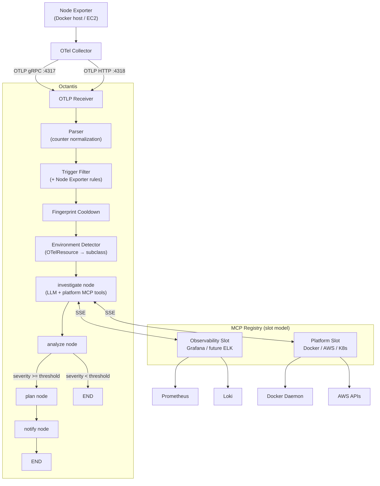
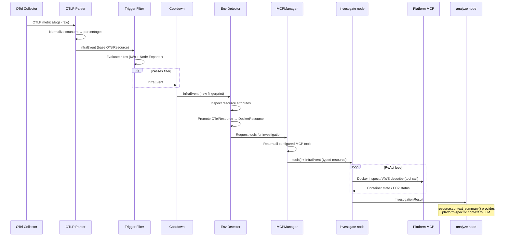
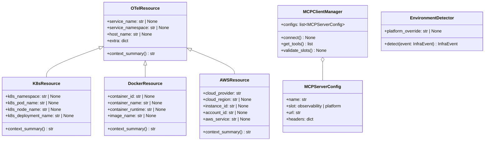
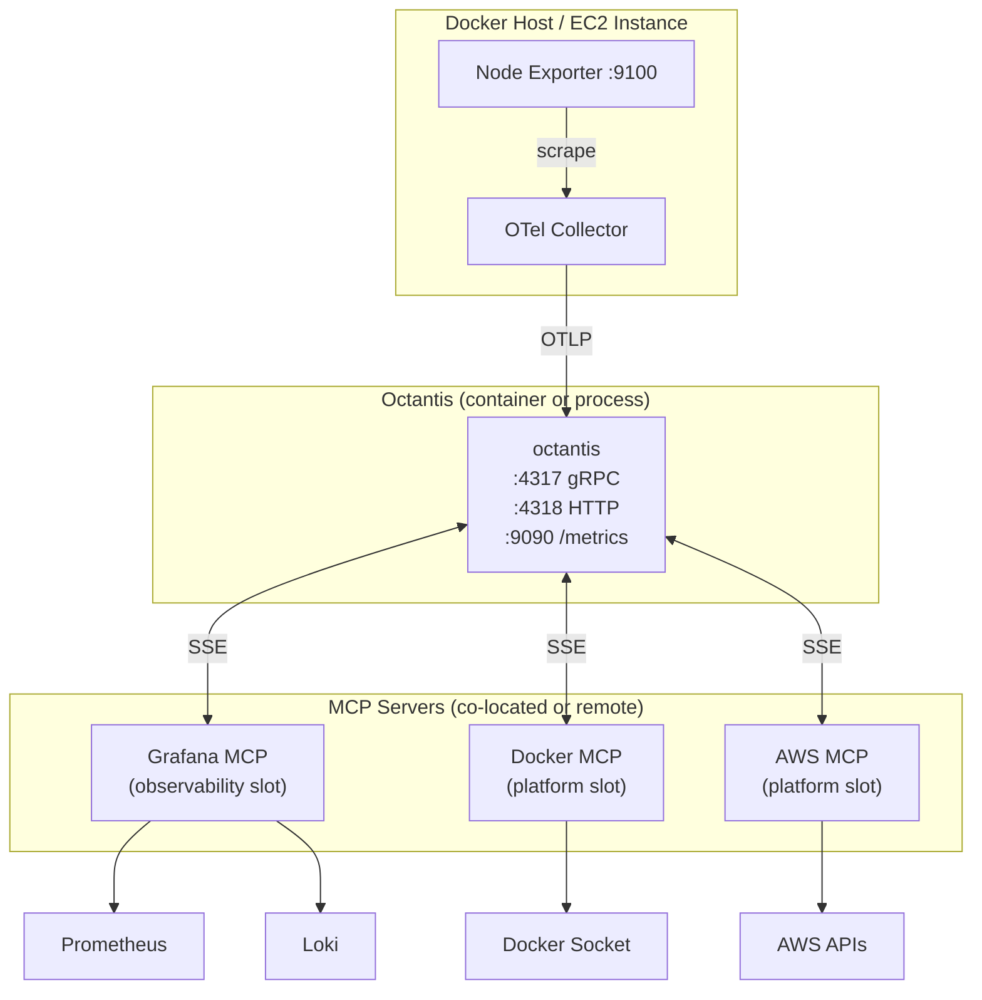

# Tech Spec 003: Multi-Platform Support — Docker & AWS

> Tech Spec — Generated by Design Docs Expert | 2026-04-10
>
> Based on: [PRD 003 — Multi-Platform Support: Docker & AWS](../prds/prd-003-multi-platform-docker-aws.md)

## List of Contents

- [1. Context](#1-context)
- [2. Objective](#2-objective)
- [3. Architecture](#3-architecture)
- [4. Technical Decisions](#4-technical-decisions)
- [5. Requirements](#5-requirements)
- [6. Data Model](#6-data-model)
- [7. Security](#7-security)
- [8. Infrastructure](#8-infrastructure)
- [9. Observability](#9-observability)
- [10. Cost Estimate](#10-cost-estimate)
- [11. Rollout Plan](#11-rollout-plan)
- [12. Future Considerations](#12-future-considerations)
- [13. Decision Log](#13-decision-log)

## 1. Context

### Problem Statement

Octantis only works with Kubernetes environments. The TriggerFilter targets K8s-specific signals (CrashLoopBackOff, OOMKill, pod evictions), the `OTelResource` model only has K8s fields, and the only investigation MCP is Grafana. Teams running Docker or AWS EC2/ECS — even with Node Exporter + OTel Collector sending OTLP data — get silently dropped events and zero investigation capability.

### Current State

- **OTelResource** (`models/event.py:9-18`): Hardcoded K8s fields (`k8s_namespace`, `k8s_pod_name`, `k8s_node_name`, `k8s_deployment_name`) + catch-all `extra` dict
- **TriggerFilter** (`pipeline/trigger_filter.py`): `MetricThresholdRule` uses substring matching (`"cpu" in name`) and assumes percentage values. Node Exporter counters (e.g., `node_cpu_seconds_total` = 123456.78 seconds) would either always or never trigger
- **MCPClientManager** (`mcp_client/manager.py`): Hardcoded `_connect_grafana()` and `_connect_k8s()` methods. Constructor takes specific settings classes. No generic mechanism for adding new MCP servers
- **InvestigationResult.summary** (`models/event.py:79-105`): Hardcoded K8s references (`k8s_namespace`, `k8s_pod_name`) — no context for Docker/AWS
- **Config** (`config.py`): Only `GrafanaMCPSettings` and `K8sMCPSettings`. No Docker, AWS, or platform detection settings

### System Type

Event-driven (async) — unchanged from Tech Spec 002. OTLP events trigger LLM investigations via MCP tool calling. This spec adds new platform-specific MCP tools and multi-platform event routing.

## 2. Objective

### Goals

- Node Exporter metrics pass TriggerFilter correctly (normalized values, host-level thresholds)
- Octantis detects the source platform (K8s, Docker, AWS) from OTLP attributes or explicit config
- Docker MCP tools available to the LLM for Docker-sourced investigations
- AWS MCP tools available to the LLM for AWS-sourced investigations
- MCPClientManager supports any MCP via registry pattern without code changes
- MCP slot model enforced: min 1, max 1 observability + 1 platform (hardcoded limit)

### Non-Goals

- Multiple MCPs per slot (paid tier — future)
- Mixed environment on a single instance (paid tier — future)
- VMware, GCP, Azure (future PRD)
- Tier/license system (not designed yet)
- OTel Collector or Node Exporter deployment

### Success Criteria

| Criterion | Baseline | Target | Verification |
|-----------|----------|--------|-------------|
| Node Exporter CPU event triggers investigation | Silently dropped | TriggerFilter passes event with normalized CPU % | Unit test: send `node_cpu_seconds_total` counter, verify normalized % compared against threshold |
| Docker investigation | Not possible | LLM uses Docker MCP tools during investigation | Integration test: `OCTANTIS_PLATFORM=docker`, Docker event → Docker MCP tool calls in investigation trace |
| AWS investigation | Not possible | LLM uses AWS MCP tools during investigation | Integration test: `OCTANTIS_PLATFORM=aws`, EC2 event → AWS MCP tool calls in investigation trace |
| Platform auto-detection | Always K8s | Correct platform detected from OTLP resource attributes | Unit test: `cloud.provider=aws` → platform `aws`; `container.runtime=docker` → platform `docker` |
| Slot enforcement | No validation | Startup error if 0 MCPs or 2+ per slot | Unit test: zero MCPs → error; 2 platform MCPs → error |
| K8s flow unaffected | Working | Still working | `uv run pytest` passes with no regressions |

## 3. Architecture

### System Diagram



### Components

| Component | Responsibility | Technology | Delta |
|-----------|---------------|------------|-------|
| OTelResource (base) | Common resource attributes (service_name, host_name, extra) | Pydantic BaseModel | Modified — extracted base, K8s fields moved to subclass |
| K8sResource | K8s-specific attributes (namespace, pod, node, deployment) + `context_summary()` | Pydantic, inherits OTelResource | Added — extracted from OTelResource |
| DockerResource | Docker attributes (container_id, container_name, image, host) + `context_summary()` | Pydantic, inherits OTelResource | Added |
| AWSResource | AWS attributes (instance_id, region, account_id, service) + `context_summary()` | Pydantic, inherits OTelResource | Added |
| OTLP Parser | Parse OTLP payloads + normalize Node Exporter counters to percentages | Python | Modified — adds counter normalization |
| Environment Detector | Promote base OTelResource to typed subclass based on OTLP attributes or config | Python | Added |
| TriggerFilter | Detect anomalous events worth investigating | Python dataclasses | Modified — MetricThresholdRule gains Node Exporter metric names |
| MCPClientManager | Manage MCP connections via registry pattern with slot validation | mcp[sse], langchain-mcp-adapters | Modified — registry replaces hardcoded methods |
| MCPServerConfig | Dataclass describing an MCP server (name, slot, url, headers) | Python dataclass | Added |
| InvestigationResult | Investigation output with polymorphic summary | Pydantic | Modified — `summary` delegates to `resource.context_summary()` |
| Config | Application settings | Pydantic BaseSettings | Modified — adds Docker/AWS MCP settings, OCTANTIS_PLATFORM |

### Data Flow



### API Contracts

#### MCPServerConfig (new)

```python
@dataclass
class MCPServerConfig:
    """Describes a single MCP server connection."""
    name: str                              # e.g., "grafana", "docker", "aws"
    slot: Literal["observability", "platform"]
    url: str                               # SSE endpoint URL
    headers: dict[str, str] = field(default_factory=dict)
```

#### OTelResource Hierarchy (modified)

```python
class OTelResource(BaseModel):
    """Base resource — common fields across all platforms."""
    service_name: str | None = None
    service_namespace: str | None = None
    host_name: str | None = None
    extra: dict[str, Any] = Field(default_factory=dict)

    def context_summary(self) -> str:
        """Platform-specific summary for LLM context. Override in subclasses."""
        parts = [f"Service: {self.service_name or 'unknown'}"]
        if self.host_name:
            parts.append(f"Host: {self.host_name}")
        return "\n".join(parts)


class K8sResource(OTelResource):
    """Kubernetes-specific resource attributes."""
    k8s_namespace: str | None = None
    k8s_pod_name: str | None = None
    k8s_node_name: str | None = None
    k8s_deployment_name: str | None = None

    def context_summary(self) -> str:
        parts = [
            f"Service: {self.service_name or 'unknown'}",
            f"Namespace: {self.k8s_namespace or 'unknown'}",
        ]
        if self.k8s_pod_name:
            parts.append(f"Pod: {self.k8s_pod_name}")
        if self.k8s_deployment_name:
            parts.append(f"Deployment: {self.k8s_deployment_name}")
        if self.k8s_node_name:
            parts.append(f"Node: {self.k8s_node_name}")
        return "\n".join(parts)


class DockerResource(OTelResource):
    """Docker-specific resource attributes."""
    container_id: str | None = None
    container_name: str | None = None
    container_runtime: str | None = None
    image_name: str | None = None

    def context_summary(self) -> str:
        parts = [f"Service: {self.service_name or 'unknown'}"]
        if self.container_name:
            parts.append(f"Container: {self.container_name}")
        if self.image_name:
            parts.append(f"Image: {self.image_name}")
        if self.container_id:
            parts.append(f"Container ID: {self.container_id[:12]}")
        if self.host_name:
            parts.append(f"Host: {self.host_name}")
        return "\n".join(parts)


class AWSResource(OTelResource):
    """AWS-specific resource attributes."""
    cloud_provider: str = "aws"
    cloud_region: str | None = None
    instance_id: str | None = None
    account_id: str | None = None
    aws_service: str | None = None  # "ec2", "ecs"

    def context_summary(self) -> str:
        parts = [f"Service: {self.service_name or 'unknown'}"]
        if self.instance_id:
            parts.append(f"Instance: {self.instance_id}")
        if self.cloud_region:
            parts.append(f"Region: {self.cloud_region}")
        if self.aws_service:
            parts.append(f"AWS Service: {self.aws_service}")
        if self.account_id:
            parts.append(f"Account: {self.account_id}")
        return "\n".join(parts)
```

#### Environment Variables (new)

```bash
# Platform detection
OCTANTIS_PLATFORM=              # Optional override: "k8s", "docker", "aws". Auto-detect if empty.

# Docker MCP (platform slot)
DOCKER_MCP_URL=                 # SSE endpoint for Docker MCP server
DOCKER_MCP_HEADERS=             # Optional: JSON-encoded headers

# AWS MCP (platform slot)
AWS_MCP_URL=                    # SSE endpoint for AWS MCP server
AWS_MCP_HEADERS=                # Optional: JSON-encoded headers

# Startup retry
MCP_RETRY_MAX_ATTEMPTS=3        # Max connection attempts per MCP server
MCP_RETRY_BACKOFF_BASE=2.0      # Base for exponential backoff (seconds)
```

#### Updated Config Classes

```python
class DockerMCPSettings(BaseSettings):
    model_config = SettingsConfigDict(env_prefix="DOCKER_MCP_", extra="ignore")
    url: str | None = None
    headers: str | None = None  # JSON-encoded

class AWSMCPSettings(BaseSettings):
    model_config = SettingsConfigDict(env_prefix="AWS_MCP_", extra="ignore")
    url: str | None = None
    headers: str | None = None  # JSON-encoded

class PlatformSettings(BaseSettings):
    model_config = SettingsConfigDict(env_prefix="OCTANTIS_", extra="ignore")
    platform: Literal["k8s", "docker", "aws"] | None = None  # None = auto-detect

class MCPRetrySettings(BaseSettings):
    model_config = SettingsConfigDict(env_prefix="MCP_RETRY_", extra="ignore")
    max_attempts: int = 3
    backoff_base: float = 2.0  # exponential: 2s, 4s, 8s
```

## 4. Technical Decisions

### Decision 1: Polymorphic OTelResource via Inheritance

**Context:** The current `OTelResource` has K8s-specific fields hardcoded. Docker and AWS require different fields. Need an extensible model for new platforms.

**Decision:** Extract a base `OTelResource` with common fields (`service_name`, `host_name`, `extra`). Create subclasses `K8sResource`, `DockerResource`, `AWSResource` with platform-specific typed fields and `context_summary()` method.

**Alternatives:**

| Option | Pros | Cons | Verdict |
|--------|------|------|---------|
| Base class + subclasses with `context_summary()` | Type-safe, OCP-compliant, polymorphic summary, IDE autocompletion | Migration effort on existing K8s fields | **Chosen** |
| Add all fields to single OTelResource | Zero migration, simple | Grows unbounded, no type safety per platform, violates SRP | Rejected — doesn't scale |
| Use `extra` dict for everything | Zero model changes | No type safety, string-coupled detection, no autocompletion | Rejected — fragile |

**Trade-offs accepted:** Migration of existing code that references `resource.k8s_namespace` directly. Bounded: only `InvestigationResult.summary` and a few log calls.

### Decision 2: Parser Normalizes, Detector Promotes (Separation of Responsibilities)

**Context:** Node Exporter sends counters (e.g., `node_cpu_seconds_total` = 123456.78 seconds) not percentages. Also, the event needs to be promoted from base `OTelResource` to a typed subclass.

**Decision:** Two distinct responsibilities:
1. **Parser** creates base `OTelResource` and normalizes known counters to percentages (e.g., `node_cpu_seconds_total` rate → CPU %)
2. **Environment Detector** inspects resource attributes (or `OCTANTIS_PLATFORM` config) and promotes the base `OTelResource` to the correct subclass (`K8sResource`, `DockerResource`, `AWSResource`)

**Alternatives:**

| Option | Pros | Cons | Verdict |
|--------|------|------|---------|
| Parser normalizes + Detector promotes | Clear SRP: parser handles data shape, detector handles platform semantics | Two passes over the event | **Chosen** |
| Parser does both (normalize + create subclass) | Single pass, all in one place | Parser couples to platform detection logic, violates SRP | Rejected — wrong responsibility boundary |
| Detector normalizes + promotes | Single component for platform-aware logic | Detector shouldn't know about counter math | Rejected — leaks data normalization into detection |

**Trade-offs accepted:** Two passes over the event data (parse + detect). Negligible performance cost for in-memory operations.

### Decision 3: Registry-Based MCPClientManager

**Context:** The current MCPClientManager has hardcoded `_connect_grafana()` and `_connect_k8s()` methods. Adding Docker and AWS means more hardcoded methods. VMware, GCP, Azure would add more.

**Decision:** Refactor to a registry pattern. MCPClientManager receives a list of `MCPServerConfig` objects. Each config declares `name`, `slot` (observability/platform), `url`, and `headers`. The manager validates slots, connects generically, and returns tools. Adding a new MCP = adding a config, zero code change in the manager.

**Alternatives:**

| Option | Pros | Cons | Verdict |
|--------|------|------|---------|
| Registry with MCPServerConfig | Adding new MCP = config only, slot validation centralized, plug-in model | Refactor of existing MCPClientManager | **Chosen** |
| Add `_connect_docker()`, `_connect_aws()` methods | Faster to implement, follows existing pattern | Each new MCP = new method + settings class, doesn't scale | Rejected — same problem in 6 months |
| Plugin system with entry points | Most extensible, third-party MCP support | Over-engineered for current needs | Rejected — YAGNI |

**Trade-offs accepted:** Breaking change in MCPClientManager constructor. Existing code that instantiates it must be updated. Bounded to `main.py` and tests.

### Decision 4: Hardcoded Slot Limits (No Tier System)

**Context:** PRD defines max 1 observability + 1 platform MCP in free tier. Need enforcement mechanism.

**Decision:** Hardcode the slot limits in MCPClientManager validation. No tier/license system. When the paid tier is designed, the validation logic is the only change point.

**Alternatives:**

| Option | Pros | Cons | Verdict |
|--------|------|------|---------|
| Hardcoded limits | Simple, no over-engineering, single change point for future | Must change code to lift limits | **Chosen** |
| `OCTANTIS_TIER=free\|paid` env var | Easy to toggle | Trivially bypassed, no real enforcement | Rejected — false sense of control |
| License key system | Proper enforcement | Significant complexity, no revenue yet | Rejected — premature |

**Trade-offs accepted:** Limits can be bypassed by modifying source code. Acceptable for an open-source project where the paid tier isn't defined yet.

### Decision 5: Startup Retry with Backoff → Hard Fail

**Context:** At least 1 MCP must be connected. MCP servers may be temporarily unavailable at startup (e.g., pod still starting).

**Decision:** Distinguish config errors from runtime errors:
- **No MCP configured** (config error) → immediate startup failure
- **MCP configured but unreachable** (runtime error) → retry with exponential backoff (default: 3 attempts, base 2s → 2s, 4s, 8s). If all retries exhausted → hard fail (exit)

**Alternatives:**

| Option | Pros | Cons | Verdict |
|--------|------|------|---------|
| Retry + hard fail | Handles temporary unavailability, fails decisively when truly broken | 14s max delay at startup (worst case) | **Chosen** |
| Immediate hard fail | Fast feedback | Flaky in container orchestration where startup order varies | Rejected — too brittle |
| Degraded mode (start without MCPs) | Maximum availability | LLM investigates blind, contradicts "min 1 MCP" rule | Rejected — violates PRD constraint |

**Trade-offs accepted:** 14-second max startup delay in worst case. Acceptable — container orchestrators have readiness probes for this.

### Decision 6: Polymorphic `context_summary()` on OTelResource

**Context:** `InvestigationResult.summary` provides text context to the LLM analyzer. Currently hardcoded for K8s. Needs platform-specific context.

**Decision:** Each OTelResource subclass implements `context_summary() -> str`. `InvestigationResult.summary` calls `self.original_event.resource.context_summary()` instead of hardcoding K8s fields.

**Alternatives:**

| Option | Pros | Cons | Verdict |
|--------|------|------|---------|
| Polymorphic `context_summary()` | Each subclass owns its summary, adding platforms = adding a method, OCP-compliant | Must ensure all subclasses implement it well | **Chosen** |
| `isinstance()` branching in InvestigationResult | Centralized, easy to read in one place | Grows with each platform, violates OCP | Rejected — doesn't scale |

**Trade-offs accepted:** Base class provides a generic fallback summary. If a new subclass forgets to override, the summary is still usable (just less specific).

## 5. Requirements

### Functional Requirements

#### Scenario: Node Exporter counter normalization
WHEN the OTLP parser receives a metric named `node_cpu_seconds_total` with value 123456.78
THEN the parser MUST normalize the value to a CPU usage percentage
AND MUST store the normalized value in the `MetricDataPoint.value` field
AND MUST preserve the original metric name for the TriggerFilter to match

#### Scenario: Node Exporter metrics pass TriggerFilter
WHEN a normalized Node Exporter metric arrives at the TriggerFilter
THEN the `MetricThresholdRule` MUST recognize metric names containing `node_cpu`, `node_memory`, `node_filesystem`, `node_network`
AND MUST apply host-level thresholds (same defaults as pod-level: CPU 75%, memory 80%)
AND MUST pass events where any metric exceeds its threshold

#### Scenario: Environment detection from OTLP attributes
WHEN an InfraEvent reaches the Environment Detector
THEN the detector MUST inspect `resource.extra` for platform-identifying attributes
AND MUST promote the base OTelResource to `K8sResource` if `k8s.pod.name` or `k8s.namespace.name` is present
AND MUST promote to `DockerResource` if `container.runtime` equals `docker` or `container.id` is present
AND MUST promote to `AWSResource` if `cloud.provider` equals `aws`
AND K8s detection MUST take priority over AWS detection (EKS edge case)

#### Scenario: Environment detection from explicit config
WHEN `OCTANTIS_PLATFORM` is set
THEN the detector MUST use the configured platform regardless of OTLP attributes
AND MUST promote the resource to the corresponding subclass
AND MUST NOT log a warning about attribute mismatch

#### Scenario: No platform detected
WHEN neither OTLP attributes nor `OCTANTIS_PLATFORM` identify a platform
THEN the detector MUST default to `K8sResource` for backwards compatibility
AND MUST log a warning: "platform not detected, defaulting to k8s"

#### Scenario: MCP registry validates slot limits
WHEN MCPClientManager receives a list of MCPServerConfig
THEN it MUST reject configurations with zero MCPs (startup error)
AND MUST reject configurations with 2+ MCPs in the same slot (startup error)
AND MUST accept configurations with 1 observability + 1 platform
AND MUST accept configurations with only 1 MCP (either slot)

#### Scenario: MCP startup with retry
WHEN MCPClientManager attempts to connect to a configured MCP server
AND the SSE connection fails
THEN the manager MUST retry with exponential backoff (base 2s, max 3 attempts)
AND MUST log each retry attempt with attempt number and wait time
AND MUST hard fail (exit) if all retries are exhausted

#### Scenario: Docker MCP tools available to LLM
WHEN Docker MCP is configured and connected
THEN the investigate node MUST receive Docker MCP tools in addition to any other configured MCP tools
AND the LLM MUST be able to call Docker container inspection, logs, and stats tools

#### Scenario: AWS MCP tools available to LLM
WHEN AWS MCP is configured and connected
THEN the investigate node MUST receive AWS MCP tools in addition to any other configured MCP tools
AND the LLM MUST be able to call EC2 describe, CloudWatch query, and ECS task status tools

#### Scenario: MCP goes down at runtime
WHEN a configured MCP server becomes unreachable during an active investigation
THEN the system MUST catch the connection error
AND MUST complete the investigation with remaining configured MCPs or trigger data only
AND MUST set `mcp_degraded: true` on the InvestigationResult
AND SHOULD attempt reconnection for subsequent investigations

#### Scenario: Polymorphic summary in investigation result
WHEN the analyze node receives an InvestigationResult
THEN `InvestigationResult.summary` MUST call `resource.context_summary()`
AND the summary MUST include platform-specific fields (Docker: container name, image; AWS: instance ID, region)

### Non-Functional Requirements

| Category | Requirement | Target | Measurement |
|----------|-------------|--------|-------------|
| **Startup (healthy)** | Time from process start to ready | < 5s (no retry) | Log timestamp delta: `main.started` → `mcp.all_connected` |
| **Startup (retry)** | Time with max retries exhausted | < 20s before exit | 3 attempts × (2s + 4s + 8s) = 14s + overhead |
| **Detection latency** | Environment detection per event | < 1ms | In-memory attribute lookup, no I/O |
| **Normalization latency** | Counter normalization per event | < 1ms | In-memory math |
| **Investigation latency** | p99 with platform MCP | < 60s | `octantis_investigation_duration_seconds` histogram |
| **MCP connection** | SSE connection per server | < 5s | `octantis_mcp_connect_duration_seconds` |

### Error Handling

#### Scenario: Parser encounters unknown counter metric
WHEN the parser receives a metric name not in the known counter list
THEN the parser MUST pass the value through unchanged (no normalization)
AND MUST NOT raise an error

#### Scenario: Two MCPs configured in same slot
WHEN MCPClientManager validates configs and finds 2 observability or 2 platform MCPs
THEN the system MUST log an error: "multiple [slot] MCPs configured — limit is 1 per slot"
AND MUST exit with non-zero status code

#### Scenario: MCP server returns unexpected tool schema
WHEN `load_mcp_tools()` returns tools with unexpected schemas
THEN the system MUST log a warning with the tool name and schema
AND MUST include the tools anyway (LLM handles gracefully)

## 6. Data Model

### Entities



### Consistency Model

Not applicable — Octantis remains stateless. The Environment Detector is a pure function (attributes in → typed resource out). No new state introduced.

### Data Retention

No changes from Tech Spec 002. All data remains transient and in-memory.

## 7. Security

### Authentication

- **Grafana MCP**: Unchanged — service account token via `GRAFANA_MCP_API_KEY`
- **Docker MCP**: Depends on chosen MCP server. If it exposes the Docker socket, the MCP server process needs Docker group access. Octantis connects via SSE — no Docker socket access needed from Octantis itself. Headers configurable via `DOCKER_MCP_HEADERS`.
- **AWS MCP**: Depends on chosen MCP server. Likely requires AWS credentials (access key + secret or IAM role). Credentials managed by the MCP server process, not by Octantis. Headers configurable via `AWS_MCP_HEADERS`.

### Authorization

- Docker MCP server SHOULD have read-only access to the Docker daemon (inspect, logs, stats — no create/delete/exec)
- AWS MCP server MUST use a minimal read-only IAM policy:
  ```json
  {
    "Effect": "Allow",
    "Action": [
      "ec2:Describe*",
      "ecs:Describe*",
      "ecs:List*",
      "cloudwatch:GetMetricData",
      "cloudwatch:ListMetrics",
      "logs:GetLogEvents",
      "logs:FilterLogEvents"
    ],
    "Resource": "*"
  }
  ```
- Octantis MUST NOT have direct access to Docker daemon or AWS APIs — all access is through MCP servers

### Data Protection

- **In transit**: MCP SSE connections use HTTP within local network. HTTPS recommended for cross-network setups (configurable via URL scheme).
- **At rest**: No change — Octantis has no persistent storage.
- **Secrets**: `DOCKER_MCP_HEADERS` and `AWS_MCP_HEADERS` may contain tokens. Must be stored as Kubernetes Secrets or equivalent, never in config files.

### Compliance

No additional compliance requirements. Docker and AWS MCP servers are external — their compliance is the operator's responsibility.

### Audit

- MCP queries recorded in `InvestigationResult.queries_executed` now include Docker and AWS datasource types
- `MCPQueryRecord.datasource` extended to include `"docker"`, `"aws"` alongside existing `"promql"`, `"logql"`, `"k8s"`
- Platform detection logged: `environment.detected` with `platform` and `source` (attributes vs config) fields

## 8. Infrastructure

### Deployment Architecture



### Resource Sizing

| Component | CPU | Memory | Storage | Replicas | Scaling |
|-----------|-----|--------|---------|----------|---------|
| Octantis | 200m req / 1 core limit | 256Mi req / 512Mi limit | None | 1 | Manual |
| Docker MCP | 100m req / 500m limit | 128Mi req / 256Mi limit | None | 1 | Manual |
| AWS MCP | 100m req / 500m limit | 128Mi req / 256Mi limit | None | 1 | Manual |

### Environments

| Environment | Purpose | Scale Factor | Differences |
|-------------|---------|-------------|-------------|
| dev | Local development (Docker Compose) | 1x | Docker MCP talks to local Docker daemon, AWS MCP mocked or uses localstack |
| prod | Production | 1x | Real Docker daemon / AWS APIs |

## 9. Observability

### SLIs & SLOs

No new SLIs — existing SLIs from Tech Spec 002 apply. Platform MCP queries are tracked by the same metrics with an additional `datasource` label.

### Metrics

New/modified metrics:

| Metric | Type | Labels | Description |
|--------|------|--------|-------------|
| `octantis_mcp_connect_duration_seconds` | Histogram | `server`, `slot` | Time to establish SSE connection per MCP server |
| `octantis_mcp_connect_retries_total` | Counter | `server`, `outcome` (success, exhausted) | Connection retry attempts |
| `octantis_environment_detected_total` | Counter | `platform` (k8s, docker, aws), `source` (attributes, config, default) | Platform detections |
| `octantis_investigation_queries_total` | Counter | `datasource` (promql, logql, k8s, docker, aws) | Extended with docker/aws labels |
| `octantis_mcp_query_duration_seconds` | Histogram | `datasource` | Extended with docker/aws labels |

### Logging

New log events:

| Event | Level | Fields | When |
|-------|-------|--------|------|
| `environment.detected` | INFO | event_id, platform, source, attributes | Platform detected for event |
| `environment.default_fallback` | WARNING | event_id | No platform detected, defaulting to K8s |
| `mcp.slot_validation` | INFO | observability_count, platform_count | Startup slot validation |
| `mcp.retry` | WARNING | server, attempt, max_attempts, backoff_s | MCP connection retry |
| `mcp.retry_exhausted` | ERROR | server, attempts | All retries failed, exiting |
| `parser.counter_normalized` | DEBUG | metric_name, raw_value, normalized_value | Counter → percentage normalization |

### Tracing

Not implemented — unchanged from Tech Spec 002.

### Dashboards

Extend existing **Octantis Operations** dashboard with:
- Platform detection breakdown (K8s vs Docker vs AWS pie chart)
- MCP connection status per server (up/down timeline)
- Investigation queries by datasource (stacked bar: promql, logql, docker, aws)

## 10. Cost Estimate

| Resource | Unit Cost | Quantity | Monthly Cost |
|----------|-----------|----------|-------------|
| LLM tokens — unchanged from TS-002 | — | — | ~$45-75 |
| Octantis compute | ~$0.05/hr | 1 instance | ~$36 |
| Docker MCP compute | ~$0.03/hr | 1 instance | ~$22 |
| AWS MCP compute | ~$0.03/hr | 1 instance | ~$22 |
| AWS API calls (CloudWatch, EC2 Describe) | ~$0.01/1000 requests | ~1500 requests/day | ~$0.50 |
| **Total (Docker setup)** | | | **~$103-133** |
| **Total (AWS setup)** | | | **~$103-134** |
| **Total (Grafana + Docker)** | | | **~$125-155** |

### Cost Optimization Opportunities

- Run Docker MCP as a sidecar instead of separate container (saves ~$22/mo)
- AWS MCP: use IAM roles instead of access keys to avoid credential rotation cost
- Tune `INVESTIGATION_MAX_QUERIES` per platform (Docker investigations may need fewer queries than AWS)

## 11. Rollout Plan

### Phases

| Phase | What | Validation | Rollback |
|-------|------|-----------|----------|
| 1 — Data Model | OTelResource hierarchy + Environment Detector + Parser normalization | `uv run pytest` — all existing tests pass with refactored models | `git revert` — restore old OTelResource |
| 2 — MCPManager Registry | Refactor MCPClientManager to registry pattern + slot validation | Existing Grafana MCP works with new registry; slot validation unit tests pass | `git revert` — restore hardcoded methods |
| 3 — TriggerFilter | Add Node Exporter metric names to MetricThresholdRule | Unit test: normalized Node Exporter event triggers investigation | `git revert` — Node Exporter rules removed |
| 4 — Docker MCP | Wire Docker MCP into registry, integration test | Full flow: Docker event → detect → investigate via Docker MCP → notify | Remove Docker MCP config — falls back to other configured MCPs |
| 5 — AWS MCP | Wire AWS MCP into registry, integration test | Full flow: AWS event → detect → investigate via AWS MCP → notify | Remove AWS MCP config — falls back to other configured MCPs |
| 6 — Documentation Overhaul | Rewrite all docs to be multi-platform (currently K8s-only), including security docs for Docker/AWS MCPs | All docs reference Docker and AWS; onboarding guides exist per platform; SECURITY.md covers all MCP types; no K8s-only language in generic descriptions | `git revert` — restore old docs |

### Migration Plan

No production migration needed — project is not in production. However, internal code migration:

1. **Phase 1**: Refactor `OTelResource` → base + `K8sResource`. Update all references to `resource.k8s_namespace` etc. to work with the new hierarchy. Since Pydantic supports inheritance, `isinstance(resource, K8sResource)` works naturally.
2. **Phase 2**: Refactor `MCPClientManager.__init__` to accept `list[MCPServerConfig]` instead of specific settings classes. Update `main.py` to build configs from settings.
3. Tests updated per phase — no big-bang test rewrite.

### Feature Flags

None — phased deployment, each phase is a commit that can be independently reverted.

### Rollback Plan

```bash
# Per-phase rollback (each phase is a separate commit)
git log --oneline -10  # find phase commit
git revert <phase-commit>
uv run pytest          # verify rollback didn't break anything
```

### Launch Checklist

- [ ] OTelResource base + K8sResource + DockerResource + AWSResource implemented with `context_summary()`
- [ ] Environment Detector promotes base resource to typed subclass
- [ ] Parser normalizes `node_cpu_seconds_total`, `node_memory_MemAvailable_bytes`, `node_filesystem_avail_bytes`
- [ ] TriggerFilter MetricThresholdRule matches `node_cpu`, `node_memory`, `node_filesystem`, `node_network`
- [ ] MCPClientManager refactored to registry pattern
- [ ] Slot validation: min 1, max 1 per slot — unit tests pass
- [ ] Retry + backoff on MCP connection failure — unit tests pass
- [ ] Hard fail after retries exhausted — verified manually
- [ ] Docker MCP integration tested end-to-end
- [ ] AWS MCP integration tested end-to-end
- [ ] `InvestigationResult.summary` uses `resource.context_summary()`
- [ ] Existing K8s flow unaffected — `uv run pytest` passes
- [ ] New Prometheus metrics visible at `:9090/metrics`
- [ ] `.env.example` updated with new environment variables
- [ ] `.github/OVERVIEW.md` rewritten for multi-platform (architecture description, diagrams, examples)
- [ ] `.github/PIPELINE.md` updated with Node Exporter examples, environment detection, MCP slot model
- [ ] `.github/ONBOARDING.md` includes Docker and AWS quickstart alongside K8s
- [ ] `.github/AGENT.md` updated with Docker and AWS investigation examples
- [ ] `README.md` reflects multi-platform support in description, features, and quickstart
- [ ] `.github/SECURITY.md` updated with Docker MCP (socket access, read-only) and AWS MCP (IAM policy, least-privilege) security guidance

## 12. Future Considerations

- **Revisit if**: Paid tier is defined → replace hardcoded slot limits with a tier-aware validation system
- **Revisit if**: VMware, GCP, or Azure support needed → add new OTelResource subclasses + MCPServerConfig entries (zero change to MCPClientManager or Environment Detector)
- **Revisit if**: ELK stack as observability backend → add ELK MCP as observability slot option (zero change to MCPClientManager)
- **Planned evolution**: Mixed environment support (multi-platform per instance) for paid tier
- **Technical debt accepted**: Slot limits are hardcoded constants. Acceptable until the paid tier business model is defined
- **Technical debt accepted**: Counter normalization in the parser uses a hardcoded list of known metric names. May need to be configurable if users run custom exporters with different naming conventions

## 13. Decision Log

| Date | Decision | Rationale |
|------|----------|-----------|
| 2026-04-10 | Polymorphic OTelResource via inheritance (base + K8s/Docker/AWS subclasses) | OCP-compliant, type-safe, each platform owns its fields and summary. Adding platforms = adding a subclass, no modification to existing code. |
| 2026-04-10 | Parser normalizes counters; Environment Detector promotes resource type | SRP: parser is responsible for data shape, detector for platform semantics. Two distinct responsibilities that shouldn't be coupled. |
| 2026-04-10 | Registry-based MCPClientManager with MCPServerConfig | Plug-in model from PRD. Adding a new MCP = adding a config object, zero code change in the manager. Replaces hardcoded `_connect_grafana()` / `_connect_k8s()` methods. |
| 2026-04-10 | Hardcoded slot limits (no tier system) | Paid tier not designed yet. Hardcoding is the simplest enforcement. Single change point when tier system is introduced. |
| 2026-04-10 | Retry with backoff → hard fail on MCP connection | Distinguishes config errors (fail immediately) from runtime errors (temporary, worth retrying). 3 attempts with 2s/4s/8s backoff before exit. |
| 2026-04-10 | Polymorphic `context_summary()` on OTelResource subclasses | `InvestigationResult.summary` delegates to the resource, not branches on `isinstance()`. Each platform owns its LLM context. Adding platforms = adding a method. |
