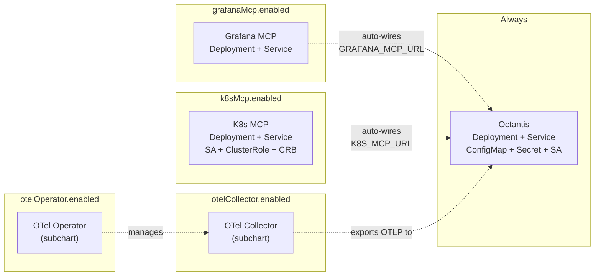
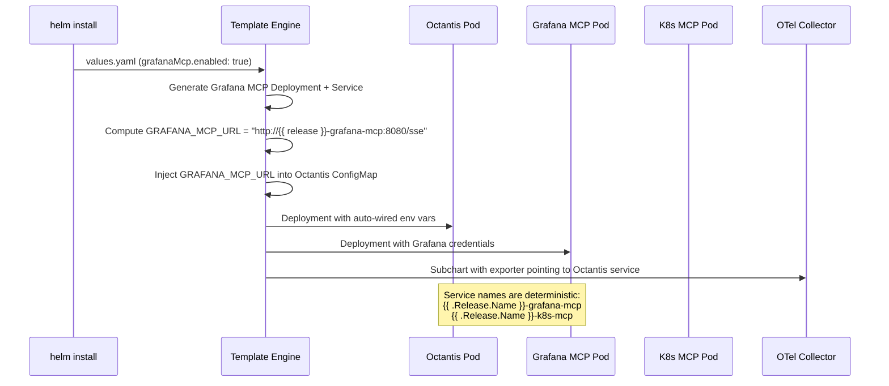
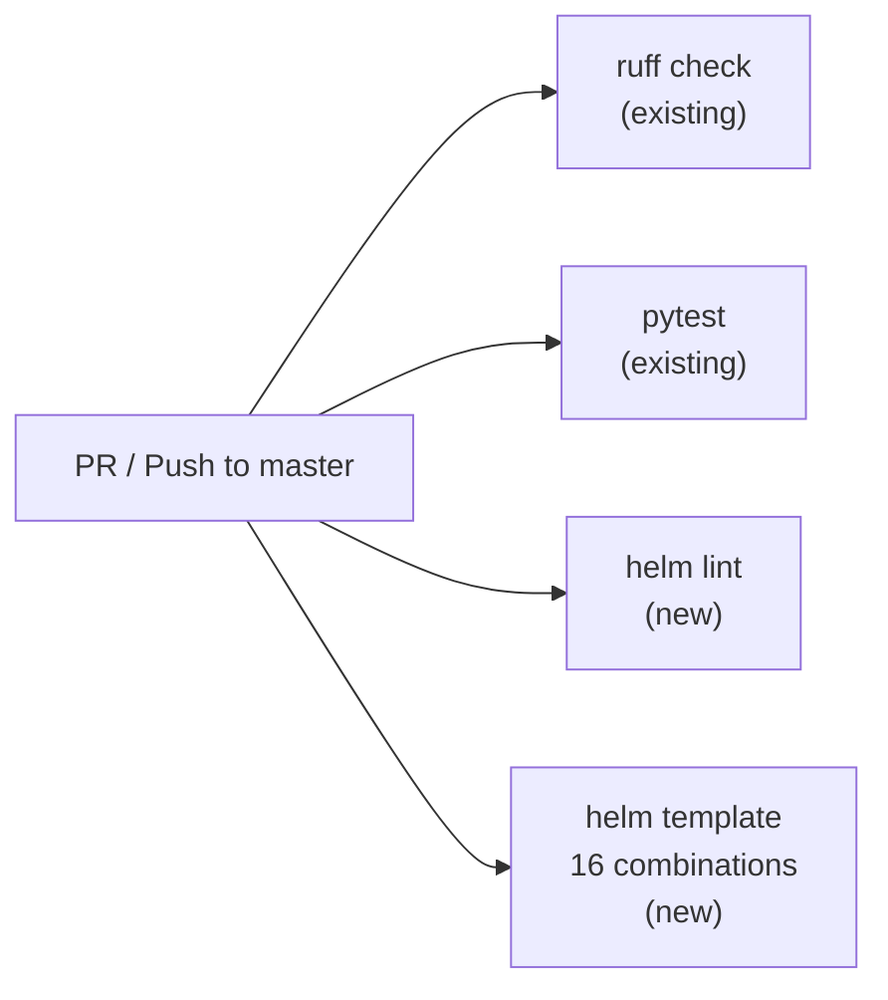
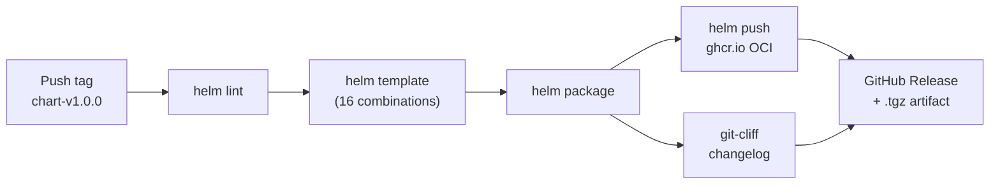

# Tech Spec 004: Octantis Helm Chart — Modular Deployment

> Tech Spec — Generated by Design Docs Expert | 2026-04-10
>
> Based on: [PRD 004 — Octantis Helm Chart](../prds/prd-004-helm-chart.md)

## List of Contents

- [1. Context](#1-context)
- [2. Objective](#2-objective)
- [3. Architecture](#3-architecture)
- [4. Technical Decisions](#4-technical-decisions)
- [5. Requirements](#5-requirements)
- [6. Data Model](#6-data-model)
- [7. Security](#7-security)
- [8. Infrastructure](#8-infrastructure)
- [9. Observability](#9-observability)
- [10. Cost Estimate](#10-cost-estimate)
- [11. Rollout Plan](#11-rollout-plan)
- [12. Future Considerations](#12-future-considerations)
- [13. Decision Log](#13-decision-log)

## 1. Context

### Problem Statement

Octantis has no standardized Kubernetes deployment method. Operators must manually create Deployments, Services, ConfigMaps, Secrets, and wire up MCP servers and OTel Collectors by hand. Example manifests exist in `examples/kubernetes/` but they are standalone YAML files with hardcoded namespaces, no templating, no dependency management, and no versioning. Installing a full stack (Octantis + OTel Collector + Grafana MCP + K8s MCP) requires deploying 3 separate YAML files, creating secrets manually, and cross-referencing service names and ports across files.

### Current State

- **Example manifests**: `examples/kubernetes/octantis.yaml`, `mcp-grafana.yaml`, `mcp-k8s.yaml` — static YAML, hardcoded to `monitoring` namespace
- **Octantis image**: Published at `ghcr.io/vinny1892/octantis:latest`
- **Grafana MCP image**: Published at `ghcr.io/vinny1892/mcp-grafana:latest` (wrapper with `--enabled-tools` defaults)
- **K8s MCP image**: `ghcr.io/containers/kubernetes-mcp-server:latest` (community)
- **No Helm chart**, no OCI artifact, no ArtifactHub listing
- **No CI for chart publishing**

### System Type

Kubernetes packaging / deployment tooling — this is a Helm chart, not a running service. The "system" is the chart itself and its CI/CD pipeline.

## 2. Objective

### Goals

- Single `helm install` deploys any combination of Octantis + OTel + MCPs
- Values API grouped by feature domain, matching `config.py` structure
- All 16 toggle combinations render without errors via `helm template`
- Chart published as OCI artifact to ghcr.io on tag push
- Chart discoverable on ArtifactHub

### Non-Goals

- Helm chart testing framework (ct, helm-unittest) — deferred to future iteration
- Docker Compose deployment
- Ingress / Gateway API resources
- Monitoring stack (Prometheus, Loki, Grafana) deployment
- Docker MCP / AWS MCP templates (deferred to PRD 003 implementation)

### Success Criteria

| Criterion | Baseline | Target | Verification |
|-----------|----------|--------|-------------|
| Install time for full stack | 30+ min manual | < 2 min `helm install` | Time from `helm install` to all pods Running |
| Toggle combinations valid | N/A | 16/16 pass `helm template` | CI script tests all combinations |
| Chart on ghcr.io | Not published | `helm pull oci://ghcr.io/vinny1892/charts/octantis` works | Manual test after first tag push |
| ArtifactHub listing | Not listed | Searchable on artifacthub.io | Search "octantis" on ArtifactHub |

## 3. Architecture

### Chart Structure

```
charts/octantis/
├── Chart.yaml                          # version, appVersion, subchart dependencies
├── Chart.lock
├── values.yaml                         # grouped by feature domain
├── values.schema.json                  # input validation
├── templates/
│   ├── _helpers.tpl                    # shared: fullname, labels, selectors
│   ├── NOTES.txt                       # post-install guidance
│   │
│   ├── octantis/                       # ── always deployed ──
│   │   ├── deployment.yaml
│   │   ├── service.yaml                #   :4317 gRPC, :4318 HTTP, :9090 metrics
│   │   ├── configmap.yaml              #   all octantis.* values → env vars
│   │   ├── serviceaccount.yaml
│   │   └── secret.yaml                 #   conditional: secrets.*.create == true
│   │
│   ├── grafana-mcp/                    # ── if grafanaMcp.enabled ──
│   │   ├── deployment.yaml             #   mcp-grafana + --enabled-tools
│   │   └── service.yaml                #   :8080 SSE
│   │
│   ├── k8s-mcp/                        # ── if k8sMcp.enabled ──
│   │   ├── deployment.yaml             #   kubernetes-mcp-server + --read-only
│   │   ├── service.yaml                #   :8080 SSE
│   │   ├── serviceaccount.yaml
│   │   ├── clusterrole.yaml            #   read-only: get, list, watch
│   │   └── clusterrolebinding.yaml
│   │
│   └── otel/                           # ── if otelOperator + otelCollector ──
│       └── opentelemetrycollector-cr.yaml
│
├── charts/                             # subchart tarballs (helm dep update)
│   ├── opentelemetry-collector-*.tgz   #   condition: otelCollector.enabled
│   └── opentelemetry-operator-*.tgz    #   condition: otelOperator.enabled
│
└── examples/
    ├── values-minimal.yaml             # octantis only
    ├── values-full-stack.yaml          # everything enabled
    └── values-external-mcp.yaml        # octantis + external MCP URLs
```

### What Gets Deployed (by toggle)



### Components

| Component | Type | Condition | Source |
|-----------|------|-----------|--------|
| Octantis | In-chart templates | Always | `templates/octantis/` |
| Grafana MCP | In-chart templates | `grafanaMcp.enabled` | `templates/grafana-mcp/` |
| K8s MCP | In-chart templates | `k8sMcp.enabled` | `templates/k8s-mcp/` |
| OTel Collector | Subchart | `otelCollector.enabled` | `opentelemetry-collector` dependency |
| OTel Operator | Subchart | `otelOperator.enabled` | `opentelemetry-operator` dependency |
| OTel Collector CR | In-chart template | `otelOperator.enabled && otelCollector.enabled` | `templates/otel/` |

### Data Flow (Auto-Wiring)



### API Contract: values.yaml Structure

```yaml
# -- Octantis core configuration
octantis:
  image:
    repository: ghcr.io/vinny1892/octantis
    tag: ""  # defaults to Chart appVersion
    pullPolicy: IfNotPresent
  replicaCount: 1
  resources:
    requests:
      cpu: 200m
      memory: 256Mi
    limits:
      cpu: "1"
      memory: 512Mi
  serviceAccount:
    create: true
    name: ""
    annotations: {}

  # -- OTLP receiver settings
  otlp:
    grpc:
      enabled: true
      port: 4317
    http:
      enabled: true
      port: 4318
    queueMaxSize: 1000

  # -- LLM provider settings
  llm:
    provider: anthropic  # anthropic, openrouter, bedrock
    model: claude-sonnet-4-6
    investigationModel: ""  # defaults to llm.model
    maxTokens: 2048
    temperature: 0.1

  # -- Investigation settings
  investigation:
    maxQueries: 10
    timeoutSeconds: 60
    queryTimeoutSeconds: 10

  # -- Pipeline settings
  pipeline:
    cpuThreshold: 75.0
    memoryThreshold: 80.0
    errorRateThreshold: 0.01
    cooldownSeconds: 300
    cooldownMaxEntries: 1000
    benignPatterns: ""

  # -- Notification settings
  notifications:
    minSeverityToNotify: MODERATE
    slack:
      channel: "#infra-alerts"
    discord: {}

  # -- Metrics endpoint
  metrics:
    enabled: true
    port: 9090

  # -- General
  logLevel: INFO
  language: en

  # -- External MCP URLs (when MCPs are managed outside this chart)
  externalMcp:
    grafanaUrl: ""
    k8sUrl: ""
    dockerUrl: ""
    awsUrl: ""

# -- Secrets management
secrets:
  anthropicApiKey:
    create: false
    value: ""  # only used when create: true
    existingSecret: ""
    key: ANTHROPIC_API_KEY
  openrouterApiKey:
    create: false
    value: ""
    existingSecret: ""
    key: OPENROUTER_API_KEY
  grafanaMcpApiKey:
    create: false
    value: ""
    existingSecret: ""
    key: GRAFANA_MCP_API_KEY
  slackWebhookUrl:
    create: false
    value: ""
    existingSecret: ""
    key: SLACK_WEBHOOK_URL
  discordWebhookUrl:
    create: false
    value: ""
    existingSecret: ""
    key: DISCORD_WEBHOOK_URL

# -- Grafana MCP server (in-chart deployment)
grafanaMcp:
  enabled: false
  image:
    repository: ghcr.io/vinny1892/mcp-grafana
    tag: latest
    pullPolicy: IfNotPresent
  port: 8080
  containerPort: 8000
  grafanaUrl: "http://grafana.monitoring.svc.cluster.local:3000"
  enabledTools: "prometheus,loki"
  extraArgs:
    - --disable-oncall
    - --disable-incident
    - --disable-sift
  resources:
    requests:
      cpu: 100m
      memory: 128Mi
    limits:
      cpu: 500m
      memory: 256Mi

# -- Kubernetes MCP server (in-chart deployment)
k8sMcp:
  enabled: false
  image:
    repository: ghcr.io/containers/kubernetes-mcp-server
    tag: latest
    pullPolicy: IfNotPresent
  port: 8080
  args:
    - --read-only
    - --log-level
    - "3"
  serviceAccount:
    create: true
    name: ""
  rbac:
    create: true
    # -- Additional RBAC rules beyond the default read-only set
    additionalRules: []
  resources:
    requests:
      cpu: 100m
      memory: 128Mi
    limits:
      cpu: 500m
      memory: 256Mi

# -- OpenTelemetry Collector (subchart)
otelCollector:
  enabled: false
  # -- All values under this key are passed to the opentelemetry-collector subchart
  # See: https://github.com/open-telemetry/opentelemetry-helm-charts/tree/main/charts/opentelemetry-collector
  mode: deployment  # deployment, daemonset, statefulset
  config:
    exporters:
      otlp:
        # Auto-wired: endpoint is computed from release name
        endpoint: ""  # overridden by template if empty
        tls:
          insecure: true
    service:
      pipelines:
        metrics:
          exporters: [otlp]
        logs:
          exporters: [otlp]

# -- OpenTelemetry Operator (subchart)
otelOperator:
  enabled: false
  # -- All values under this key are passed to the opentelemetry-operator subchart
  # See: https://github.com/open-telemetry/opentelemetry-helm-charts/tree/main/charts/opentelemetry-operator

  # -- When both otelOperator and otelCollector are enabled,
  # an OpenTelemetryCollector CR is created instead of a plain Deployment.
  collector:
    mode: deployment  # deployment, daemonset, sidecar
```

## 4. Technical Decisions

### Decision 1: Values Grouped by Feature Domain

**Context:** The values.yaml is the public API of the chart. Its structure determines ergonomics and long-term maintainability.

**Decision:** Group values by feature domain: `octantis.otlp.*`, `octantis.llm.*`, `grafanaMcp.*`, `k8sMcp.*`, `otelCollector.*`. Mirrors the `config.py` settings structure.

**Alternatives:**

| Option | Pros | Cons | Verdict |
|--------|------|------|---------|
| Grouped by feature | Idiomatic Helm, discoverable, matches config.py | Nested keys are verbose in `--set` flags | **Chosen** |
| Flat top-level | Simple `--set` flags | Unstructured, hard to navigate with 50+ keys | Rejected — doesn't scale |
| Config-mirrored env vars | 1:1 with config.py, zero translation | Not idiomatic Helm, poor UX, camelCase vs SCREAMING_SNAKE | Rejected — bad DX |

**Trade-offs accepted:** `--set` flags are verbose (e.g., `--set octantis.llm.provider=openrouter`). Acceptable — most operators use `-f values.yaml` files, not `--set`.

### Decision 2: Chart Lives in Same Repository

**Context:** Chart could live in the same repo as Octantis or in a dedicated `octantis-helm` repo.

**Decision:** Same repo, under `charts/octantis/`. CI publishes the chart when a `chart-v*` tag is pushed.

**Alternatives:**

| Option | Pros | Cons | Verdict |
|--------|------|------|---------|
| Same repo (`charts/octantis/`) | Single source of truth, atomic PRs that change code + chart, simpler CI | Chart releases coupled to repo | **Chosen** |
| Separate repo | Clean separation, independent CI | Two repos to maintain, env var changes need PRs in both | Rejected — overhead without benefit for solo dev |

**Trade-offs accepted:** Chart releases share the same git history as the application. Mitigated by independent versioning and `chart-v*` tag prefix.

### Decision 3: Auto-Wiring MCP URLs via Template Logic

**Context:** When `grafanaMcp.enabled: true`, Octantis needs `GRAFANA_MCP_URL` to point to the in-chart Grafana MCP service. The operator shouldn't have to manually set this.

**Decision:** The Octantis ConfigMap template computes MCP URLs based on enabled components:

```gotemplate
{{- if .Values.grafanaMcp.enabled }}
GRAFANA_MCP_URL: "http://{{ include "octantis.fullname" . }}-grafana-mcp:{{ .Values.grafanaMcp.port }}/sse"
{{- else if .Values.octantis.externalMcp.grafanaUrl }}
GRAFANA_MCP_URL: {{ .Values.octantis.externalMcp.grafanaUrl | quote }}
{{- end }}
```

Priority: in-chart component > external URL > not set.

**Trade-offs accepted:** Operator cannot override the auto-wired URL when the component is enabled. If they want a custom URL, they must disable the in-chart component and use `externalMcp`.

### Decision 4: Tag-Based Publishing with git-cliff

**Context:** Need a CI trigger for publishing the chart to ghcr.io and creating a GitHub Release.

**Decision:** Pushing a `chart-v*` git tag triggers a GitHub Actions workflow that:
1. Runs `helm lint` and `helm template` for all toggle combinations
2. Packages the chart with `helm package`
3. Pushes to ghcr.io with `helm push`
4. Generates a changelog via `git-cliff` scoped to `charts/` changes
5. Creates a GitHub Release with the changelog and chart artifact

**Alternatives:**

| Option | Pros | Cons | Verdict |
|--------|------|------|---------|
| Tag `chart-v*` → CI → ghcr.io + GitHub Release | Explicit control, works with git-cliff release system, two outputs from one trigger | Manual tag creation | **Chosen** |
| Auto-publish on push to master | Fully automated | Risk of accidental publish, must auto-bump version | Rejected — too risky |
| GitHub Release only (no tag convention) | Simple | Doesn't integrate with git-cliff tag-based flow | Rejected — inconsistent with planned release system |

**Trade-offs accepted:** Manual tag creation. Acceptable — git-cliff can automate this.

### Decision 5: Release Namespace for All Components

**Context:** Helm charts can target specific namespaces. The K8s MCP needs cluster-scoped RBAC (ClusterRole, ClusterRoleBinding).

**Decision:** All components deploy to the Helm release namespace (`helm install -n monitoring`). ClusterRole and ClusterRoleBinding are cluster-scoped by nature but reference the release namespace in the subject.

**Trade-offs accepted:** All chart components share one namespace. Operators who want isolation (e.g., MCPs in a separate namespace) must deploy them outside the chart.

### Decision 6: Conditional Subchart Dependencies

**Context:** OTel Collector and Operator subcharts install CRDs and controllers. They shouldn't be installed unless explicitly enabled.

**Decision:** Use Helm conditional dependencies in `Chart.yaml`:

```yaml
dependencies:
  - name: opentelemetry-collector
    version: "~0.x.x"
    repository: https://open-telemetry.github.io/opentelemetry-helm-charts
    condition: otelCollector.enabled
  - name: opentelemetry-operator
    version: "~0.x.x"
    repository: https://open-telemetry.github.io/opentelemetry-helm-charts
    condition: otelOperator.enabled
```

When `condition` is false, the subchart is not rendered at all — no CRDs, no RBAC, no pods.

**Trade-offs accepted:** `helm dependency update` must be run before packaging. CI handles this automatically.

## 5. Requirements

### Functional Requirements

#### Scenario: Minimal install (Octantis only)
WHEN an operator runs `helm install octantis charts/octantis/ -n monitoring`
THEN the chart MUST deploy an Octantis Deployment, Service, ConfigMap, and ServiceAccount
AND MUST NOT deploy any MCP or OTel components
AND NOTES.txt MUST warn that no MCP is configured

#### Scenario: Full stack install
WHEN an operator runs `helm install` with `grafanaMcp.enabled: true`, `k8sMcp.enabled: true`, `otelCollector.enabled: true`
THEN the chart MUST deploy Octantis + Grafana MCP + K8s MCP + OTel Collector
AND MUST auto-wire `GRAFANA_MCP_URL` and `K8S_MCP_URL` in Octantis ConfigMap
AND OTel Collector MUST be pre-configured to export to Octantis OTLP service

#### Scenario: OTel Operator + Collector
WHEN `otelOperator.enabled: true` and `otelCollector.enabled: true`
THEN the chart MUST deploy the OTel Operator subchart
AND MUST create an `OpenTelemetryCollector` CR instead of using the Collector subchart's Deployment
AND the CR mode MUST be configurable (deployment, daemonset, sidecar)

#### Scenario: OTel Operator without Collector
WHEN `otelOperator.enabled: true` and `otelCollector.enabled: false`
THEN the chart MUST deploy the OTel Operator subchart
AND MUST NOT create an `OpenTelemetryCollector` CR

#### Scenario: Secret creation mode
WHEN `secrets.anthropicApiKey.create: true` and `secrets.anthropicApiKey.value: "sk-ant-..."`
THEN the chart MUST create a Kubernetes Secret with the provided value
AND the Octantis Deployment MUST reference this Secret via `secretKeyRef`

#### Scenario: Existing secret mode
WHEN `secrets.anthropicApiKey.existingSecret: "my-external-secret"`
THEN the chart MUST NOT create a Secret for the Anthropic API key
AND the Octantis Deployment MUST reference `my-external-secret` via `secretKeyRef`
AND the key name MUST be configurable via `secrets.anthropicApiKey.key`

#### Scenario: External MCP URL
WHEN `grafanaMcp.enabled: false` and `octantis.externalMcp.grafanaUrl: "http://my-mcp:8080/sse"`
THEN the Octantis ConfigMap MUST include `GRAFANA_MCP_URL: "http://my-mcp:8080/sse"`

#### Scenario: In-chart MCP takes precedence
WHEN `grafanaMcp.enabled: true` and `octantis.externalMcp.grafanaUrl: "http://other:8080/sse"`
THEN the Octantis ConfigMap MUST use the auto-wired in-chart URL
AND MUST NOT use the external URL

#### Scenario: Chart publishing
WHEN a `chart-v*` tag is pushed to the repository
THEN the CI MUST run `helm lint` and `helm template` for all 16 toggle combinations
AND MUST package and push the chart to `ghcr.io/vinny1892/charts/octantis`
AND MUST generate a changelog via git-cliff scoped to `charts/` changes
AND MUST create a GitHub Release with the changelog and chart artifact attached

#### Scenario: Chart version already exists
WHEN the CI attempts to push a chart version that already exists on ghcr.io
THEN the CI MUST fail with a clear error message
AND MUST NOT overwrite the existing version

#### Scenario: Chart lint passes on PR
WHEN a PR modifies files under `charts/`
THEN the CI MUST run `helm lint charts/octantis/`
AND MUST fail the PR if lint reports any warnings or errors

#### Scenario: All toggle combinations render
WHEN a PR modifies files under `charts/`
THEN the CI MUST run `helm template` for all 16 combinations (2^4: otelCollector, otelOperator, grafanaMcp, k8sMcp)
AND MUST fail the PR if any combination produces a rendering error

#### Scenario: Chart tests run alongside existing tests
WHEN CI runs on a PR
THEN Helm chart tests MUST run in the same workflow as `ruff check` and `pytest`
AND MUST follow the same CI patterns (GitHub Actions, `ubuntu-latest`, no external dependencies beyond Helm CLI)

### Non-Functional Requirements

| Category | Requirement | Target | Measurement |
|----------|-------------|--------|-------------|
| **Render time** | `helm template` for full stack | < 5s | Time command locally |
| **Chart size** | Packaged `.tgz` (without subcharts) | < 50KB | `ls -la` on packaged chart |
| **Lint** | `helm lint` passes | 0 warnings, 0 errors | CI output |
| **Toggle coverage** | All combinations render | 16/16 pass | CI matrix test |
| **Publish latency** | Tag push → chart available on ghcr.io | < 5 min | GitHub Actions run time |

### Error Handling

#### Scenario: Missing required secret
WHEN neither `create` nor `existingSecret` is set for `secrets.anthropicApiKey`
THEN the Octantis pod MUST fail to start with a clear event message
AND NOTES.txt SHOULD warn about unconfigured secrets

#### Scenario: Subchart version conflict
WHEN the pinned OTel subchart version is not available in the repository
THEN `helm dependency update` MUST fail with a clear version mismatch error
AND the CI MUST not proceed with packaging

## 6. Data Model

### Entities

Not applicable — this is a Helm chart, not a data-storing system. The "data model" is the `values.yaml` schema defined in section 3.

### Consistency Model

Not applicable.

### Data Retention

Not applicable.

## 7. Security

### Secrets Handling

All sensitive values follow the dual-mode pattern:

| Secret | Env Var | Used By | Default |
|--------|---------|---------|---------|
| Anthropic API key | `ANTHROPIC_API_KEY` | Octantis | Not set |
| OpenRouter API key | `OPENROUTER_API_KEY` | Octantis | Not set |
| Grafana MCP API key | `GRAFANA_MCP_API_KEY` | Octantis + Grafana MCP | Not set |
| Slack webhook URL | `SLACK_WEBHOOK_URL` | Octantis | Not set |
| Discord webhook URL | `DISCORD_WEBHOOK_URL` | Octantis | Not set |

**Rules:**
- `values.yaml` defaults MUST never contain secret values
- When `create: true`, the Secret is created from `value` — this is for convenience in dev, not production
- In production, operators SHOULD use `existingSecret` with ExternalSecrets or Sealed Secrets
- All env vars referencing secrets MUST use `secretKeyRef`, never plain `value`

### RBAC

| Component | ServiceAccount | Scope | Permissions |
|-----------|---------------|-------|-------------|
| Octantis | `{{ release }}-octantis` | Namespace | None (no K8s API access needed) |
| K8s MCP | `{{ release }}-k8s-mcp` | Cluster | Read-only: get, list, watch on core, apps, batch, networking, autoscaling resources |
| OTel Collector | Subchart-managed | Namespace | Depends on subchart config |
| OTel Operator | Subchart-managed | Cluster | CRD management (subchart handles RBAC) |

K8s MCP ClusterRole replicates the exact rules from `examples/kubernetes/mcp-k8s.yaml:31-64`.

### Pod Security

- All containers MUST run as non-root where the image supports it
- SecurityContext configurable via values for each component
- No `privileged: true` or `hostNetwork: true` by default

## 8. Infrastructure

### Directory Layout

```
octantis/
├── charts/
│   └── octantis/
│       ├── Chart.yaml
│       ├── Chart.lock
│       ├── values.yaml
│       ├── values.schema.json
│       ├── templates/
│       │   ├── _helpers.tpl
│       │   ├── NOTES.txt
│       │   ├── octantis/
│       │   │   ├── deployment.yaml
│       │   │   ├── service.yaml
│       │   │   ├── configmap.yaml
│       │   │   ├── serviceaccount.yaml
│       │   │   └── secret.yaml
│       │   ├── grafana-mcp/
│       │   │   ├── deployment.yaml
│       │   │   └── service.yaml
│       │   ├── k8s-mcp/
│       │   │   ├── deployment.yaml
│       │   │   ├── service.yaml
│       │   │   ├── serviceaccount.yaml
│       │   │   ├── clusterrole.yaml
│       │   │   └── clusterrolebinding.yaml
│       │   └── otel/
│       │       └── opentelemetrycollector-cr.yaml
│       └── charts/           # subchart tarballs (generated by helm dep update)
├── .github/
│   └── workflows/
│       └── helm-publish.yml
├── artifacthub-repo.yml
└── cliff.toml              # git-cliff config (existing or new)
```

### CI/CD Pipeline

Two pipelines: one for PRs (tests only), one for releases (publish).

**PR pipeline** (extends existing `.github/workflows/ci.yml`):



New `helm` job added to the existing `ci.yml` workflow, runs in parallel with `lint` and `test` jobs:

```yaml
  helm:
    name: Helm Chart Validation
    runs-on: ubuntu-latest
    steps:
      - uses: actions/checkout@v4
      - uses: azure/setup-helm@v4
      - run: helm dependency update charts/octantis/
      - run: helm lint charts/octantis/
      - name: Test all toggle combinations
        run: |
          for otel in true false; do
            for operator in true false; do
              for grafana in true false; do
                for k8s in true false; do
                  helm template octantis charts/octantis/ \
                    --set otelCollector.enabled=$otel \
                    --set otelOperator.enabled=$operator \
                    --set grafanaMcp.enabled=$grafana \
                    --set k8sMcp.enabled=$k8s > /dev/null
                done
              done
            done
          done
```

**Release pipeline** (new `.github/workflows/helm-publish.yml`):



**GitHub Actions workflow** (`helm-publish.yml`):

```yaml
name: Publish Helm Chart
on:
  push:
    tags:
      - 'chart-v*'

jobs:
  publish:
    runs-on: ubuntu-latest
    permissions:
      contents: write   # GitHub Release
      packages: write   # ghcr.io push
    steps:
      - uses: actions/checkout@v4
        with:
          fetch-depth: 0  # git-cliff needs full history

      - name: Setup Helm
        uses: azure/setup-helm@v4

      - name: Helm dependency update
        run: helm dependency update charts/octantis/

      - name: Helm lint
        run: helm lint charts/octantis/

      - name: Test all toggle combinations
        run: |
          for otel in true false; do
            for operator in true false; do
              for grafana in true false; do
                for k8s in true false; do
                  echo "Testing: otel=$otel operator=$operator grafana=$grafana k8s=$k8s"
                  helm template octantis charts/octantis/ \
                    --set otelCollector.enabled=$otel \
                    --set otelOperator.enabled=$operator \
                    --set grafanaMcp.enabled=$grafana \
                    --set k8sMcp.enabled=$k8s > /dev/null
                done
              done
            done
          done

      - name: Package chart
        run: helm package charts/octantis/ -d .cr-release-packages/

      - name: Login to ghcr.io
        run: echo "${{ secrets.GITHUB_TOKEN }}" | helm registry login ghcr.io -u ${{ github.actor }} --password-stdin

      - name: Push to ghcr.io
        run: helm push .cr-release-packages/octantis-*.tgz oci://ghcr.io/vinny1892/charts

      - name: Generate changelog
        uses: orhun/git-cliff-action@v4
        with:
          config: cliff.toml
          args: --latest --strip header
        env:
          OUTPUT: CHANGELOG.md

      - name: Create GitHub Release
        uses: softprops/action-gh-release@v2
        with:
          body_path: CHANGELOG.md
          files: .cr-release-packages/octantis-*.tgz
```

### ArtifactHub Configuration

```yaml
# artifacthub-repo.yml (repo root)
repositoryID: <generated-by-artifacthub>
owners:
  - name: Vinicius Espindola
    email: <email>
```

Chart.yaml must include ArtifactHub annotations:

```yaml
annotations:
  artifacthub.io/changes: |
    - kind: added
      description: Initial chart release
  artifacthub.io/license: MIT
```

### Environments

| Environment | Purpose | How |
|-------------|---------|-----|
| Dev | Local testing | `helm install octantis charts/octantis/ -n dev` with local values |
| CI | Automated validation | `helm template` + `helm lint` (no cluster needed) |
| Release | Published artifact | Tag push → ghcr.io |

## 9. Observability

### Chart-Level Observability

The chart itself doesn't emit metrics. However, it configures observability for deployed components:

- **Octantis**: Prometheus annotations on the pod (`prometheus.io/scrape: "true"`, port 9090)
- **Grafana MCP**: Liveness/readiness probes on SSE port
- **K8s MCP**: Liveness/readiness probes on SSE port
- **OTel Collector**: Subchart handles its own metrics/probes

### Probes

All components include liveness and readiness probes:

| Component | Probe Type | Target | Initial Delay | Period |
|-----------|-----------|--------|---------------|--------|
| Octantis | tcpSocket | 4317 (gRPC) | 10s | 30s |
| Grafana MCP | tcpSocket | 8000 (container) | 10s | 30s |
| K8s MCP | tcpSocket | 8080 | 10s | 30s |

Probe settings are configurable via values.

### NOTES.txt

Post-install output includes:
1. How to check pod status
2. Warning if no MCP is configured
3. How to send a test OTLP event
4. How to view Octantis logs
5. Links to documentation

## 10. Cost Estimate

| Resource | Unit Cost | Quantity | Monthly Cost |
|----------|-----------|----------|-------------|
| ghcr.io storage (OCI artifacts) | Free (public repo) | ~5 versions/month | $0 |
| GitHub Actions minutes | Free (public repo) | ~10 min/release | $0 |
| ArtifactHub | Free | 1 listing | $0 |
| **Total** | | | **$0** |

The chart itself has zero infrastructure cost. Deployed components' costs are covered in Tech Specs 002 and 003.

### Cost Optimization Opportunities

- Use `ghcr.io` (free for public repos) instead of paid registries
- ArtifactHub listing is free — no reason not to publish

## 11. Rollout Plan

### Phases

| Phase | What | Validation | Rollback |
|-------|------|-----------|----------|
| 1 — Core Chart | `charts/octantis/` with Octantis templates + secrets | `helm template`, `helm lint`, `helm install --dry-run` | Delete chart directory |
| 2 — OTel Subcharts | Add conditional subchart dependencies | `helm dependency update` + `helm template` with OTel toggles | Remove dependencies from Chart.yaml |
| 3 — MCP Templates | Add Grafana MCP + K8s MCP templates | `helm template` with MCP toggles, verify auto-wired URLs | Remove MCP template directories |
| 4 — Tests & CI | `helm lint` + 16-combo `helm template` matrix in `.github/workflows/ci.yml` | CI green on PR with chart changes | Remove helm jobs from CI workflow |
| 5 — Documentation | Chart README, example values, update `.github/ONBOARDING.md` and `.github/OVERVIEW.md` | Docs follow repo patterns (Mermaid, List of Contents, file citations); onboarding references `helm install` | `git revert` |
| 6 — Publishing | GitHub Actions workflow for OCI push + git-cliff release, ArtifactHub registration | Push `chart-v0.1.0` tag, verify ghcr.io + ArtifactHub | Delete workflow file |

### Migration Plan

No migration — greenfield chart. Existing example manifests in `examples/kubernetes/` remain as reference but the chart is the recommended deployment method going forward.

### Rollback Plan

```bash
# Uninstall the chart (removes all deployed components)
helm uninstall octantis -n monitoring

# If a chart version is broken, pin to previous version
helm install octantis oci://ghcr.io/vinny1892/charts/octantis --version 1.0.0
```

### Launch Checklist

- [ ] `charts/octantis/Chart.yaml` with correct `appVersion` and subchart dependencies
- [ ] `values.yaml` with all configurable options and sensible defaults
- [ ] `values.schema.json` validates all inputs
- [ ] `_helpers.tpl` with naming, labels, and selector helpers
- [ ] Octantis templates: Deployment, Service, ConfigMap, ServiceAccount, Secret
- [ ] Grafana MCP templates: Deployment, Service (conditional)
- [ ] K8s MCP templates: Deployment, Service, ServiceAccount, ClusterRole, ClusterRoleBinding (conditional)
- [ ] OTel Collector CR template (conditional on both Operator and Collector)
- [ ] Auto-wiring logic tested: enable MCP → URL appears in ConfigMap
- [ ] All 16 toggle combinations pass `helm template`
- [ ] `helm lint` passes with 0 warnings
- [ ] NOTES.txt provides useful post-install guidance
- [ ] **Tests**: `helm lint` job added to `.github/workflows/ci.yml`
- [ ] **Tests**: 16-combination `helm template` matrix job added to CI
- [ ] **Tests**: CI green on PR that touches `charts/`
- [ ] **Docs**: `charts/octantis/README.md` with configuration table, examples, and quickstart
- [ ] **Docs**: `.github/ONBOARDING.md` updated — Helm install as recommended K8s deployment method
- [ ] **Docs**: `.github/OVERVIEW.md` updated — references the chart in deployment section
- [ ] **Docs**: Example values files: `values-minimal.yaml`, `values-full-stack.yaml`, `values-external-mcp.yaml`
- [ ] **Docs**: All docs follow repo patterns (dark-mode Mermaid, List of Contents, `file_path:line_number` citations)
- [ ] `helm-publish.yml` workflow tested with dry run
- [ ] `artifacthub-repo.yml` in repo root
- [ ] First tag `chart-v0.1.0` pushed successfully
- [ ] Chart pullable from ghcr.io: `helm pull oci://ghcr.io/vinny1892/charts/octantis`
- [ ] Chart visible on ArtifactHub

## 12. Future Considerations

- **Revisit if**: PRD 003 implemented → add Docker MCP and AWS MCP templates (same pattern as Grafana/K8s MCP)
- **Revisit if**: Chart usage grows → add `helm test` hooks (in-cluster connectivity tests) and ct (chart-testing) for more advanced validation
- **Revisit if**: Multi-namespace demand → add per-component namespace overrides
- **Planned evolution**: Ingress template (optional) once there's demand
- **Planned evolution**: HorizontalPodAutoscaler template for Octantis (when scaling beyond 1 replica is supported)
- **Technical debt accepted**: Subchart versions pinned with `~` (patch range). Should be reviewed on each chart release.

## 13. Decision Log

| Date | Decision | Rationale |
|------|----------|-----------|
| 2026-04-10 | Values grouped by feature domain | Idiomatic Helm, discoverable, mirrors config.py structure. Verbose `--set` flags are acceptable since operators use `-f values.yaml` files. |
| 2026-04-10 | Chart in same repo (`charts/octantis/`) | Single source of truth, atomic PRs, simpler CI. Independent versioning via `chart-v*` tags mitigates coupling. |
| 2026-04-10 | Auto-wiring MCP URLs in ConfigMap template | Eliminates manual URL configuration when MCPs are deployed by the chart. In-chart component takes precedence over external URL. |
| 2026-04-10 | Tag `chart-v*` triggers CI → ghcr.io + GitHub Release via git-cliff | Integrates with planned tag-based release system. Explicit control over when charts are published. |
| 2026-04-10 | All components in release namespace | Simplifies templates and RBAC. ClusterRole/ClusterRoleBinding are cluster-scoped by nature. Operators who need namespace isolation deploy MCPs outside the chart. |
| 2026-04-10 | Conditional subchart dependencies | OTel subcharts install CRDs and controllers. `condition:` in Chart.yaml ensures nothing is rendered when disabled. |
