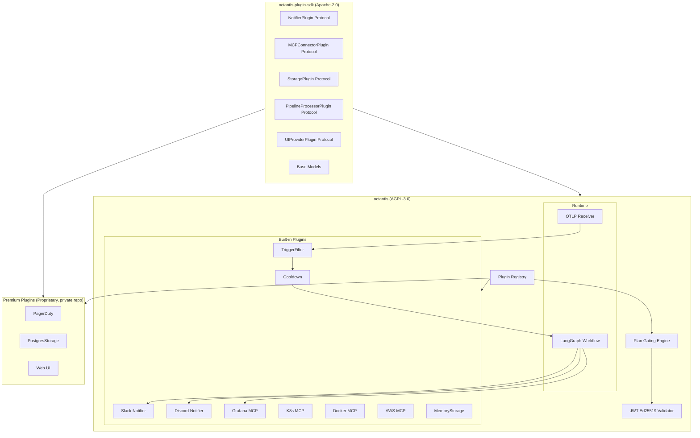
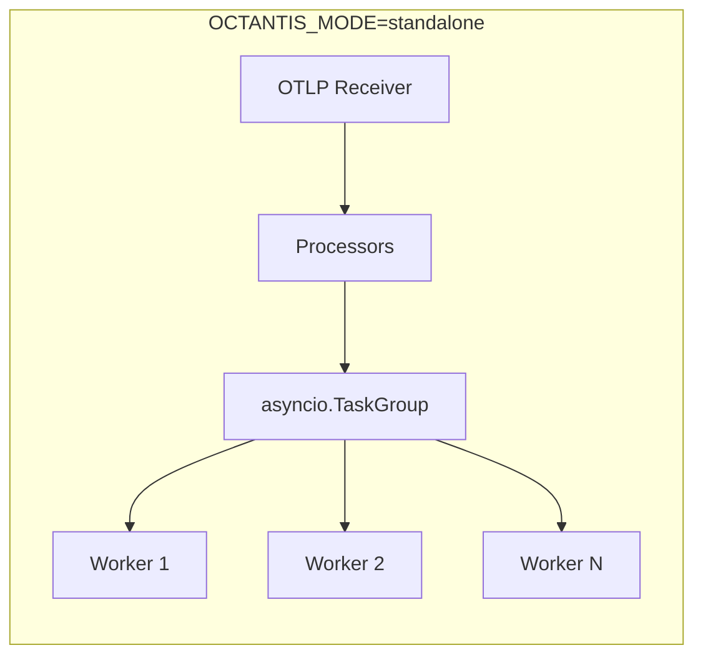
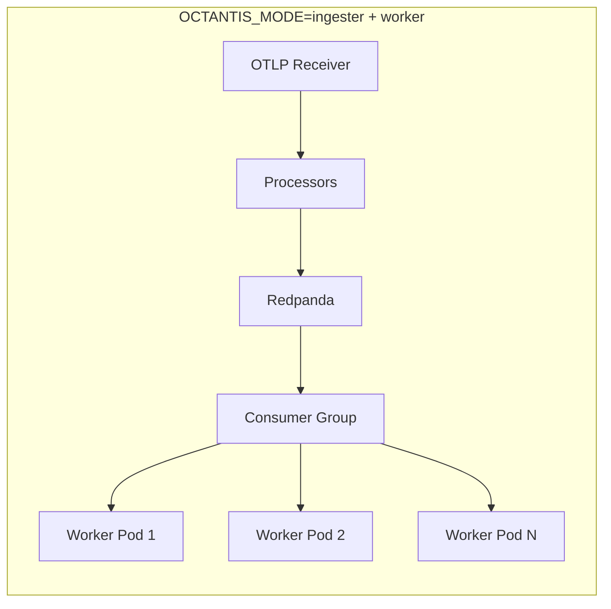
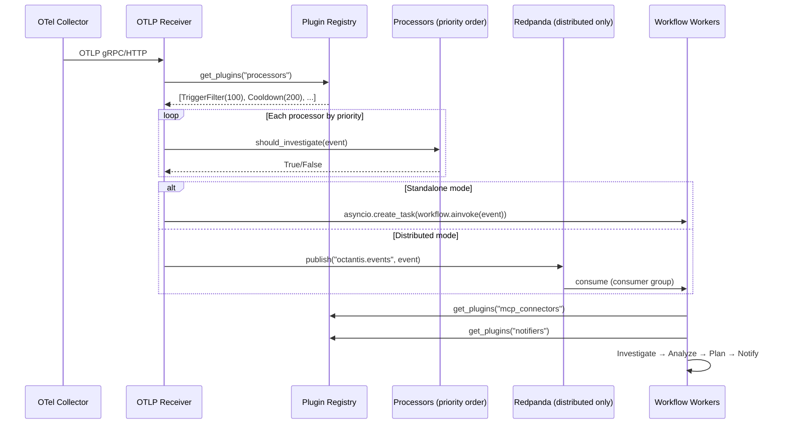
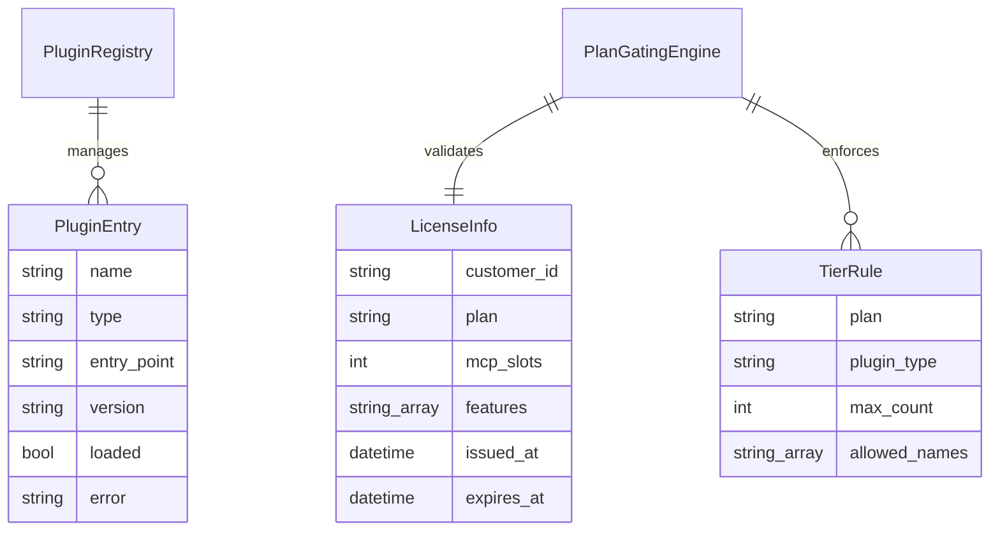
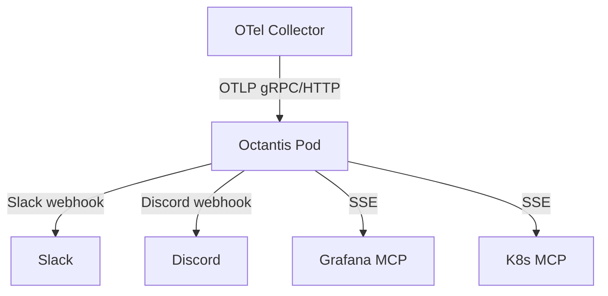
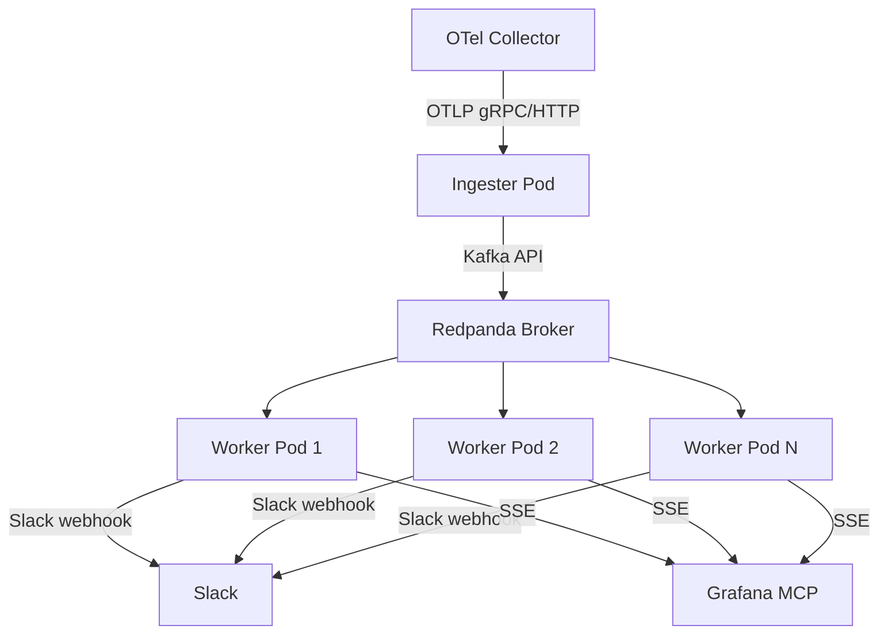

# Tech Spec 005: Plugin Architecture & Open-Core Foundation

> Tech Spec — Generated by Design Docs Expert | 2026-04-11
>
> Based on: [PRD 005 — Plugin Architecture & Open-Core Foundation](../prds/prd-005-plugin-architecture.md)

## List of Contents

- [1. Context](#1-context)
- [2. Objective](#2-objective)
- [3. Architecture](#3-architecture)
- [4. Technical Decisions](#4-technical-decisions)
- [5. Requirements](#5-requirements)
- [6. Data Model](#6-data-model)
- [7. Security](#7-security)
- [8. Infrastructure](#8-infrastructure)
- [9. Observability](#9-observability)
- [10. Cost Estimate](#10-cost-estimate)
- [11. Rollout Plan](#11-rollout-plan)
- [12. Future Considerations](#12-future-considerations)
- [13. Decision Log](#13-decision-log)

## 1. Context

### Problem Statement

Octantis is a monolithic Python application where all components — notifiers, MCP connectors, pipeline processors — are tightly coupled in `src/octantis/`. Every feature added is immediately available to anyone who clones the repo, making the open-core monetization model defined in the Business Model v2.0 impossible to enforce. The MIT license compounds this: any competitor can fork, build a SaaS offering, and contribute nothing back. Additionally, the current single-process sequential pipeline cannot scale beyond one event at a time — each LLM investigation blocks for 5-30 seconds, queuing subsequent events.

### Current State

- **Monolithic architecture**: Notifiers (`slack.py`, `discord.py`), MCP connectors (Grafana, K8s, Docker, AWS), pipeline processors (TriggerFilter, FingerprintCooldown) are direct imports in `main.py`
- **Sequential processing**: `async for event in consumer.events()` processes one event at a time — the `await workflow.ainvoke()` call blocks 5-30s per event
- **No plugin discovery**: Adding a new notifier or MCP connector requires modifying core code
- **No plan gating**: `MCPClientManager` enforces `MAX_PER_SLOT=1` hardcoded — no tier differentiation
- **MIT license**: No protection against SaaS competitors
- **254 tests, 94% coverage**: Stable codebase ready for refactoring

### System Type

Event-driven (async) with plugin-based extensibility. Two deployment modes: standalone (single process) and distributed (ingester + workers via Redpanda). The plugin system itself is a structural refactoring — no new runtime dependencies in standalone mode.

## 2. Objective

### Goals

- 5 plugin types discoverable via Python entry points at startup
- Existing components (Slack, Discord, Grafana MCP, K8s MCP, TriggerFilter, Cooldown) refactored as built-in plugins with zero behavior change
- Plan gating engine enforces free/pro/enterprise tier limits via JWT Ed25519 license keys
- Plugin SDK published as separate Apache-2.0 package (`octantis-plugin-sdk`)
- Standalone mode processes multiple events concurrently via asyncio.TaskGroup
- Distributed mode separates ingestion from processing via Redpanda
- Repository license migrated from MIT to AGPL-3.0

### Non-Goals

- Premium plugin implementations (PagerDuty, Opsgenie, Postgres storage, Web UI)
- SaaS platform / multi-tenant infrastructure
- Billing / payment processing
- Plugin marketplace / registry service
- CLA (Contributor License Agreement)

### Success Criteria

| Criterion | Baseline | Target | Verification |
|-----------|----------|--------|-------------|
| Plugin discovery | No plugin system | Octantis discovers and loads built-in plugins via entry points | Startup logs show loaded plugins by type |
| Plan gating | `MAX_PER_SLOT=1` hardcoded | JWT-based tier enforcement (1/3/unlimited MCP slots) | Configure 2 MCPs with no license → startup error |
| Concurrent processing | 1 event at a time | N concurrent investigations (configurable) | 5 events arrive within 1s ��� 5 parallel investigations |
| Distributed mode | Not possible | Ingester + N workers via Redpanda | 3 worker pods, events distributed across all 3 |
| Existing tests pass | 254 tests, 94% coverage | 254 tests pass, coverage >= 94% | `uv run pytest` — all green |
| License is AGPL-3.0 | MIT | AGPL-3.0 everywhere | LICENSE file, pyproject.toml, Chart.yaml |

## 3. Architecture

### System Diagram



### Deployment Modes





### Components

| Component | Responsibility | Technology | Delta |
|-----------|---------------|------------|-------|
| Plugin Registry | Discover, load, validate, lifecycle plugins | `importlib.metadata` entry points | Added |
| Plan Gating Engine | Enforce tier limits at plugin load time | JWT Ed25519 + tier rules | Added |
| Plugin SDK | Protocol interfaces + base models | Separate PyPI package (Apache-2.0) | Added |
| Slack Notifier | Send Block Kit alerts to Slack | httpx (existing) | Modified → implements NotifierPlugin |
| Discord Notifier | Send embed alerts to Discord | httpx (existing) | Modified → implements NotifierPlugin |
| Grafana MCP | SSE connection to Grafana MCP server | mcp-sdk, langchain-mcp-adapters | Modified → implements MCPConnectorPlugin |
| K8s/Docker/AWS MCP | SSE connections to platform MCPs | mcp-sdk, langchain-mcp-adapters | Modified → implements MCPConnectorPlugin |
| TriggerFilter | Drop benign events | regex, threshold rules | Modified → implements PipelineProcessorPlugin |
| FingerprintCooldown | Suppress duplicate fingerprints | in-memory dict | Modified → implements PipelineProcessorPlugin |
| MemoryStorage | In-memory state (free tier) | Python dict | Added |
| OTLP Receiver | Receive gRPC/HTTP telemetry | grpcio, aiohttp | Reused |
| LangGraph Workflow | Investigate → Analyze → Plan → Notify | langgraph | Reused |
| Redpanda Client | Publish/consume events (distributed mode) | `aiokafka` (Kafka-compatible) | Added (optional) |

### Data Flow



### API Contracts — Plugin Protocols

All protocols are defined in `octantis-plugin-sdk` and use `typing.Protocol` (PEP 544) for structural subtyping.

#### NotifierPlugin

```python
from typing import Protocol, runtime_checkable
from octantis_plugin_sdk.models import InvestigationResult, SeverityAnalysis, ActionPlan

@runtime_checkable
class NotifierPlugin(Protocol):
    """Interface for notification plugins."""

    @property
    def name(self) -> str: ...

    @property
    def plugin_type(self) -> str:
        return "notifier"

    async def setup(self, config: dict) -> None:
        """Initialize the plugin with validated configuration."""
        ...

    async def teardown(self) -> None:
        """Clean up resources."""
        ...

    async def send(
        self,
        investigation: InvestigationResult,
        analysis: SeverityAnalysis,
        action_plan: ActionPlan | None = None,
        extra_text: str = "",
    ) -> None:
        """Send a notification for an incident."""
        ...

    def config_schema(self) -> dict:
        """Return JSON Schema for plugin configuration."""
        ...
```

#### MCPConnectorPlugin

```python
from typing import Any, Protocol, runtime_checkable

@runtime_checkable
class MCPConnectorPlugin(Protocol):
    """Interface for MCP server connector plugins."""

    @property
    def name(self) -> str: ...

    @property
    def plugin_type(self) -> str:
        return "mcp_connector"

    @property
    def slot(self) -> str:
        """Slot type: 'observability' or 'platform'."""
        ...

    async def setup(self, config: dict) -> None:
        """Initialize connection to MCP server."""
        ...

    async def teardown(self) -> None:
        """Close connection and clean up."""
        ...

    async def connect(self) -> None:
        """Establish SSE connection with retry."""
        ...

    async def close(self) -> None:
        """Close the SSE connection."""
        ...

    def get_tools(self) -> list[Any]:
        """Return LangChain-compatible tools for LLM tool calling."""
        ...

    @property
    def is_connected(self) -> bool: ...

    def config_schema(self) -> dict: ...
```

#### StoragePlugin

```python
from datetime import datetime
from typing import Protocol, runtime_checkable
from octantis_plugin_sdk.models import (
    InvestigationResult, SeverityAnalysis, ActionPlan, InvestigationRecord, QueryFilters,
)

@runtime_checkable
class StoragePlugin(Protocol):
    """Interface for persistent storage backends."""

    @property
    def name(self) -> str: ...

    @property
    def plugin_type(self) -> str:
        return "storage"

    async def setup(self, config: dict) -> None: ...
    async def teardown(self) -> None: ...

    async def save_investigation(
        self,
        investigation: InvestigationResult,
        analysis: SeverityAnalysis,
        plan: ActionPlan | None,
    ) -> str:
        """Persist an investigation. Returns record ID."""
        ...

    async def get_investigations(
        self, filters: QueryFilters,
    ) -> list[InvestigationRecord]:
        """Query past investigations."""
        ...

    async def save_cooldown_state(
        self, fingerprint: str, expires_at: datetime,
    ) -> None:
        """Persist a cooldown fingerprint."""
        ...

    async def is_cooled_down(self, fingerprint: str) -> bool:
        """Check if a fingerprint is in cooldown."""
        ...

    def config_schema(self) -> dict: ...
```

#### PipelineProcessorPlugin

```python
from typing import Protocol, runtime_checkable
from octantis_plugin_sdk.models import InfraEvent

@runtime_checkable
class PipelineProcessorPlugin(Protocol):
    """Interface for pipeline processor plugins."""

    @property
    def name(self) -> str: ...

    @property
    def plugin_type(self) -> str:
        return "processor"

    @property
    def priority(self) -> int:
        """Execution order. Lower runs first. Built-in: TriggerFilter=100, Cooldown=200."""
        ...

    async def setup(self, config: dict) -> None: ...
    async def teardown(self) -> None: ...

    def should_investigate(self, event: InfraEvent) -> bool:
        """Return True if the event should proceed, False to drop."""
        ...

    def config_schema(self) -> dict: ...
```

#### UIProviderPlugin

```python
from typing import Protocol, runtime_checkable

@runtime_checkable
class UIProviderPlugin(Protocol):
    """Interface for UI provider plugins (enterprise tier)."""

    @property
    def name(self) -> str: ...

    @property
    def plugin_type(self) -> str:
        return "ui"

    async def setup(self, config: dict) -> None: ...
    async def teardown(self) -> None: ...

    async def start(self, host: str, port: int) -> None:
        """Start the UI server."""
        ...

    async def stop(self) -> None:
        """Stop the UI server."""
        ...

    def config_schema(self) -> dict: ...
```

## 4. Technical Decisions

### Decision 1: Separate Plugin SDK (Apache-2.0)

**Context:** Plugins need to import Protocol interfaces. If those live in the AGPL-3.0 core, proprietary plugins might inherit the AGPL copyleft obligation.

**Decision:** Publish `octantis-plugin-sdk` as a separate PyPI package under Apache-2.0. Core imports from SDK. Plugins import from SDK. No plugin ever imports from `octantis` core directly.

**Alternatives:**

| Option | Pros | Cons | Verdict |
|--------|------|------|---------|
| Separate SDK (Apache-2.0) | Clean legal boundary, Grafana/MinIO proven model | Extra package to maintain and version | **Chosen** |
| Submodule in core (AGPL) | Zero maintenance overhead | AGPL ambiguity for proprietary plugins | Rejected — legal risk |
| No SDK, duck typing only | No package at all | No type safety, no discoverability | Rejected — poor DX |

**Trade-offs accepted:** Additional packaging overhead (PyPI publish, version sync between SDK and core).

### Decision 2: JWT Ed25519 License Validation

**Context:** Need to differentiate free/pro/enterprise tiers. Must work offline (self-hosted, air-gapped environments).

**Decision:** License keys are JWT tokens signed with Ed25519. Octantis embeds the public key and validates offline at startup. No call-home required.

**JWT payload:**
```json
{
  "sub": "customer-uuid",
  "jti": "unique-token-id",
  "plan": "pro",
  "mcp_slots": 3,
  "features": ["all_notifiers", "persistent_storage"],
  "iat": 1744300800,
  "exp": 1775836800,
  "iss": "licensing.octantis.io"
}
```

**Validation flow:**
1. Read `OCTANTIS_LICENSE_KEY` env var or `/etc/octantis/license.key` file
2. Decode JWT with embedded Ed25519 public key
3. Verify signature → invalid: fallback to free tier + log warning
4. Check `exp` claim → expired: fallback to free tier + log warning
5. Extract `plan`, `mcp_slots`, `features` → pass to PlanGatingEngine
6. No license key present → free tier (default)

**Alternatives:**

| Option | Pros | Cons | Verdict |
|--------|------|------|---------|
| JWT Ed25519 offline | Works air-gapped, secure (asymmetric) | Leaked JWT valid until expiry | **Chosen** |
| Call-home server | Can revoke instantly | Fails without internet, single point of failure | Rejected for v1 — future enhancement |
| Simple env var (`OCTANTIS_PLAN=pro`) | Zero complexity | Zero security | Rejected — too easy to bypass |
| HMAC JWT | Simpler | Symmetric key in open-source code = zero security | Rejected — fundamentally broken for OSS |

**Trade-offs accepted:** Leaked JWTs are valid until expiration. Mitigated by: `sub` claim for tracing, 1-year max expiry, future revocation endpoint.

### Decision 3: Fixed Plugin Load Order by Type

**Context:** Plugins may have implicit dependencies between types (e.g., a notifier that reads config from storage).

**Decision:** Registry loads plugins in fixed order: Storage → MCP Connectors → Processors → Notifiers → UI. Teardown in reverse order. Within a type, load order is undefined.

**Alternatives:**

| Option | Pros | Cons | Verdict |
|--------|------|------|---------|
| Fixed order by type | Simple, predictable, prevents silent race conditions | Plugins can't declare cross-type deps | **Chosen** |
| Dependency graph | Maximum flexibility | Cycle detection, resolution complexity | Rejected — YAGNI |
| No guaranteed order | Simplest to implement | Footgun for plugin developers, intermittent bugs | Rejected — not worth the risk |

**Trade-offs accepted:** A plugin cannot depend on a specific plugin of the same type. Acceptable because same-type plugins serve parallel purposes (e.g., Slack and Discord are independent notifiers).

### Decision 4: Dual Deploy Mode — Standalone + Distributed via Redpanda

**Context:** Single-process sequential pipeline cannot scale. Multiple events queued behind 5-30s LLM investigations.

**Decision:** Same binary, three modes controlled by `OCTANTIS_MODE`:
- `standalone` (default): asyncio.TaskGroup with configurable semaphore for concurrent investigations
- `ingester`: Receives OTLP, runs processors, publishes surviving events to Redpanda
- `worker`: Consumes from Redpanda, runs workflow (investigate → analyze → plan → notify)

**Alternatives:**

| Option | Pros | Cons | Verdict |
|--------|------|------|---------|
| Redpanda (Kafka-compatible) | Single binary C++, built-in schema registry, Kafka ecosystem | 512MB+ RAM, heavier than needed for simple queues | **Chosen** — future-proof, ecosystem |
| NATS JetStream | 32MB RAM, ultra-light | Smaller ecosystem, no schema registry | Rejected — Redpanda offers better growth path |
| Gossip/CRDT (Elixir-style) | No broker dependency | 3-4 new libs, complex to maintain in Python | Rejected — reimplementing distributed systems |
| No distribution | Zero complexity | Cannot scale past 1 event/5-30s | Rejected — insufficient for production |

**Trade-offs accepted:** Redpanda is optional and only required in distributed mode. Standalone mode has zero external dependencies.

### Decision 5: Configurable Processor Priority

**Context:** Pipeline processors (TriggerFilter, Cooldown, custom processors) must execute in a defined order. Order affects correctness — TriggerFilter must run before Cooldown.

**Decision:** Each `PipelineProcessorPlugin` declares a `priority: int` property. Lower values execute first. Built-in defaults: TriggerFilter=100, Cooldown=200. Custom processors insert at any priority.

**Performance:** Benchmarked at ~1M events/s for sort + loop dispatch with 5 processors (0.7µs/event). No optimization needed — LLM calls (5-30s) are 7 orders of magnitude slower than plugin dispatch.

## 5. Requirements

### Functional Requirements

#### Scenario: Plugin discovery at startup
WHEN Octantis starts
THEN the Plugin Registry MUST scan all installed packages for entry points in the 5 registered groups
AND load plugins in order: Storage → MCP Connectors → Processors → Notifiers → UI
AND call `setup(config)` on each successfully loaded plugin
AND log the loaded plugin name, type, and version

#### Scenario: Plugin load failure
WHEN a plugin entry point exists but the module fails to import
THEN the Registry MUST log an error with the plugin name, type, and exception
AND continue loading remaining plugins (graceful degradation)
AND the failed plugin MUST NOT appear in `list_plugins()` results

#### Scenario: Duplicate plugin name
WHEN two plugins register with the same name for the same type
THEN the first loaded MUST win
AND the Registry MUST log a warning with both plugin sources

#### Scenario: Plan gating — free tier MCP limit
WHEN `OCTANTIS_LICENSE_KEY` is absent or invalid
AND the operator configures 2 MCP connectors
THEN the PlanGatingEngine MUST reject the second MCP at startup
AND log: "Free tier supports 1 MCP connector. Upgrade to Pro for up to 3."
AND exit with a non-zero status code

#### Scenario: Plan gating — valid license
WHEN a valid JWT with `plan: "pro"` and `mcp_slots: 3` is provided
THEN the PlanGatingEngine MUST allow up to 3 MCP connectors
AND allow all notifier plugins (built-in and third-party)
AND allow persistent storage plugins

#### Scenario: Standalone concurrent processing
WHEN `OCTANTIS_MODE=standalone` and `OCTANTIS_WORKERS=5`
AND 5 events pass processors simultaneously
THEN the runtime MUST invoke 5 workflow instances concurrently via asyncio.TaskGroup
AND each workflow runs independently (investigate → analyze → plan → notify)
AND a 6th event MUST wait until a semaphore slot frees

#### Scenario: Distributed mode — ingester
WHEN `OCTANTIS_MODE=ingester`
AND an event passes all processors
THEN the ingester MUST serialize the event and publish to Redpanda topic `octantis.events`
AND the ingester MUST NOT run the workflow locally

#### Scenario: Distributed mode — worker
WHEN `OCTANTIS_MODE=worker`
AND a message is available in Redpanda topic `octantis.events`
THEN the worker MUST consume the message from consumer group `octantis-workers`
AND deserialize the event
AND run the full workflow (investigate → analyze → plan → notify)
AND ACK the message only after successful processing

#### Scenario: Processor priority ordering
WHEN the registry returns processors with priorities [200, 100, 150]
THEN the runtime MUST execute them in order [100, 150, 200]
AND stop on the first processor that returns `False`

### Non-Functional Requirements

| Category | Requirement | Target | Measurement |
|----------|-------------|--------|-------------|
| **Plugin dispatch** | Overhead per event for sort + loop | < 5µs with 10 processors | Benchmark: `time.perf_counter()` in processor chain |
| **Startup time** | Plugin discovery + load + setup | < 2s for 10 built-in plugins | Log timestamp delta: start → ready |
| **Concurrent investigations** | Parallel workflows in standalone | Up to 20 (configurable) | Semaphore count via `OCTANTIS_WORKERS` |
| **Distributed throughput** | Events/s through Redpanda | 10k+ events/s | Redpanda consumer lag metric |
| **License validation** | JWT verification time | < 1ms | Ed25519 verify is ~50µs |
| **Availability** | Worker crash recovery | Event redelivered within 30s | Redpanda redelivery timeout config |

### Error Handling

#### Scenario: Notifier plugin fails during send
WHEN a notifier's `send()` raises an exception
THEN the runtime MUST log the error with event_id and plugin name
AND continue sending to remaining notifiers
AND the failed notifier MUST NOT block the pipeline

#### Scenario: MCP connector loses connection mid-investigation
WHEN an MCP connector's `get_tools()` returns empty or a tool call fails
THEN the investigator MUST continue with remaining tools
AND mark `mcp_degraded=True` in the InvestigationResult
AND notifiers MUST include a degradation warning

#### Scenario: Redpanda unavailable (distributed mode)
WHEN the ingester cannot connect to Redpanda
THEN the ingester MUST retry with exponential backoff (2s, 4s, 8s, max 60s)
AND log each retry attempt
AND if all retries exhausted, exit with non-zero status

#### Scenario: Worker crash mid-processing
WHEN a worker pod dies during workflow execution
THEN the Redpanda message MUST NOT be ACKed
AND Redpanda MUST redeliver the message to another worker in the consumer group
AND the redelivered message MUST be processed from scratch (idempotent design)

## 6. Data Model

### Entities



### Tier Rules

| Plan | MCP Slots | Notifiers | Storage | Processors | UI |
|------|-----------|-----------|---------|------------|----|
| free | 1 | Built-in only (Slack, Discord) | MemoryStorage only | All | None |
| pro | 3 | All | All | All | None |
| enterprise | Unlimited | All | All | All | All |

### Plugin Entry Point Groups

```toml
# In octantis's own pyproject.toml (built-in plugins)
[project.entry-points."octantis.notifiers"]
slack = "octantis.plugins.notifiers.slack:SlackNotifier"
discord = "octantis.plugins.notifiers.discord:DiscordNotifier"

[project.entry-points."octantis.mcp_connectors"]
grafana = "octantis.plugins.mcp.grafana:GrafanaMCPConnector"
k8s = "octantis.plugins.mcp.k8s:K8sMCPConnector"
docker = "octantis.plugins.mcp.docker:DockerMCPConnector"
aws = "octantis.plugins.mcp.aws:AWSMCPConnector"

[project.entry-points."octantis.storage"]
memory = "octantis.plugins.storage.memory:MemoryStorage"

[project.entry-points."octantis.processors"]
trigger_filter = "octantis.plugins.processors.trigger_filter:TriggerFilterProcessor"
cooldown = "octantis.plugins.processors.cooldown:CooldownProcessor"

[project.entry-points."octantis.ui"]
# No built-in UI provider — enterprise-only
```

```toml
# In a third-party plugin's pyproject.toml
[project.entry-points."octantis.notifiers"]
pagerduty = "octantis_pagerduty:PagerDutyNotifier"
```

### Consistency Model

In-memory (standalone mode) — no consistency concerns. In distributed mode, Redpanda provides exactly-once delivery semantics within consumer groups. Cooldown state is per-instance in standalone, and must use shared StoragePlugin in distributed mode for cross-worker deduplication.

### Data Retention

| Tier | Retention | Storage | Access Pattern |
|------|-----------|---------|----------------|
| Plugin configs | Permanent | Environment variables / config files | Read once at startup |
| License key | Permanent | Env var or file | Read once at startup, cached in memory |
| Cooldown state | TTL-based (default 300s) | In-memory (standalone) or StoragePlugin (distributed) | Read/write per event |
| Investigation history | Configurable (0 = disabled) | StoragePlugin | Write per investigation, read on demand |
| Redpanda messages | 24h default | Redpanda log segments | Write by ingester, read by workers |

## 7. Security

### Authentication

**License key validation:** JWT Ed25519 tokens verified offline with embedded public key. No network calls required.

**Key management:**
- **Private key** (Ed25519): Held exclusively by Octantis project maintainers. Never distributed. Used to sign license JWTs.
- **Public key** (Ed25519): Embedded in `octantis/plugins/licensing.py`. Used to verify JWTs. Safe to distribute (cannot forge signatures).
- **Key rotation**: Core supports multiple public keys (`PUBLIC_KEYS = [key_v1, key_v2]`). New releases can add a new key while keeping the old one for transition. Old keys removed after 6-12 months.

**Revocation (future):** Optional call-home to `https://licensing.octantis.io/v1/revoked` returning revoked JTIs. If endpoint unreachable, accept the JWT (graceful degradation). Not implemented in v1.

### Authorization

Plan gating enforces which plugins and how many can load per tier. This is a convenience barrier, not a security barrier — the code is open source. Real protection comes from premium plugins living in a private repository.

### Data Protection

- **In transit**: OTLP supports TLS (configurable). Redpanda supports TLS + SASL. MCP connections use SSE over HTTPS.
- **At rest**: License keys in environment variables or files with restricted permissions (0600). Redpanda data encrypted via filesystem-level encryption.
- **Plugin config secrets**: API keys, tokens, webhook URLs follow existing pattern — environment variables or Kubernetes Secrets. Never logged, never included in error messages.

### Compliance

- **AGPL-3.0 core**: All source modifications must be shared if Octantis is offered as a service
- **Apache-2.0 SDK**: No copyleft obligation for plugins
- **Dependency audit**: `pip-licenses` must show zero AGPL-incompatible dependencies before license migration

### Audit

Plugin Registry logs all plugin lifecycle events:
- Plugin discovered (name, type, entry point)
- Plugin loaded / failed to load (with error)
- Plugin setup completed / failed
- Plan gating: plugin allowed / rejected (with tier and reason)
- Plugin teardown completed

## 8. Infrastructure

### Deployment Architecture — Standalone



Single pod. Zero external dependencies. Same as today but with plugin architecture internally and concurrent processing.

### Deployment Architecture — Distributed



### Resource Sizing

| Component | CPU | Memory | Storage | Replicas | Scaling |
|-----------|-----|--------|---------|----------|---------|
| Octantis standalone | 0.5 core | 256Mi | None | 1 | Manual |
| Ingester | 0.25 core | 128Mi | None | 1-2 | HPA on OTLP request rate |
| Worker | 0.5 core | 256Mi | None | 1-N | HPA on Redpanda consumer lag |
| Redpanda (single) | 1 core | 512Mi | 20Gi | 1 | Manual |
| Redpanda (production) | 2 cores | 2Gi | 50Gi | 3 | Manual |

### Configuration

```yaml
# Standalone mode (default)
OCTANTIS_MODE: standalone
OCTANTIS_WORKERS: 5                    # concurrent investigations

# Distributed mode — ingester
OCTANTIS_MODE: ingester
OCTANTIS_REDPANDA_BROKERS: redpanda:9092
OCTANTIS_REDPANDA_TOPIC: octantis.events

# Distributed mode — worker
OCTANTIS_MODE: worker
OCTANTIS_REDPANDA_BROKERS: redpanda:9092
OCTANTIS_REDPANDA_TOPIC: octantis.events
OCTANTIS_REDPANDA_GROUP: octantis-workers

# Plan gating
OCTANTIS_LICENSE_KEY: eyJhbGciOiJFZERTQSIs...

# Plugin configuration
OCTANTIS_PLUGIN_NOTIFIER_SLACK_WEBHOOK_URL: https://hooks.slack.com/...
OCTANTIS_PLUGIN_NOTIFIER_SLACK_CHANNEL: "#infra-alerts"
OCTANTIS_PLUGIN_MCP_GRAFANA_URL: http://grafana-mcp:8080
OCTANTIS_PLUGIN_MCP_GRAFANA_API_KEY: "..."
```

## 9. Observability

### SLIs & SLOs

| SLI | SLO | Window | Alert Threshold |
|-----|-----|--------|-----------------|
| Plugin load success rate | 100% for built-in plugins | Per startup | Any built-in plugin fails to load |
| Event processing success rate | >= 99% | 1 hour | Error rate > 1% for 5 minutes |
| Investigation latency p99 | < 60s | 1 hour | p99 > 60s for 10 minutes |
| Redpanda consumer lag (distributed) | < 100 messages | Continuous | Lag > 100 for 5 minutes |

### Metrics

New Prometheus metrics added by the plugin system:

```python
# Plugin registry
plugin_load_total{type, name, status}        # Counter: success/failure per plugin
plugin_load_duration_seconds{type, name}     # Histogram: setup() duration
plugin_active{type, name}                    # Gauge: currently active plugins

# Plan gating
plan_gating_checks_total{plan, result}       # Counter: allowed/rejected
license_expiry_timestamp_seconds             # Gauge: when current license expires

# Concurrent processing (standalone)
worker_active_investigations                 # Gauge: current concurrent workflows
worker_semaphore_waiters                     # Gauge: events waiting for a slot

# Distributed mode
redpanda_publish_total{topic}                # Counter: events published by ingester
redpanda_consume_total{topic, group}         # Counter: events consumed by workers
redpanda_consumer_lag{topic, group}          # Gauge: consumer lag
```

### Logging

All plugin lifecycle events use structured logging (structlog) with consistent fields:
- `plugin_name`, `plugin_type` on all plugin-related log entries
- `event_id` propagated through the full pipeline
- `mode` (standalone/ingester/worker) on startup log

### Dashboards

- **Plugin Health**: Load status, active count by type, setup duration
- **Plan Usage**: Current tier, MCP slots used vs available, gating rejections
- **Processing**: Concurrent investigations, throughput, latency distribution
- **Distributed (if enabled)**: Redpanda consumer lag, publish rate, worker count

## 10. Cost Estimate

| Resource | Unit Cost | Quantity | Monthly Cost |
|----------|-----------|----------|-------------|
| Plugin system code | $0 | N/A | $0 |
| SDK PyPI publishing | $0 | 1 package | $0 |
| GitHub Actions CI (SDK) | $0 | ~100 min/month | $0 (free tier) |
| Redpanda (distributed, optional) | $0 (self-hosted) | 1-3 brokers | $0 (compute already counted in cluster) |
| **Total incremental** | | | **$0** |

Zero incremental infrastructure cost. The plugin system is a pure code architecture change. Redpanda is optional and only deployed when the operator chooses distributed mode. LLM API costs and MCP server costs are unchanged — they are product costs, not plugin architecture costs.

### Cost Optimization Opportunities

- Standalone mode has zero dependencies — recommended for teams with < 15 services generating alerts
- Redpanda single-broker mode (512MB RAM) sufficient for most production deployments
- Worker autoscaling based on consumer lag prevents over-provisioning

## 11. Rollout Plan

### Phases

| Phase | What | Validation | Rollback |
|-------|------|-----------|----------|
| 1: SDK + Registry + Protocols | Publish `octantis-plugin-sdk`. Implement Plugin Registry with entry point discovery. Define 5 Protocols. | Unit tests for registry discovery, load order, duplicate handling. At least 1 built-in plugin loads via entry point. | `git revert` — no external consumers yet |
| 2: Built-in plugin refactoring | Refactor all existing components to implement Protocols. Register via entry points in `pyproject.toml`. | All 254 existing tests pass. Octantis starts and processes events identically. | `git revert` — pre-0.0.1, no users |
| 3: Plan gating | JWT Ed25519 validator. PlanGatingEngine with free/pro/enterprise rules. MCP slot enforcement. | Start with 2 MCPs + no license → error. Start with pro JWT → loads 2 MCPs. | Remove PlanGatingEngine, hardcode free tier |
| 4: Concurrent standalone | asyncio.TaskGroup + semaphore in standalone mode. | 5 events arrive → 5 parallel investigations (verify via logs/metrics). | Revert to sequential `await` |
| 5: Distributed mode | Redpanda client. Ingester mode publishes. Worker mode consumes. | Ingester + 3 workers + Redpanda. Events distributed. Worker crash → redelivery. | Set `OCTANTIS_MODE=standalone` |
| 6: License migration | AGPL-3.0 LICENSE, headers, pyproject.toml, Chart.yaml, README, LICENSING.md. | `pip-licenses` audit clean. LICENSE file is AGPL-3.0. | `git revert` on LICENSE + headers |

### Launch Checklist

- [ ] `octantis-plugin-sdk` published to PyPI
- [ ] All 5 Protocol interfaces implemented and type-checked
- [ ] All built-in plugins load via entry points (zero direct imports in `main.py`)
- [ ] Plugin Registry logs all lifecycle events
- [ ] PlanGatingEngine enforces tier limits with clear error messages
- [ ] JWT Ed25519 validation works offline
- [ ] `OCTANTIS_MODE=standalone` processes events concurrently
- [ ] `OCTANTIS_MODE=ingester` + `worker` processes events via Redpanda
- [ ] All 254+ tests pass, coverage >= 94%
- [ ] `pip-licenses` shows zero AGPL-incompatible dependencies
- [ ] LICENSE file is AGPL-3.0
- [ ] LICENSING.md explains dual-license model
- [ ] README badges updated (license, SDK)

## 12. Future Considerations

- **Revocation endpoint**: Optional call-home for JWT revocation. Revisit when first paying customer signs.
- **Plugin marketplace**: PyPI-based discovery with curated listing on octantis.io. Planned Q2 2027 per roadmap.
- **Hot reload**: Reload plugins without restarting Octantis. Revisit if operators request zero-downtime plugin updates.
- **Plugin sandboxing**: Resource limits (CPU, memory, timeout) per plugin. Revisit if third-party plugins cause stability issues.
- **Multi-region Redpanda**: Mirror topics across regions. Revisit if enterprise customers require geo-redundancy.
- **NATS as alternative broker**: Lighter option (32MB RAM) for small deployments. Could be offered as a plugin alternative to Redpanda.
- **Key rotation automation**: CLI tool to generate and distribute new Ed25519 key pairs. Build when customer count exceeds manual management.

## 13. Decision Log

| Date | Decision | Rationale |
|------|----------|-----------|
| 2026-04-11 | JWT Ed25519 for license validation | Asymmetric crypto works offline, public key safe in open-source code. HMAC rejected — symmetric key in OSS means zero security. |
| 2026-04-11 | Separate SDK package (Apache-2.0) | Grafana model — clean legal boundary between AGPL core and proprietary plugins. Industry standard for open-core. |
| 2026-04-11 | 5 entry point groups with stable namespaces | Entry points are the plugin discovery contract. Changing group names breaks all installed plugins. Defined once, stable forever. |
| 2026-04-11 | Fixed load order by type (Storage → MCP → Processors → Notifiers → UI) | Prevents silent race conditions in `setup()`. Cost: ~0 (one sorted array). Grafana and Ansible use the same pattern. |
| 2026-04-11 | Configurable processor priority (int) | TriggerFilter=100, Cooldown=200. Custom processors insert at any priority. Sort + loop benchmarked at ~1M events/s — no optimization needed. |
| 2026-04-11 | Redpanda for distributed mode | Kafka-compatible, single binary C++, built-in schema registry. Heavier than NATS (512MB vs 32MB) but better ecosystem and growth path. |
| 2026-04-11 | Dual deploy: standalone + distributed (same binary) | `OCTANTIS_MODE` flag. Standalone has zero external deps. Distributed adds Redpanda. Operator chooses based on scale needs. |
| 2026-04-11 | Refactor everything at once (no feature flags) | Pre-0.0.1, zero users. No backward compatibility concerns. Feature flags would be dead code. |
| 2026-04-11 | AGPL-3.0 for core, Apache-2.0 for SDK | AGPL protects against SaaS competitors. Apache-2.0 SDK enables proprietary plugins without copyleft. Grafana built $6B+ on this model. |
